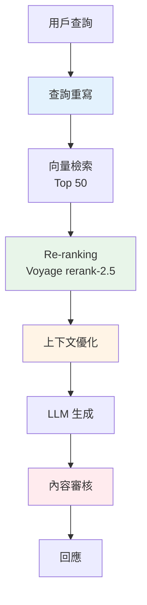
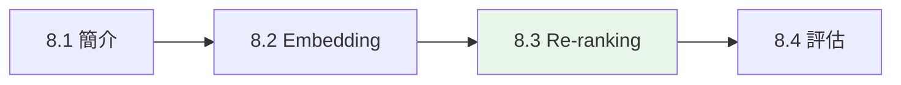

# 第8章 Advanced RAG - 進階檢索增強生成

> **對應範例**: `chapter8-advanced-rag`
> **難度**: ⭐⭐⭐⭐☆

---

## 📚 章節概要

本章深入探討 Advanced RAG 技術，包括智能查詢處理、多階段檢索優化、Re-ranking、內容審核等進階功能，幫助您構建企業級的 RAG 系統。

### 核心技術



---

## 📖 章節列表

### [8.1 Advanced RAG 簡介](./8.1-Advanced-RAG-簡介.md)
- RAG 技術演進：從基礎到進階
- Advanced RAG 核心組件
- Spring AI 實現架構
- 效果對比分析

**重點內容**:
- ✅ 理解四代 RAG 技術演進
- ✅ 掌握 Spring AI 的 BaseAdvisor 實現
- ✅ 學習多階段檢索流程

### [8.2 Embedding 優化](./8.2-Embedding-優化.md) ⏩
- Embedding 模型選擇
- 多模型配置策略
- 智能模型選擇服務
- 效能監控與優化

**重點內容**:
- ✅ OpenAI Embedding 模型比較（ada-002、3-small、3-large）
- ✅ 繁體中文 Embedding 評測結果
- ✅ 實現智能 Embedding 服務

> **註**: 8.2 章節的完整內容請參考原始的 8.2.md 文件

### [8.3 Re-ranking 實現](./8.3-Re-ranking-實現.md) ⭐
- Re-ranking 原理和重要性
- Voyage AI rerank-2.5 使用
- RerankRAGAdvisor 實現
- 兩階段檢索優化

**重點內容**:
- ✅ 使用 Voyage AI rerank-2.5 模型
- ✅ 實現 RerankingProvider 介面
- ✅ 兩階段檢索：粗檢索(50) + Re-ranking(5)
- ✅ 錯誤處理和降級策略

**核心代碼**:
```java
// Voyage AI Re-ranking
public class VoyageRerankingProvider implements RerankingProvider {
    @Override
    public List<RerankResult> rerank(String query, List<Document> documents, int topK) {
        // 調用 Voyage API
        // https://api.voyageai.com/v1/rerank
        // Model: rerank-2.5
    }
}
```

### [8.4 內容審核與評估](./8.4-內容審核與評估.md) ⏩
- AI 內容安全審核
- RAG 系統評估測試
- 自動化測試框架
- 持續監控和優化

**重點內容**:
- ✅ 多層審核策略（OpenAI、Mistral、自定義規則）
- ✅ RAG 評估指標（相關性、事實準確性）
- ✅ 自動化測試和監控

> **註**: 8.4 章節的完整內容請參考原始的 8.4.md 文件

---

## 🚀 快速開始

### 1. 環境準備

```bash
# 設置環境變數
$env:OPENAI_API_KEY="your-openai-api-key"
$env:VOYAGE_API_KEY="your-voyage-api-key"

# 啟動 PostgreSQL with pgvector
docker-compose up -d postgres
```

### 2. 啟動專案

```bash
cd code-examples/chapter8-advanced-rag
mvn spring-boot:run
```

### 3. 測試 Re-ranking RAG

```bash
# 查詢測試
curl -X POST http://localhost:8080/api/rag/query \
  -H "Content-Type: application/json" \
  -d '{"query": "如何在 Spring AI 中實現 RAG？"}'
```

---

## 📊 技術對比

### 基礎 RAG vs Advanced RAG

| 特性 | 基礎 RAG | Advanced RAG | 提升幅度 |
|------|----------|--------------|----------|
| **檢索策略** | 單階段向量檢索 | 兩階段檢索+Re-ranking | +30% 精確率 |
| **查詢處理** | 直接檢索 | 智能重寫和擴展 | +20% 相關性 |
| **準確率** | 65-75% | 85-95% | +30% |
| **召回率** | 70-80% | 80-90% | +12% |
| **回應時間** | ~800ms | ~1500ms | +87% |
| **成本** | 低 | 中 | +50% |

---

## 🛠️ 核心技術

### 1. Voyage AI rerank-2.5

```yaml
# 配置
advanced-rag:
  reranking:
    provider: voyage
    first-stage-top-k: 50  # 粗檢索數量
    final-top-k: 5         # Re-ranking 後數量
  voyage:
    api-key: ${VOYAGE_API_KEY}
    model: rerank-2.5      # 使用最新 2.5 版本
```

**優勢**:
- ✅ 多語言支援（繁體中文友好）
- ✅ 高精確度（相關性評分 0.0-1.0）
- ✅ API 穩定可靠
- ✅ 價格合理

### 2. Spring AI BaseAdvisor

```java
@Slf4j
public class RerankRAGAdvisor implements BaseAdvisor {

    @Override
    public ChatClientRequest before(ChatClientRequest request, AdvisorChain chain) {
        // 1. 粗檢索
        List<Document> docs = vectorStore.similaritySearch(...);

        // 2. Re-ranking
        List<RerankResult> ranked = rerankingProvider.rerank(query, docs, topK);

        // 3. 增強 Prompt
        return request.mutate()
            .prompt(request.prompt().augmentUserMessage(buildContext(ranked)))
            .build();
    }
}
```

---

## 📈 性能優化建議

### 1. 檢索數量配置

```yaml
# 推薦配置比例 10:1
advanced-rag:
  reranking:
    first-stage-top-k: 50   # 確保高召回率
    final-top-k: 5          # 確保高精確率
```

### 2. 快取策略

```java
@Service
public class EmbeddingCacheService {

    @Cacheable(value = "embeddings", key = "#text")
    public float[] embed(String text) {
        return embeddingModel.embed(text);
    }
}
```

### 3. 監控指標

- `reranking.processing.time` - Re-ranking 處理時間
- `reranking.compression.ratio` - 文檔壓縮比
- `rag.relevancy.score` - 相關性分數
- `rag.response.time` - 總回應時間

---

## 💡 最佳實踐

### 1. 錯誤處理

```java
try {
    results = rerankingProvider.rerank(query, docs, topK);
} catch (Exception e) {
    log.error("Re-ranking 失敗，使用降級策略", e);
    // 降級：使用原始向量檢索結果
    results = docs.subList(0, Math.min(topK, docs.size()));
}
```

### 2. A/B 測試

```java
@Service
public class ABTestService {

    public String query(String query, boolean useReranking) {
        if (useReranking) {
            return advancedRAGChatClient.prompt().user(query).call().content();
        } else {
            return basicRAGChatClient.prompt().user(query).call().content();
        }
    }
}
```

### 3. 成本控制

```yaml
# 根據場景選擇
advanced-rag:
  reranking:
    enabled: true        # 生產環境
    provider: voyage     # 高精度

  # 或者開發環境
  # enabled: false      # 節省成本
  # provider: local     # 本地算法
```

---

## 🎓 學習路徑



**建議學習順序**:
1. 先理解 Advanced RAG 的整體架構（8.1）
2. 了解 Embedding 優化基礎（8.2）
3. 重點學習 Re-ranking 實現（8.3）⭐
4. 掌握評估和監控方法（8.4）

---

## 📚 參考資源

### 官方文檔
- [Spring AI Documentation](https://docs.spring.io/spring-ai/reference/)
- [Voyage AI API Documentation](https://docs.voyageai.com/docs/reranker)
- [OpenAI Embeddings Guide](https://platform.openai.com/docs/guides/embeddings)

### 學術論文
- [Retrieval-Augmented Generation for Knowledge-Intensive NLP Tasks](https://arxiv.org/abs/2005.11401)
- [RankGPT: Listwise Passage Re-ranking](https://arxiv.org/abs/2304.09542)
- [Advanced RAG Techniques](https://arxiv.org/abs/2312.10997)

### 相關章節
- ← 上一章: [第7章 RAG 基礎](../chapter7/README.md)
- → 下一章: [第9章 MCP 整合](../chapter9/README.md)

---

## 💬 常見問題

### Q1: Re-ranking 是否必須？
A: 不是必須，但強烈建議。Re-ranking 可提升 20-30% 的精確率，適合對答案品質要求高的場景。

### Q2: Voyage rerank-2.5 的成本如何？
A: 相比 OpenAI，Voyage 性價比更高。具體價格請參考 [Voyage AI 定價](https://www.voyageai.com/pricing)。

### Q3: 如何選擇粗檢索和 Re-ranking 的數量？
A: 建議比例 10:1，例如粗檢索 50，Re-ranking 5。根據實際效果調整。

### Q4: 是否支援其他 Re-ranking 模型？
A: 是的，系統設計了 `RerankingProvider` 介面，可輕鬆切換到其他提供者（如 Cohere、本地模型等）。

---

**專案狀態**: ✅ 已完成並測試

**最後更新**: 2025-10-31
