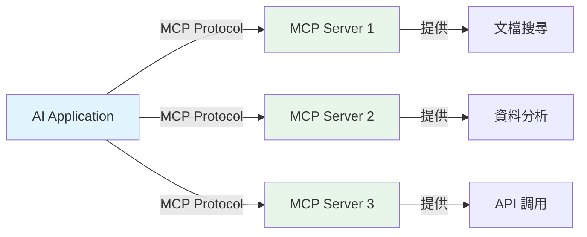
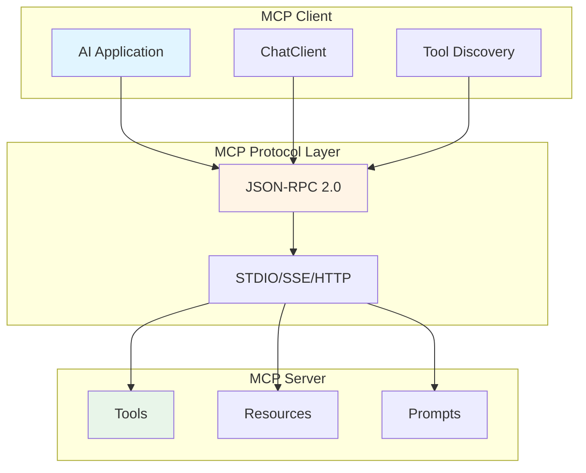
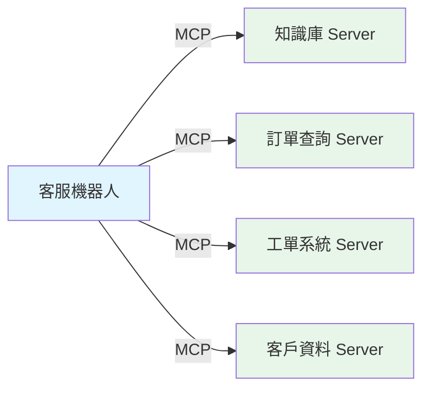
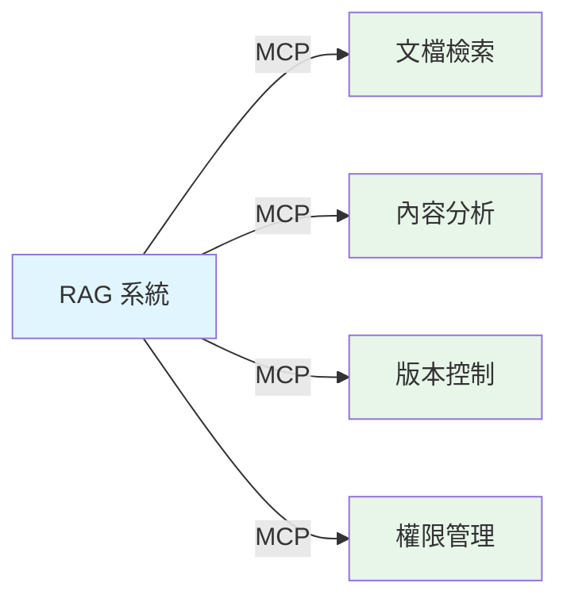
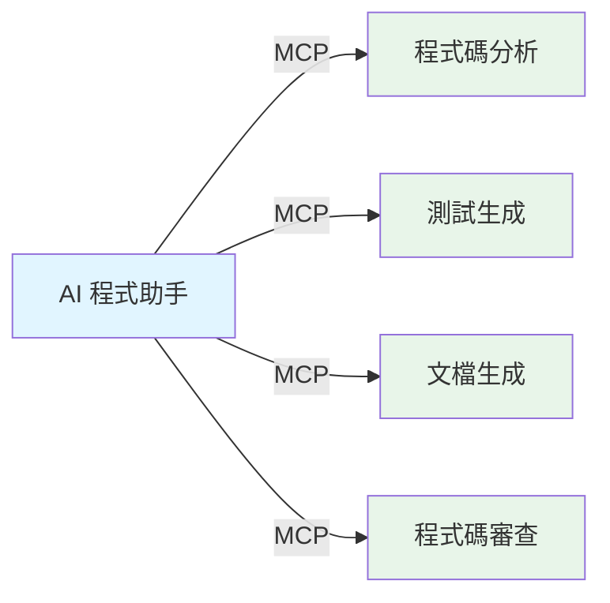

# 9.1 MCP 協議基礎

> **對應章節**: 理論基礎
> **難度**: ⭐⭐☆☆☆
> **學習時間**: 45 分鐘

---

## 📚 本章概要

Model Context Protocol (MCP) 是解決 AI 系統互操作性的開放標準協議。本章將帶你理解 MCP 的核心概念、架構設計和在企業中的應用價值。

**學習目標**:
- 理解 MCP 協議的核心概念和設計理念
- 掌握 MCP 的 Client-Server 架構
- 熟悉 JSON-RPC 2.0 通訊協議
- 認識 MCP 在企業 AI 系統中的價值

---

## 🎯 什麼是 MCP？

### 核心問題：AI 系統的孤島化

在企業 AI 應用中，我們經常遇到以下問題：

```
問題場景：
├─ 不同 AI 工具無法互相溝通
├─ 每個工具都有自己的 API 格式
├─ 重複開發相似功能
└─ 整合成本高昂、維護困難
```

**傳統解決方案的困境**:
- 為每個工具編寫專門的適配器
- 維護成本隨著工具數量指數增長
- 缺乏統一的標準和規範

---

### MCP 的解決方案

Model Context Protocol 提供了一個**統一的標準化框架**：



**MCP 的核心價值**:
- ✅ **統一協議**: 所有服務遵循相同的通訊標準
- ✅ **標準格式**: 使用 JSON-RPC 2.0 格式
- ✅ **可重用**: 工具和資源跨專案共享
- ✅ **簡化整合**: 一次開發，處處可用

---

## 🏗️ MCP 架構設計

### Client-Server 架構



---

### 核心組件說明

#### MCP Client（客戶端）

**職責**:
- 發起對 MCP Server 的連接
- 發現和使用可用的工具、資源、提示
- 管理與多個 Server 的連接
- 處理回應和錯誤

**Spring AI 中的實現**:
```java
// Spring AI 自動配置 MCP Client
@Autowired
private List<McpSyncClient> mcpClients;  // 所有配置的 MCP Client

@Autowired
private SyncMcpToolCallbackProvider toolProvider;  // 工具提供者
```

**典型應用**:
- AI 聊天應用
- RAG 知識庫系統
- 智能助手
- 自動化工具

---

#### MCP Server（伺服器）

**職責**:
- 提供工具、資源和提示服務
- 處理客戶端請求
- 管理服務的生命週期
- 確保服務的安全性和穩定性

**Spring AI 中的實現**:
```java
// 使用 @Tool 註解註冊工具
@Service
public class MyToolProvider {

    @Tool(description = "搜尋企業文檔")
    public String searchDocuments(String query) {
        // 工具實現
        return "搜尋結果...";
    }
}
```

**服務類型**:
- **Tools（工具）**: 可執行的功能（API 調用、計算、處理）
- **Resources（資源）**: 可讀取的資料（文件、資料庫記錄）
- **Prompts（提示）**: 預定義的提示模板

---

## 🔌 傳輸方式

MCP 支援多種傳輸協議，適應不同的應用場景：

| 傳輸方式 | 適用場景 | 優點 | 缺點 |
|---------|---------|------|------|
| **STDIO** | 本地開發、CLI 工具 | 低延遲、高效能 | 僅限本地 |
| **SSE** | 遠端服務、生產環境 | 支援遠端、標準 HTTP | 需要網絡 |
| **HTTP** | RESTful 整合 | 廣泛支援、易於調試 | 單向通訊 |

### STDIO 傳輸範例

```yaml
# application.yml
spring:
  ai:
    mcp:
      client:
        stdio:
          connections:
            local-server:
              command: java
              args:
                - "-jar"
                - "/path/to/mcp-server.jar"
```

### SSE 傳輸範例

```yaml
spring:
  ai:
    mcp:
      client:
        sse:
          connections:
            remote-server:
              url: http://localhost:8080
              sse-endpoint: /mcp/sse
```

---

## 📡 JSON-RPC 2.0 協議

MCP 基於 JSON-RPC 2.0 協議進行通訊。

### 基本請求格式

```json
{
  "jsonrpc": "2.0",
  "method": "tools/list",
  "params": {},
  "id": 1
}
```

### 基本回應格式

```json
{
  "jsonrpc": "2.0",
  "result": {
    "tools": [
      {
        "name": "search_documents",
        "description": "搜尋企業文檔",
        "inputSchema": {
          "type": "object",
          "properties": {
            "query": {
              "type": "string"
            }
          },
          "required": ["query"]
        }
      }
    ]
  },
  "id": 1
}
```

---

## 💡 MCP 核心功能

### 1. 工具調用 (Tools)

**工具列表請求**:
```json
{
  "jsonrpc": "2.0",
  "method": "tools/list",
  "params": {},
  "id": 1
}
```

**執行工具**:
```json
{
  "jsonrpc": "2.0",
  "method": "tools/call",
  "params": {
    "name": "search_documents",
    "arguments": {
      "query": "Spring AI 教學"
    }
  },
  "id": 2
}
```

---

### 2. 資源讀取 (Resources)

**列出資源**:
```json
{
  "jsonrpc": "2.0",
  "method": "resources/list",
  "params": {},
  "id": 3
}
```

**讀取資源**:
```json
{
  "jsonrpc": "2.0",
  "method": "resources/read",
  "params": {
    "uri": "file:///docs/guide.md"
  },
  "id": 4
}
```

---

### 3. 智能提示 (Prompts)

**獲取提示**:
```json
{
  "jsonrpc": "2.0",
  "method": "prompts/get",
  "params": {
    "name": "code_review",
    "arguments": {
      "language": "java",
      "code": "public class Example { ... }"
    }
  },
  "id": 5
}
```

---

## 🏢 MCP 在企業中的應用價值

### 解決的核心挑戰

#### 1. 系統整合複雜性

**傳統方式**:
```
每個 AI 工具 → 專門的適配器 → 維護成本高
```

**MCP 方式**:
```
統一協議 → 標準化整合 → 成本大幅降低
```

---

#### 2. 功能重複開發

**問題**: 不同團隊重複開發相似功能

**MCP 解決**: 工具標準化封裝，跨團隊共享

---

#### 3. 可擴展性限制

**MCP 優勢**:
- 插件式架構
- 動態服務發現
- 無需修改核心系統即可擴展

---

### 企業應用場景

#### 場景 1: 智能客服系統



**整合優勢**:
- 統一的客服介面
- 多個後端服務標準化接入
- 易於擴展新功能

---

#### 場景 2: 企業知識管理



---

#### 場景 3: 開發輔助工具



---

## 🆚 MCP vs 其他解決方案

### 技術比較

| 特性 | MCP | REST API | GraphQL | gRPC |
|------|-----|----------|---------|------|
| **AI 特化** | ✅ 是 | ❌ 否 | ❌ 否 | ❌ 否 |
| **標準化程度** | ⭐⭐⭐⭐⭐ | ⭐⭐⭐ | ⭐⭐⭐ | ⭐⭐⭐⭐ |
| **動態發現** | ✅ 支援 | ⚠️ 有限 | ⚠️ 有限 | ⚠️ 有限 |
| **工具生態** | ✅ 內建 | ❌ 需自建 | ❌ 需自建 | ❌ 需自建 |
| **學習成本** | ⭐⭐⭐ | ⭐⭐ | ⭐⭐⭐ | ⭐⭐⭐⭐ |

---

### MCP 的獨特優勢

#### 1. AI 原生設計
- 專為 AI 應用場景設計
- 內建工具、資源、提示概念
- 支援 AI 特有的互動模式

#### 2. 標準化工具生態
- 統一的工具描述格式
- 標準化的參數驗證
- 一致的錯誤處理機制

#### 3. 動態能力發現
- 運行時發現可用服務
- 自動適應服務變更
- 支援服務的熱插拔

---

## 📝 重點回顧

### 核心概念

| 概念 | 說明 | 重要性 |
|------|------|--------|
| **MCP 協議** | 標準化的 AI 工具通訊協議 | ⭐⭐⭐⭐⭐ |
| **Client-Server** | 分離式架構設計 | ⭐⭐⭐⭐ |
| **JSON-RPC 2.0** | 基礎通訊協議 | ⭐⭐⭐⭐ |
| **三大服務** | Tools、Resources、Prompts | ⭐⭐⭐⭐⭐ |

---

### MCP 的核心價值

1. **標準化**: 統一的協議規範
2. **互操作性**: 不同系統無縫協作
3. **可擴展性**: 靈活的插件式架構
4. **重用性**: 工具跨專案共享
5. **維護性**: 簡化系統維護和升級

---

## 🔗 與 Spring AI 的整合

Spring AI 1.0.3 提供了完整的 MCP 支援：

```java
// MCP Client 自動配置
spring-ai-starter-mcp-client

// MCP Server 開發
spring-ai-starter-mcp-server-webmvc
```

在接下來的章節中，我們將學習：
- 如何配置和使用 MCP Client
- 如何開發 MCP Server
- 如何整合到 Spring AI 應用中

---

## 🚀 下一步

現在你已經理解了 MCP 的基礎概念，接下來我們將學習：

👉 [9.2 MCP Client 使用](./9.2-MCP-Client-使用.md) - 如何使用 MCP Client 連接 Server

---

## 📚 參考資源

### 官方文檔
- [Model Context Protocol 規範](https://spec.modelcontextprotocol.io/)
- [JSON-RPC 2.0 規範](https://www.jsonrpc.org/specification)
- [Spring AI MCP Documentation](https://docs.spring.io/spring-ai/reference/api/mcp/)

### 社群資源
- [MCP GitHub Repository](https://github.com/modelcontextprotocol)
- [MCP Servers 集合](https://github.com/modelcontextprotocol/servers)

---

**相關章節**:
- → 下一章: [9.2 MCP Client 使用](./9.2-MCP-Client-使用.md)
- ← 回到: [第9章總覽](./README.md)
