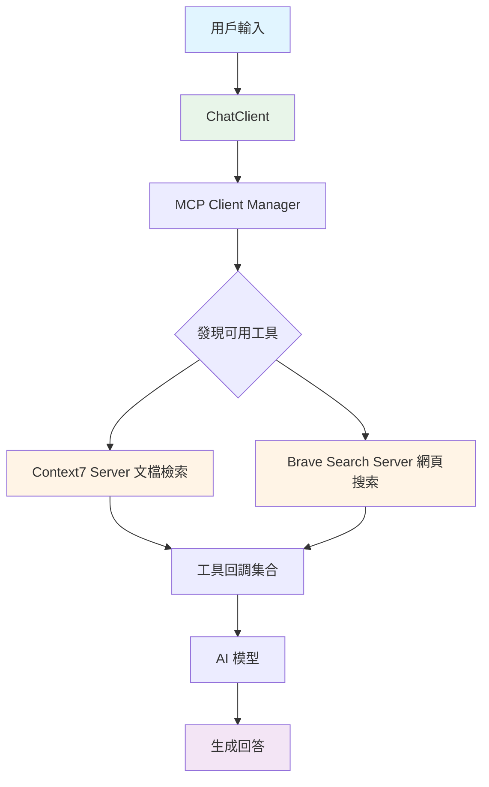
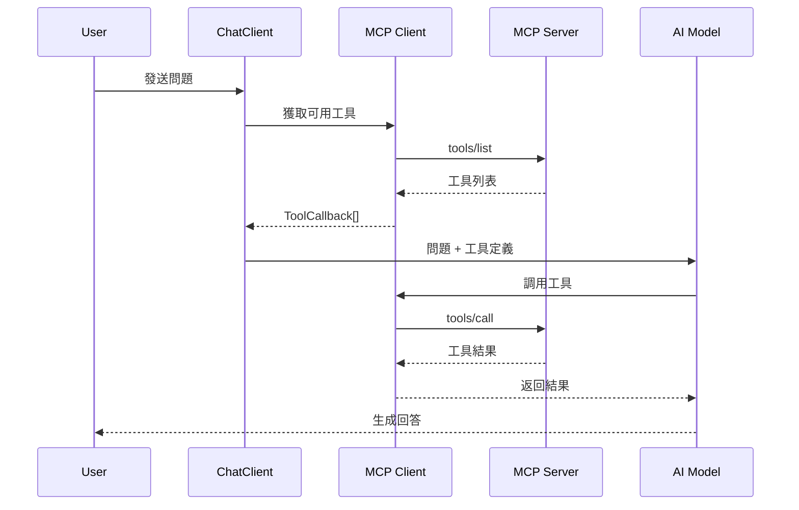
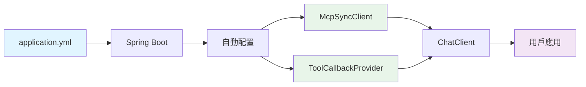

# 9.2 MCP Client 使用

> **對應章節**: Client 應用
> **對應範例**: `chapter9-mcp-client-basic`
> **難度**: ⭐⭐⭐☆☆
> **學習時間**: 60 分鐘

---

## 📚 本章概要

學習如何在 Spring AI 應用中使用 MCP Client 連接和調用 MCP Server，掌握工具發現、調用和與 ChatClient 的整合。

**學習目標**:
- 配置 MCP Client 連接（STDIO/SSE）
- 發現和調用 MCP 工具
- 整合到 Spring AI ChatClient
- 管理多個 MCP Server 連接

---

## 🎯 專案架構

### 完整的 MCP Client 應用流程



**對應專案**: `code-examples/chapter9-mcp-integration/chapter9-mcp-client-basic/`

---

## 🔧 Maven 依賴配置

### 核心依賴

**位置**: `pom.xml`

```xml
<dependencies>
    <!-- Spring AI MCP Client -->
    <dependency>
        <groupId>org.springframework.ai</groupId>
        <artifactId>spring-ai-starter-mcp-client</artifactId>
    </dependency>

    <!-- Spring AI OpenAI -->
    <dependency>
        <groupId>org.springframework.ai</groupId>
        <artifactId>spring-ai-openai-spring-boot-starter</artifactId>
    </dependency>

    <!-- Spring Boot Web -->
    <dependency>
        <groupId>org.springframework.boot</groupId>
        <artifactId>spring-boot-starter-web</artifactId>
    </dependency>
</dependencies>

<dependencyManagement>
    <dependencies>
        <dependency>
            <groupId>org.springframework.ai</groupId>
            <artifactId>spring-ai-bom</artifactId>
            <version>1.0.3</version>
            <type>pom</type>
            <scope>import</scope>
        </dependency>
    </dependencies>
</dependencyManagement>
```

**版本說明**:
- Spring AI: 1.0.3
- Spring Boot: 3.5.7
- Java: 21

---

## ⚙️ MCP Client 配置

### SSE 傳輸配置

**位置**: `src/main/resources/application.yml`

```yaml
spring:
  ai:
    openai:
      api-key: ${OPENAI_API_KEY}

    mcp:
      client:
        # Client 基本配置
        enabled: true
        type: SYNC

        # SSE 連接 - Context7 文檔檢索服務
        sse:
          connections:
            context7:
              url: https://mcp.context7.com
              sse-endpoint: /mcp
```

**關鍵配置說明**:
- `type: SYNC`: 使用同步 Client（也可選擇 ASYNC）
- `url`: MCP Server 的 HTTP 端點
- `sse-endpoint`: Server-Sent Events 端點路徑

---

### STDIO 傳輸配置

適用於本地 Node.js MCP Server

```yaml
spring:
  ai:
    mcp:
      client:
        stdio:
          connections:
            brave-search:
              command: npx
              args:
                - "-y"
                - "@modelcontextprotocol/server-brave-search"
              env:
                BRAVE_API_KEY: ${BRAVE_API_KEY}
```

**STDIO vs SSE**:

| 特性 | STDIO | SSE |
|------|-------|-----|
| **適用場景** | 本地開發、CLI 整合 | 遠端服務、生產環境 |
| **網絡需求** | ❌ 無需網絡 | ✅ 需要 HTTP |
| **性能** | ⚡ 低延遲 | 🌐 依賴網絡 |
| **部署** | 本地進程 | 遠端 Server |

---

## 💻 MCP Client 核心服務

### Client 管理器

**位置**: `src/main/java/com/example/mcpclient/config/McpClientManager.java`

```java
@Configuration
@Slf4j
public class McpClientManager {

    private final List<McpSyncClient> syncClients;
    private final SyncMcpToolCallbackProvider toolCallbackProvider;

    public McpClientManager(List<McpSyncClient> syncClients,
                           SyncMcpToolCallbackProvider toolCallbackProvider) {
        this.syncClients = syncClients;
        this.toolCallbackProvider = toolCallbackProvider;

        logServerConnections();
    }

    /**
     * 記錄已連接的 Server
     */
    private void logServerConnections() {
        log.info("=== MCP Client 連接狀態 ===");
        log.info("已連接 {} 個 MCP Server", syncClients.size());

        for (McpSyncClient client : syncClients) {
            log.info("  - Server: {}", client.getServerName());
        }
    }
}
```

**關鍵組件**:
- `List<McpSyncClient>`: Spring 自動注入所有配置的 MCP Client
- `SyncMcpToolCallbackProvider`: 自動聚合所有 Server 的工具

---

## 🔗 與 ChatClient 整合

### 配置 ChatClient

**位置**: `src/main/java/com/example/mcpclient/config/ChatClientConfig.java`

```java
@Configuration
@Slf4j
public class ChatClientConfig {

    /**
     * 配置帶有 MCP 工具的 ChatClient
     */
    @Bean
    public ChatClient chatClient(ChatClient.Builder builder,
                                SyncMcpToolCallbackProvider toolProvider) {

        ToolCallback[] mcpTools = toolProvider.getToolCallbacks();
        log.info("ChatClient 註冊了 {} 個 MCP 工具", mcpTools.length);

        return builder
            .defaultSystem("""
                你是一個智能助手，可以使用以下工具協助用戶：
                - 文檔檢索工具 (Context7)
                - 網頁搜索工具 (Brave Search)

                請根據用戶需求選擇合適的工具。
                """)
            .defaultFunctions(mcpTools)  // 註冊所有 MCP 工具
            .build();
    }
}
```

**整合流程**:



---

## 🎬 命令行交互應用

### CLI Runner

**位置**: `src/main/java/com/example/mcpclient/cli/CliRunner.java`

```java
@Component
@Slf4j
public class CliRunner implements CommandLineRunner {

    private final ChatClient chatClient;
    private final List<McpSyncClient> mcpClients;

    @Override
    public void run(String... args) {
        displayWelcomeMessage();
        displayAvailableTools();
        startChatLoop();
    }

    /**
     * 顯示可用的 MCP 工具
     */
    private void displayAvailableTools() {
        log.info("\n=== 可用的 MCP Server ===");

        for (McpSyncClient client : mcpClients) {
            var result = client.listTools(new McpSchema.ListToolsRequest());

            log.info("Server: {}", client.getServerName());
            result.tools().forEach(tool ->
                log.info("  - {}: {}", tool.name(), tool.description())
            );
        }
    }

    /**
     * 聊天循環
     */
    private void startChatLoop() {
        Scanner scanner = new Scanner(System.in);

        while (true) {
            System.out.print("\nYou: ");
            String input = scanner.nextLine();

            if ("exit".equalsIgnoreCase(input)) {
                break;
            }

            // 使用 ChatClient 處理
            String response = chatClient.prompt()
                .user(input)
                .call()
                .content();

            System.out.println("AI: " + response);
        }
    }
}
```

**參考完整實現**: `src/main/java/com/example/mcpclient/cli/CliRunner.java:15-80`

---

## 🔍 工具發現與調用

### 手動工具調用

雖然 ChatClient 會自動調用工具，但你也可以手動調用：

**位置**: `src/main/java/com/example/mcpclient/service/McpToolService.java`

```java
@Service
@Slf4j
public class McpToolService {

    private final List<McpSyncClient> mcpClients;

    /**
     * 手動執行指定工具
     */
    public String executeTool(String toolName, Map<String, Object> arguments) {

        for (McpSyncClient client : mcpClients) {
            // 檢查工具是否存在
            if (hasToolInClient(client, toolName)) {

                // 調用工具
                var request = new McpSchema.CallToolRequest(toolName, arguments);
                var result = client.callTool(request);

                // 提取文本結果
                return extractTextContent(result);
            }
        }

        throw new RuntimeException("工具未找到: " + toolName);
    }

    private boolean hasToolInClient(McpSyncClient client, String toolName) {
        var result = client.listTools(new McpSchema.ListToolsRequest());
        return result.tools().stream()
            .anyMatch(tool -> tool.name().equals(toolName));
    }
}
```

**參考完整實現**: `src/main/java/com/example/mcpclient/service/McpToolService.java:25-65`

---

## 📖 資源讀取

### 讀取 MCP 資源

MCP Server 也可以提供資源（如文件、資料）：

```java
@Service
@Slf4j
public class McpResourceService {

    private final List<McpSyncClient> mcpClients;

    /**
     * 讀取資源
     */
    public String readResource(String resourceUri) {

        for (McpSyncClient client : mcpClients) {
            try {
                var request = new McpSchema.ReadResourceRequest(
                    URI.create(resourceUri)
                );

                var result = client.readResource(request);

                // 提取文本內容
                return result.contents().stream()
                    .filter(c -> c instanceof McpSchema.TextResourceContents)
                    .map(c -> ((McpSchema.TextResourceContents) c).text())
                    .collect(Collectors.joining("\n"));

            } catch (Exception e) {
                log.debug("資源不在此 Server: {}", client.getServerName());
            }
        }

        throw new RuntimeException("資源未找到: " + resourceUri);
    }
}
```

**參考完整實現**: `src/main/java/com/example/mcpclient/service/McpResourceService.java:18-50`

---

## 🚀 啟動和測試

### 啟動應用

1. **設置環境變數**:
```bash
export OPENAI_API_KEY="your-openai-api-key"
export BRAVE_API_KEY="your-brave-api-key"  # 可選
```

2. **啟動應用**:
```bash
cd code-examples/chapter9-mcp-integration/chapter9-mcp-client-basic
mvn spring-boot:run
```

3. **查看啟動日誌**:
```
=== MCP Client 連接狀態 ===
已連接 1 個 MCP Server
  - Server: context7

=== 可用的 MCP Server ===
Server: context7
  - resolve-library-id: 解析程式庫名稱到 Context7 ID
  - get-library-docs: 獲取程式庫文檔
```

---

### 測試對話

**範例 1: 查詢 React 文檔**
```
You: How to use React hooks?

AI: [使用 get-library-docs 工具查詢]
    React Hooks 是 React 16.8 引入的功能...
```

**範例 2: 搜索最新資訊**
```
You: What's the latest news about AI?

AI: [使用 brave_web_search 工具]
    根據最新搜索結果...
```

---

## 🔧 進階配置

### 自定義 Client 行為

**位置**: `src/main/java/com/example/mcpclient/config/McpClientCustomizer.java`

```java
@Component
@Slf4j
public class McpClientCustomizer implements McpSyncClientCustomizer {

    @Override
    public void customize(String serverName, McpClient.SyncSpec spec) {
        log.info("自定義 MCP Client: {}", serverName);

        // 設置超時
        spec.requestTimeout(Duration.ofSeconds(30));

        // 監聽工具變更
        spec.toolsChangeConsumer(tools -> {
            log.info("Server {} 工具已更新，共 {} 個",
                serverName, tools.size());
        });

        // 監聽資源變更
        spec.resourcesChangeConsumer(resources -> {
            log.info("Server {} 資源已更新，共 {} 個",
                serverName, resources.size());
        });
    }
}
```

**參考完整實現**: `src/main/java/com/example/mcpclient/config/McpClientManager.java:45-70`

---

## 📝 重點回顧

### 核心概念

| 組件 | 說明 | 重要性 |
|------|------|--------|
| **McpSyncClient** | MCP 客戶端實例 | ⭐⭐⭐⭐⭐ |
| **ToolCallbackProvider** | 工具回調提供者 | ⭐⭐⭐⭐⭐ |
| **ChatClient 整合** | 與 AI 對話整合 | ⭐⭐⭐⭐ |
| **多 Server 管理** | 同時連接多個 Server | ⭐⭐⭐ |

---

### 配置要點

1. **SSE 傳輸**: 用於遠端 HTTP Server
2. **STDIO 傳輸**: 用於本地進程 Server
3. **自動注入**: Spring 自動配置所有 Client
4. **工具聚合**: 自動合併多個 Server 的工具

---

### 整合流程



---

## 🚀 下一步

現在你已經掌握了 MCP Client 的使用，接下來我們將學習：

👉 [9.3 MCP Server 工具開發](./9.3-MCP-Server-工具開發.md) - 如何開發自己的 MCP Server

---

## 📚 完整範例

本章概念的完整實現請參考:

📁 **chapter9-mcp-client-basic**
- `src/main/resources/application.yml` - Client 配置
- `src/main/java/.../config/ChatClientConfig.java` - ChatClient 整合
- `src/main/java/.../cli/CliRunner.java` - 命令行應用
- `src/main/java/.../service/McpToolService.java` - 工具服務

🔗 **啟動範例**:
```bash
cd code-examples/chapter9-mcp-integration/chapter9-mcp-client-basic
export OPENAI_API_KEY="your-key"
mvn spring-boot:run
```

---

## ❓ 常見問題

### Q1: 如何連接多個 MCP Server?

在 `application.yml` 中添加多個連接配置：

```yaml
spring:
  ai:
    mcp:
      client:
        sse:
          connections:
            server1:
              url: http://localhost:8080
            server2:
              url: http://localhost:8081
```

所有工具會自動聚合到 `ToolCallbackProvider`。

---

### Q2: STDIO Server 無法啟動怎麼辦?

檢查以下項目：
1. Node.js 是否已安裝
2. 環境變數是否正確設置
3. Server 命令是否正確
4. 查看啟動日誌中的錯誤訊息

---

### Q3: 如何處理工具調用錯誤?

MCP Client 會自動處理錯誤，你也可以添加自定義處理：

```java
try {
    String result = mcpService.executeTool(toolName, params);
} catch (Exception e) {
    log.error("工具調用失敗", e);
    return "工具暫時不可用，請稍後再試";
}
```

---

**相關章節**:
- ← 上一章: [9.1 MCP 協議基礎](./9.1-MCP-協議基礎.md)
- → 下一章: [9.3 MCP Server 工具開發](./9.3-MCP-Server-工具開發.md)
- ↑ 回到: [第9章總覽](./README.md)
