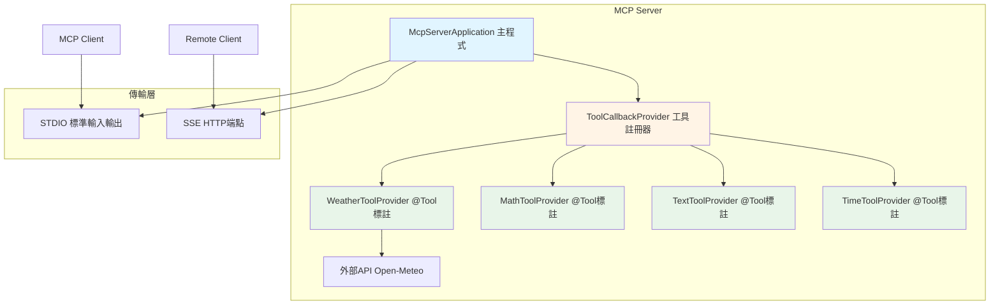
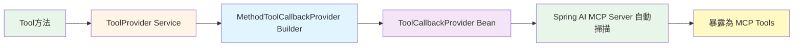
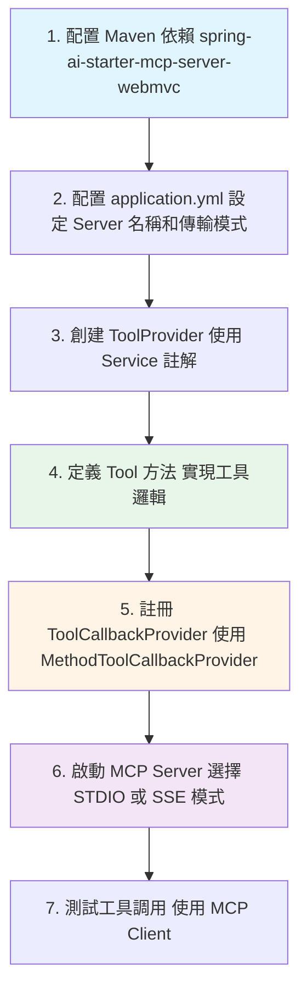

# 9.3 MCP Server 工具開發

> **對應章節**: 實戰開發
> **難度**: ⭐⭐⭐☆☆
> **學習時間**: 75 分鐘

---

## 📚 本章概要

掌握如何使用 Spring AI 開發 MCP Server，提供標準化的工具服務給 AI 模型調用。本章將從 Maven 配置開始，學習如何使用 `@Tool` 註解定義工具，並透過 `ToolCallbackProvider` 註冊工具，支援 STDIO 和 SSE 雙傳輸模式。

**學習目標**:
- 配置 Spring AI MCP Server 專案
- 使用 @Tool 註解開發工具
- 註冊和管理 ToolCallbackProvider
- 支援 STDIO 和 SSE 雙傳輸模式
- 整合外部 API 服務

**對應範例專案**: `code-examples/chapter9-mcp-integration/chapter9-mcp-server-tools-resources`

---

## 🎯 MCP Server 架構概覽



---

## 🔧 專案配置

### Maven 依賴

MCP Server 開發需要以下核心依賴：

```xml
<!-- Spring AI MCP Server WebMVC -->
<dependency>
    <groupId>org.springframework.ai</groupId>
    <artifactId>spring-ai-starter-mcp-server-webmvc</artifactId>
</dependency>

<!-- WebFlux (用於調用外部 API) -->
<dependency>
    <groupId>org.springframework.boot</groupId>
    <artifactId>spring-boot-starter-webflux</artifactId>
</dependency>
```

**對應檔案**: `chapter9-mcp-server-tools-resources/pom.xml:38-48`

**版本管理**:
- Spring Boot: 3.5.7
- Spring AI: 1.0.3
- Java: 21

---

### application.yml 配置

```yaml
spring:
  ai:
    mcp:
      server:
        # Server 基本資訊
        name: tools-resources-server
        version: 1.0.0

        # Server 類型（同步）
        type: SYNC

        # STDIO 模式開關（false=SSE, true=STDIO）
        stdio: false

        # SSE 端點配置（當 stdio=false 時使用）
        sse-message-endpoint: /mcp/message

        # 變更通知功能
        tool-change-notification: true

server:
  port: 8080  # SSE 模式的 HTTP 埠號
```

**對應檔案**: `chapter9-mcp-server-tools-resources/src/main/resources/application.yml:1-27`

**配置說明**:

| 配置項 | 說明 | 值 |
|--------|------|-----|
| `name` | Server 名稱 | 自定義，建議語義化 |
| `type` | 處理模式 | SYNC（同步）/ ASYNC（異步） |
| `stdio` | 傳輸模式 | true=STDIO, false=SSE |
| `sse-message-endpoint` | SSE 端點路徑 | 預設 `/mcp/message` |
| `tool-change-notification` | 工具變更通知 | true=啟用動態更新 |

---

## 🛠️ 開發 MCP 工具

### 使用 @Tool 註解

Spring AI 提供了 `@Tool` 註解來定義 MCP 工具，這是官方推薦的方式。

#### 基礎工具範例：數學運算

```java
@Service
@Slf4j
public class MathToolProvider {

    @Tool(description = "Calculate the sum of multiple numbers")
    public double sum(double... numbers) {
        log.info("執行加法運算: {}", Arrays.toString(numbers));

        if (numbers == null || numbers.length == 0) {
            return 0.0;
        }

        double result = Arrays.stream(numbers).sum();
        log.info("加法結果: {} = {}", Arrays.toString(numbers), result);

        return result;
    }

    @Tool(description = "Divide two numbers (dividend / divisor)")
    public double divide(double dividend, double divisor) {
        log.info("執行除法運算: {} ÷ {}", dividend, divisor);

        if (divisor == 0) {
            throw new ArithmeticException("除數不能為零");
        }

        return dividend / divisor;
    }
}
```

**對應檔案**: `chapter9-mcp-server-tools-resources/src/main/java/com/example/mcp/server/provider/tool/MathToolProvider.java:23-81`

**關鍵要點**:
- 使用 `@Service` 將類別註冊為 Spring Bean
- 使用 `@Tool(description = "...")` 標註可調用的方法
- description 會顯示給 AI 模型，幫助其理解工具用途
- 方法參數會自動轉換為工具參數
- 支援基本類型、陣列、可變參數

---

#### 進階工具範例：外部 API 整合

```java
@Service
@Slf4j
public class WeatherToolProvider {

    private final WebClient webClient;

    public WeatherToolProvider() {
        this.webClient = WebClient.create();
    }

    @Tool(description = "Get weather temperature for a specific location using latitude and longitude coordinates")
    public WeatherResponse getTemperature(double latitude, double longitude, String city) {

        log.info("查詢天氣 - 城市: {}, 緯度: {}, 經度: {}", city, latitude, longitude);

        try {
            // 調用 Open-Meteo API
            WeatherResponse response = webClient
                .get()
                .uri("https://api.open-meteo.com/v1/forecast?latitude={latitude}&longitude={longitude}&current=temperature_2m",
                        latitude, longitude)
                .retrieve()
                .bodyToMono(WeatherResponse.class)
                .block();

            if (response != null && response.getCurrent() != null) {
                log.info("天氣查詢成功 - 城市: {}, 溫度: {}°C",
                        city, response.getCurrent().getTemperature());
            }

            return response;

        } catch (Exception e) {
            log.error("查詢天氣失敗 - 城市: {}, 錯誤: {}", city, e.getMessage());
            throw new RuntimeException("無法獲取天氣資訊: " + e.getMessage(), e);
        }
    }
}
```

**對應檔案**: `chapter9-mcp-server-tools-resources/src/main/java/com/example/mcp/server/provider/tool/WeatherToolProvider.java:37-63`

**技術亮點**:
- 使用 `WebClient` 調用外部 REST API
- 整合 Open-Meteo 免費天氣服務
- 完整的錯誤處理和日誌記錄
- 支援自定義回應模型（WeatherResponse）

---

## 📦 註冊 ToolCallbackProvider

定義好工具後，需要在主程式中註冊 `ToolCallbackProvider`，Spring AI 會自動掃描並暴露這些工具。

### 主程式配置

```java
@SpringBootApplication
@Slf4j
public class McpServerApplication {

    public static void main(String[] args) {
        SpringApplication.run(McpServerApplication.class, args);
    }

    /**
     * 註冊數學工具
     */
    @Bean
    public ToolCallbackProvider mathTools(MathToolProvider mathToolProvider) {
        return MethodToolCallbackProvider.builder()
                .toolObjects(mathToolProvider)
                .build();
    }

    /**
     * 註冊天氣工具
     */
    @Bean
    public ToolCallbackProvider weatherTools(WeatherToolProvider weatherToolProvider) {
        return MethodToolCallbackProvider.builder()
                .toolObjects(weatherToolProvider)
                .build();
    }

    /**
     * 註冊文本工具
     */
    @Bean
    public ToolCallbackProvider textTools(TextToolProvider textToolProvider) {
        return MethodToolCallbackProvider.builder()
                .toolObjects(textToolProvider)
                .build();
    }

    /**
     * 註冊時間工具
     */
    @Bean
    public ToolCallbackProvider timeTools(TimeToolProvider timeToolProvider) {
        return MethodToolCallbackProvider.builder()
                .toolObjects(timeToolProvider)
                .build();
    }
}
```

**對應檔案**: `chapter9-mcp-server-tools-resources/src/main/java/com/example/mcp/server/McpServerApplication.java:53-97`

**註冊流程**:



**重要概念**:
- 每個 `ToolCallbackProvider` Bean 對應一組工具
- 可以將多個 Provider 類別傳給 `.toolObjects()` 方法
- Spring AI 會自動合併所有 `ToolCallbackProvider` Bean
- 工具名稱預設為方法名稱，可透過 `@Tool(name = "...")` 自定義

---

## 🔄 雙傳輸模式支援

MCP Server 支援兩種傳輸模式，適用於不同場景。

### STDIO 模式（標準輸入輸出）

**適用場景**:
- 本地開發和測試
- 命令行工具整合
- 低延遲要求

**啟動方式**:

```powershell
# 方式一：修改 application.yml
spring.ai.mcp.server.stdio: true

# 方式二：使用啟動參數
mvn spring-boot:run -Dspring-boot.run.arguments="--spring.ai.mcp.server.stdio=true"
```

**通訊方式**:
- 透過標準輸入（stdin）接收 JSON-RPC 請求
- 透過標準輸出（stdout）回傳 JSON-RPC 回應
- 適合本地程序間通訊（IPC）

---

### SSE 模式（Server-Sent Events）

**適用場景**:
- 遠端服務整合
- HTTP/Web 環境
- 生產環境部署

**啟動方式**:

```powershell
# 預設即為 SSE 模式
mvn spring-boot:run
```

**端點配置**:
- HTTP 端點: `http://localhost:8080/mcp/message`
- 支援 POST 請求傳送 JSON-RPC
- 回應格式: Server-Sent Events 串流

**測試範例**:

```bash
# 測試 MCP Server 工具列表
curl -X POST http://localhost:8080/mcp/message \
  -H "Content-Type: application/json" \
  -d '{
    "jsonrpc": "2.0",
    "id": 1,
    "method": "tools/list",
    "params": {}
  }'
```

---

### 傳輸模式比較

| 特性 | STDIO 模式 | SSE 模式 |
|------|-----------|---------|
| **通訊方式** | 標準輸入/輸出 | HTTP 端點 |
| **網路需求** | 無需網路 | 需要 HTTP 連線 |
| **適用環境** | 本地開發、CLI | 遠端服務、生產環境 |
| **延遲** | 極低 | 中等（依網路） |
| **調試方式** | 命令行日誌 | curl、Postman |
| **安全性** | 僅限本地訪問 | 需配置認證授權 |
| **可擴展性** | 單一程序 | 支援分散式部署 |

---

## 🚀 啟動和測試

### 編譯專案

```powershell
# 設定 Java 21 環境
$env:JAVA_HOME="D:\java\jdk-21"
$env:Path="D:\java\jdk-21\bin;$env:Path"

# 編譯
cd E:\Spring_AI_BOOK\code-examples\chapter9-mcp-integration\chapter9-mcp-server-tools-resources
mvn clean compile
```

---

### 啟動 MCP Server

#### STDIO 模式

```powershell
mvn spring-boot:run -Dspring-boot.run.arguments="--spring.ai.mcp.server.stdio=true"
```

#### SSE 模式

```powershell
mvn spring-boot:run
```

**啟動成功日誌**:

```
========================================
  啟動 MCP Server - 工具與資源
  Spring AI 1.0.3 穩定版
========================================
... Spring Boot 啟動日誌 ...
========================================
  MCP Server 已啟動完成
========================================
```

---

### 工具清單

本專案提供的工具：

| 工具名稱 | Provider | 說明 | 參數 |
|---------|----------|------|------|
| `sum` | MathToolProvider | 計算多個數字的總和 | numbers（可變參數） |
| `multiply` | MathToolProvider | 計算多個數字的乘積 | numbers（可變參數） |
| `divide` | MathToolProvider | 兩數相除 | dividend, divisor |
| `sqrt` | MathToolProvider | 計算平方根 | number |
| `getTemperature` | WeatherToolProvider | 獲取天氣溫度 | latitude, longitude, city |
| `toUpperCase` | TextToolProvider | 轉換為大寫 | text |
| `toLowerCase` | TextToolProvider | 轉換為小寫 | text |
| `wordCount` | TextToolProvider | 計算單字數量 | text |
| `getCurrentTime` | TimeToolProvider | 獲取當前時間 | timezone（可選） |

---

### 測試工具調用

使用 `chapter9-mcp-client-basic` 專案測試：

```java
// 在 MCP Client 中調用 MCP Server 工具
String response = chatClient.prompt()
    .user("台北現在的溫度是多少？緯度25.0330，經度121.5654")
    .call()
    .content();

// AI 會自動調用 getTemperature 工具
// 實際請求: getTemperature(25.0330, 121.5654, "台北")
```

---

## 📝 重點回顧

### 核心開發流程



---

### 關鍵技術點

| 技術點 | 說明 | 重要性 |
|--------|------|--------|
| `@Tool` 註解 | 標記可調用的工具方法 | ⭐⭐⭐⭐⭐ |
| `MethodToolCallbackProvider` | 註冊工具的官方方式 | ⭐⭐⭐⭐⭐ |
| `WebClient` | 整合外部 API 服務 | ⭐⭐⭐⭐ |
| STDIO/SSE 雙模式 | 靈活適應不同部署環境 | ⭐⭐⭐⭐ |
| 錯誤處理 | 確保工具調用的穩定性 | ⭐⭐⭐⭐⭐ |

---

### 最佳實踐

1. **工具描述要清晰**：`@Tool(description = "...")` 的描述會直接影響 AI 對工具的選擇
2. **參數驗證**：在工具方法中加入參數檢查（如除零、負數平方根）
3. **日誌記錄**：記錄工具的調用和執行結果，便於調試和監控
4. **異常處理**：捕獲並轉換異常為有意義的錯誤訊息
5. **模組化設計**：將不同類型的工具分別放在不同的 Provider 中
6. **傳輸模式選擇**：開發用 STDIO，生產用 SSE

---

## 🔗 實戰應用

### 新增自定義工具

假設要新增一個「文件搜尋」工具：

**步驟 1**: 創建 ToolProvider

```java
@Service
@Slf4j
public class DocumentToolProvider {

    @Tool(description = "Search documents by keyword")
    public String searchDocuments(String keyword, int limit) {
        log.info("搜尋文件: 關鍵字={}, 限制={}", keyword, limit);

        // 實現搜尋邏輯（示範）
        List<String> results = performSearch(keyword, limit);

        return String.format("找到 %d 個結果: %s", results.size(), results);
    }

    private List<String> performSearch(String keyword, int limit) {
        // 實際搜尋實作
        return List.of("doc1.pdf", "doc2.docx", "doc3.txt")
            .stream()
            .limit(limit)
            .toList();
    }
}
```

**步驟 2**: 在 McpServerApplication 中註冊

```java
@Bean
public ToolCallbackProvider documentTools(DocumentToolProvider documentToolProvider) {
    return MethodToolCallbackProvider.builder()
            .toolObjects(documentToolProvider)
            .build();
}
```

完成！工具會自動暴露為 MCP Tool，可被 Client 調用。

---

## 🚀 下一步

現在你已經掌握了 MCP Server 的基礎工具開發，接下來我們將學習：

👉 [9.4 MCP Server 進階特性](./9.4-MCP-Server-進階特性.md) - Prompts、Completions、動態工具更新

---

## 📚 參考資源

### 官方文檔
- [Spring AI MCP Server Documentation](https://docs.spring.io/spring-ai/reference/api/mcp/)
- [MCP Tools Specification](https://spec.modelcontextprotocol.io/specification/basic/tools/)
- [Spring AI @Tool Annotation](https://docs.spring.io/spring-ai/reference/api/functions.html)

### 範例專案
- [本章範例: chapter9-mcp-server-tools-resources](../../code-examples/chapter9-mcp-integration/chapter9-mcp-server-tools-resources/)
- [Spring AI Examples - MCP Server](https://github.com/spring-projects/spring-ai-examples/tree/main/model-context-protocol)

---

**相關章節**:
- ← 上一章: [9.2 MCP Client 使用](./9.2-MCP-Client-使用.md)
- → 下一章: [9.4 MCP Server 進階特性](./9.4-MCP-Server-進階特性.md)
- ← 回到: [第9章總覽](./README.md)
