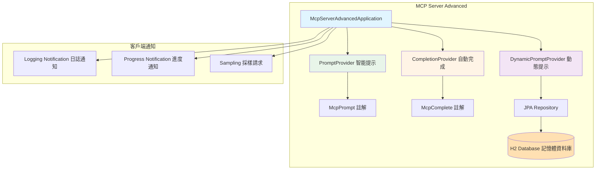
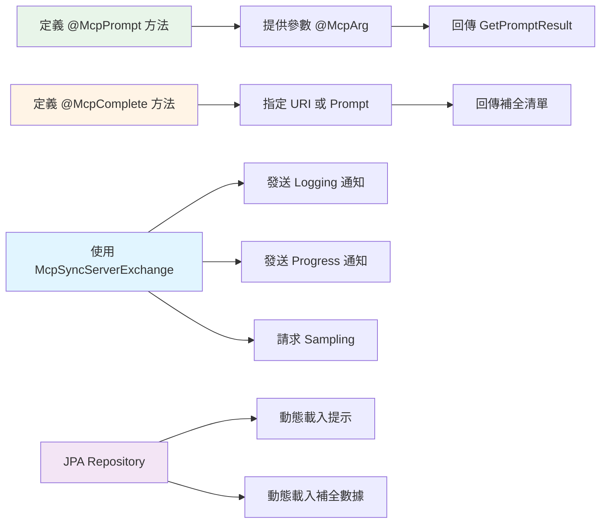

# 9.4 MCP Server 進階特性

> **對應章節**: 進階實戰
> **難度**: ⭐⭐⭐⭐☆
> **學習時間**: 90 分鐘

---

## 📚 本章概要

深入掌握 MCP Server 的進階功能，包括智能提示系統（Prompts）、自動完成（Completions）、動態工具更新、客戶端通知等企業級特性。本章將使用 Spring AI 的高階註解和 JPA 整合，實現更複雜的 MCP 應用場景。

**學習目標**:
- 使用 @McpPrompt 開發智能提示系統
- 使用 @McpComplete 實現自動完成功能
- 掌握客戶端通知機制（Logging、Progress、Sampling）
- 整合資料庫實現動態功能
- 理解 MCP Server 的進階部署策略

**對應範例專案**: `code-examples/chapter9-mcp-integration/chapter9-mcp-server-advanced`

---

## ⚠️ 版本要求

**重要提示**: 本章功能需要 **Spring AI 1.1.0-SNAPSHOT** 或更高版本。

進階 MCP 功能（`@McpPrompt`、`@McpComplete` 等註解）在 Spring AI 1.0.3 穩定版中不可用。如果你希望使用穩定版本，請跳過本章進階功能，專注於 9.3 章的基礎工具開發。

```xml
<!-- 使用 Spring AI 1.1.0-SNAPSHOT -->
<spring-ai.version>1.1.0-SNAPSHOT</spring-ai.version>
```

---

## 🎯 進階功能架構



---

## 🎨 智能提示系統 (Prompts)

### 使用 @McpPrompt 註解

Spring AI 提供 `@McpPrompt` 註解來定義可重用的智能提示模板。

#### 基礎提示範例

```java
@Service
@Slf4j
public class PromptProvider {

    @McpPrompt(
        name = "greeting",
        description = "Simple greeting prompt"
    )
    public McpSchema.GetPromptResult greeting(
            @McpArg(name = "name", required = true, description = "User's name")
            String name) {

        log.info("生成問候提示: name={}", name);

        String message = String.format("Hello, %s! How can I help you today?", name);

        return new McpSchema.GetPromptResult(
            "Greeting",
            List.of(new McpSchema.PromptMessage(
                McpSchema.Role.ASSISTANT,
                new McpSchema.TextContent(message)
            ))
        );
    }
}
```

**對應檔案**: `chapter9-mcp-server-advanced/src/main/java/com/example/mcp/server/advanced/provider/PromptProvider.java:28-46`

**關鍵要點**:
- `@McpPrompt` 定義提示名稱和描述
- `@McpArg` 定義提示參數（可標記必填項）
- 回傳 `GetPromptResult` 包含一個或多個 `PromptMessage`
- 支援 `Role.USER`、`Role.ASSISTANT`、`Role.SYSTEM`

---

#### 進階提示：條件邏輯

```java
@McpPrompt(
    name = "personalized-message",
    description = "Personalized message based on user info (name, age, interests)"
)
public McpSchema.GetPromptResult personalizedMessage(
        McpSyncServerExchange exchange,
        @McpArg(name = "name", required = true, description = "User's name") String name,
        @McpArg(name = "age", required = false, description = "User's age") Integer age,
        @McpArg(name = "interests", required = false, description = "User's interests") String interests) {

    StringBuilder message = new StringBuilder("Hello, " + name + "!\n\n");

    // 根據年齡添加不同內容
    if (age != null) {
        if (age < 18) {
            message.append("You're young and full of potential! The world is yours to explore.\n");
        } else if (age < 30) {
            message.append("This is a great time to build your future.\n");
        } else {
            message.append("You have gained valuable life experience and wisdom.\n");
        }
    }

    // 根據興趣添加內容
    if (interests != null && !interests.isEmpty()) {
        message.append("I see you're interested in ").append(interests).append(".\n");
    }

    return new McpSchema.GetPromptResult(
        "Personalized Message",
        List.of(new McpSchema.PromptMessage(
            McpSchema.Role.ASSISTANT,
            new McpSchema.TextContent(message.toString())
        ))
    );
}
```

**對應檔案**: `chapter9-mcp-server-advanced/src/main/java/com/example/mcp/server/advanced/provider/PromptProvider.java:58-112`

**技術亮點**:
- 支援可選參數（`required = false`）
- 條件邏輯根據參數動態生成內容
- 可注入 `McpSyncServerExchange` 發送客戶端通知

---

#### 多訊息對話流程

```java
@McpPrompt(
    name = "conversation-starter",
    description = "Multi-message conversation flow for learning a topic"
)
public McpSchema.GetPromptResult conversationStarter(
        @McpArg(name = "topic", required = true, description = "Topic to learn about")
        String topic) {

    List<McpSchema.PromptMessage> messages = new ArrayList<>();

    // 用戶初始請求
    messages.add(new McpSchema.PromptMessage(
        McpSchema.Role.USER,
        new McpSchema.TextContent("I want to learn about " + topic)
    ));

    // 助手回應
    messages.add(new McpSchema.PromptMessage(
        McpSchema.Role.ASSISTANT,
        new McpSchema.TextContent(
            "Great! Let's start with the basics of " + topic + ". " +
            "I'll guide you through the fundamental concepts step by step."
        )
    ));

    // 用戶後續問題
    messages.add(new McpSchema.PromptMessage(
        McpSchema.Role.USER,
        new McpSchema.TextContent("What are the key concepts I should understand?")
    ));

    return new McpSchema.GetPromptResult("Conversation Starter", messages);
}
```

**對應檔案**: `chapter9-mcp-server-advanced/src/main/java/com/example/mcp/server/advanced/provider/PromptProvider.java:121-168`

**應用場景**:
- 建立預設對話流程
- 引導用戶進入特定主題
- 提供學習路徑模板

---

### 動態提示（資料庫驅動）

使用 JPA 從資料庫載入提示模板，實現運行時動態管理。

#### 資料模型

```java
@Entity
@Table(name = "prompt_template")
@Data
@NoArgsConstructor
@AllArgsConstructor
public class PromptTemplate {

    @Id
    @GeneratedValue(strategy = GenerationType.IDENTITY)
    private Long id;

    @Column(nullable = false, unique = true)
    private String name;  // 提示名稱

    @Column(length = 1000)
    private String description;  // 提示描述

    @Column(length = 5000)
    private String template;  // 提示模板

    @Column(length = 500)
    private String parameters;  // 參數列表（JSON 格式）
}
```

**實作位置**: `chapter9-mcp-server-advanced/src/main/java/com/example/mcp/server/advanced/entity/PromptTemplate.java`

---

#### 動態提示提供者

```java
@Service
@Slf4j
public class DynamicPromptProvider {

    @Autowired
    private PromptTemplateRepository promptTemplateRepository;

    @McpPrompt(
        name = "template-prompt",
        description = "Dynamic prompt loaded from database by template name"
    )
    public McpSchema.GetPromptResult getTemplatePrompt(
            @McpArg(name = "template_name", required = true) String templateName,
            @McpArg(name = "variables", required = false) String variablesJson) {

        log.info("載入動態提示模板: template={}", templateName);

        // 從資料庫載入模板
        Optional<PromptTemplate> templateOpt = promptTemplateRepository.findByName(templateName);

        if (templateOpt.isEmpty()) {
            return new McpSchema.GetPromptResult(
                "Error",
                List.of(new McpSchema.PromptMessage(
                    McpSchema.Role.ASSISTANT,
                    new McpSchema.TextContent("找不到提示模板: " + templateName)
                ))
            );
        }

        PromptTemplate template = templateOpt.get();
        String content = template.getTemplate();

        // 替換變數（如果有提供）
        if (variablesJson != null) {
            content = replaceVariables(content, variablesJson);
        }

        return new McpSchema.GetPromptResult(
            template.getDescription(),
            List.of(new McpSchema.PromptMessage(
                McpSchema.Role.ASSISTANT,
                new McpSchema.TextContent(content)
            ))
        );
    }
}
```

**實作位置**: `chapter9-mcp-server-advanced/src/main/java/com/example/mcp/server/advanced/provider/DynamicPromptProvider.java`

---

## ✨ 自動完成功能 (Completions)

### URI 補全

為 MCP 資源 URI 提供自動完成建議。

```java
@Service
@Slf4j
public class CompletionProvider {

    @McpComplete(uri = "user-profile://{username}")
    public List<String> completeUsername(String usernamePrefix) {
        log.info("用戶名 URI 補全: prefix={}", usernamePrefix);

        if (usernamePrefix == null || usernamePrefix.isEmpty()) {
            return List.of("Enter a username (e.g., alice, bob, charlie)");
        }

        // 從快取或資料庫載入用戶名列表
        List<String> usernames = loadUsernames();

        // 過濾匹配的用戶名
        return usernames.stream()
            .filter(u -> u.toLowerCase().startsWith(usernamePrefix.toLowerCase()))
            .sorted()
            .limit(10)
            .toList();
    }
}
```

**對應檔案**: `chapter9-mcp-server-advanced/src/main/java/com/example/mcp/server/advanced/provider/CompletionProvider.java:115-137`

**使用場景**:
- 用戶輸入 `user-profile://a` 時，自動建議 `alice`, `andrew`, `amanda`
- 支援動態載入候選清單（從資料庫或 API）

---

### Prompt 參數補全

為提示的參數提供自動完成。

```java
@McpComplete(prompt = "travel-plan")
public McpSchema.CompleteResult completeCountryName(McpSchema.CompleteRequest request) {
    log.info("國家名 Prompt 補全: request={}", request);

    // 取得當前輸入的參數值
    String prefix = extractPrefix(request.argument());

    // 從資料庫載入國家清單
    List<String> countries = loadCountries(prefix);

    // 建立補全結果
    List<CompleteCompletion> completions = countries.stream()
        .map(country -> new CompleteCompletion(country, "country", false))
        .toList();

    return new McpSchema.CompleteResult(completions, false);
}
```

**實作位置**: `chapter9-mcp-server-advanced/src/main/java/com/example/mcp/server/advanced/provider/CompletionProvider.java:146`

**補全格式**:
- `CompleteCompletion(value, type, hasMore)`
- `value`: 補全值
- `type`: 補全類型（可選）
- `hasMore`: 是否還有更多結果

---

### 資料庫驅動的補全

使用 JPA 管理補全數據，支援動態更新。

#### 資料模型

```java
@Entity
@Table(name = "completion_data")
@Data
@NoArgsConstructor
public class CompletionData {

    @Id
    private String category;  // 類別（username, country, language）

    @Convert(converter = StringListConverter.class)
    @Column(length = 5000)
    private List<String> values;  // 補全值列表

    private String description;  // 描述

    private boolean enabled = true;  // 是否啟用
}
```

**實作位置**: `chapter9-mcp-server-advanced/src/main/java/com/example/mcp/server/advanced/entity/CompletionData.java`

#### 初始化補全快取

```java
@PostConstruct
public void initializeCache() {
    log.info("初始化補全數據快取");

    // 從資料庫載入數據到記憶體快取
    loadCacheFromDatabase("username");
    loadCacheFromDatabase("country");
    loadCacheFromDatabase("language");
}

private void loadCacheFromDatabase(String category) {
    Optional<CompletionData> dataOpt = completionDataRepository.findByCategory(category);
    if (dataOpt.isPresent()) {
        List<String> values = dataOpt.get().getValues();
        // 按首字母分組，加速查詢
        cache.put(category, groupByFirstLetter(values));
    }
}
```

**對應檔案**: `chapter9-mcp-server-advanced/src/main/java/com/example/mcp/server/advanced/provider/CompletionProvider.java:39-69`

---

## 🔔 客戶端通知機制

MCP Server 可以主動向客戶端發送通知，增強互動性。

### Logging Notification（日誌通知）

```java
@McpPrompt(name = "personalized-message", description = "...")
public McpSchema.GetPromptResult personalizedMessage(
        McpSyncServerExchange exchange,
        @McpArg(name = "name", required = true) String name,
        ...) {

    // 發送 INFO 日誌
    exchange.loggingNotification(McpSchema.LoggingMessageNotification.builder()
        .level(McpSchema.LoggingLevel.INFO)
        .data("Generating personalized message for: " + name)
        .build());

    // 處理邏輯...

    // 發送完成通知
    exchange.loggingNotification(McpSchema.LoggingMessageNotification.builder()
        .level(McpSchema.LoggingLevel.INFO)
        .data("Personalized message generated successfully")
        .build());

    return result;
}
```

**對應檔案**: `chapter9-mcp-server-advanced/src/main/java/com/example/mcp/server/advanced/provider/PromptProvider.java:71-103`

**日誌級別**:
- `DEBUG`: 調試資訊
- `INFO`: 一般資訊
- `WARNING`: 警告
- `ERROR`: 錯誤

---

### Progress Notification（進度通知）

對於長時間運行的操作，可發送進度更新。

```java
public void processLongRunningTask(McpSyncServerExchange exchange) {
    int totalSteps = 5;

    for (int i = 1; i <= totalSteps; i++) {
        // 發送進度通知
        exchange.progressNotification(McpSchema.ProgressNotification.builder()
            .progressToken("task-123")
            .progress(i)
            .total(totalSteps)
            .build());

        // 執行步驟...
        performStep(i);
    }
}
```

**應用場景**:
- 大檔案處理
- 批次資料分析
- 長時間運算

---

### Sampling Request（採樣請求）

MCP Server 可以請求客戶端的 LLM 生成內容。

```java
@Tool(description = "Generate content using client's LLM")
public String generateWithSampling(McpSyncServerExchange exchange, String prompt) {

    // 發送 Sampling 請求
    McpSchema.CreateMessageRequest samplingRequest = McpSchema.CreateMessageRequest.builder()
        .messages(List.of(new McpSchema.SamplingMessage(
            McpSchema.Role.USER,
            new McpSchema.TextContent(prompt)
        )))
        .maxTokens(1000)
        .build();

    McpSchema.CreateMessageResult result = exchange.createMessage(samplingRequest);

    return extractContent(result);
}
```

**使用場景**:
- 利用客戶端的 LLM 能力
- 減少 Server 端的模型負擔
- 讓客戶端控制生成策略

---

## 🗄️ 資料庫整合

### H2 記憶體資料庫配置

```yaml
spring:
  datasource:
    url: jdbc:h2:mem:mcpdb
    driver-class-name: org.h2.Driver
    username: sa
    password:

  jpa:
    hibernate:
      ddl-auto: create-drop  # 每次啟動重建資料庫
    show-sql: true           # 顯示 SQL 語句

  h2:
    console:
      enabled: true          # 啟用 H2 Console
      path: /h2-console      # Console 路徑

  sql:
    init:
      mode: always
      data-locations: classpath:data.sql  # 初始化數據腳本
```

**對應檔案**: `chapter9-mcp-server-advanced/src/main/resources/application.yml:31-58`

---

### 資料初始化腳本

```sql
-- data.sql
-- 插入提示模板
INSERT INTO prompt_template (name, description, template, parameters) VALUES
('code-review', 'Code review template',
 'Please review the following {{language}} code:\n\n{{code}}\n\nProvide feedback on:',
 '["language", "code"]');

-- 插入補全數據
INSERT INTO completion_data (category, values, description, enabled) VALUES
('username', '["alice", "bob", "charlie", "david"]', 'User names', true),
('country', '["Japan", "Taiwan", "United States"]', 'Country names', true),
('language', '["Java", "Python", "JavaScript"]', 'Programming languages', true);
```

**實作位置**: `chapter9-mcp-server-advanced/src/main/resources/data.sql`

---

## 📝 配置和啟動

### application.yml 核心配置

```yaml
spring:
  ai:
    mcp:
      server:
        name: advanced-server
        version: 1.0.0
        type: SYNC

        # 啟用變更通知
        prompt-change-notification: true
        tool-change-notification: true
        resource-change-notification: true

server:
  port: 8081  # 避免與 8080 衝突
```

**對應檔案**: `chapter9-mcp-server-advanced/src/main/resources/application.yml:1-23`

---

### 編譯和啟動

```powershell
# 設定環境
$env:JAVA_HOME="D:\java\jdk-21"
$env:Path="D:\java\jdk-21\bin;$env:Path"

# 編譯
cd E:\Spring_AI_BOOK\code-examples\chapter9-mcp-integration\chapter9-mcp-server-advanced
mvn clean compile

# 啟動
mvn spring-boot:run
```

**啟動後訪問**:
- 應用程式: http://localhost:8081
- H2 Console: http://localhost:8081/h2-console
  - JDBC URL: `jdbc:h2:mem:mcpdb`
  - Username: `sa`
  - Password: (空白)

---

## 🚀 測試進階功能

### 測試 Prompts

使用 MCP Client 調用提示：

```java
// 調用簡單問候提示
McpSchema.GetPromptRequest request = new McpSchema.GetPromptRequest(
    "greeting",
    Map.of("name", "Alice")
);
McpSchema.GetPromptResult result = mcpClient.getPrompt(request);

// 調用個性化訊息
request = new McpSchema.GetPromptRequest(
    "personalized-message",
    Map.of("name", "Bob", "age", 25, "interests", "programming")
);
result = mcpClient.getPrompt(request);
```

---

### 測試 Completions

```java
// 測試 URI 補全
McpSchema.CompleteRequest completeRequest = new McpSchema.CompleteRequest(
    new McpSchema.ResourceReference("user-profile://a"),
    new McpSchema.CompleteArgument("username", "a")
);
McpSchema.CompleteResult completions = mcpClient.complete(completeRequest);

// 結果: ["alice", "andrew", "amanda"]
```

---

## 📊 重點回顧

### 功能對照表

| 功能 | 註解 | 用途 | 重要性 |
|------|------|------|--------|
| **智能提示** | `@McpPrompt` | 可重用提示模板 | ⭐⭐⭐⭐⭐ |
| **自動完成** | `@McpComplete` | URI 和參數補全 | ⭐⭐⭐⭐ |
| **Logging 通知** | `exchange.loggingNotification` | 日誌發送 | ⭐⭐⭐ |
| **Progress 通知** | `exchange.progressNotification` | 進度更新 | ⭐⭐⭐ |
| **Sampling** | `exchange.createMessage` | 請求 LLM 生成 | ⭐⭐⭐⭐ |
| **資料庫整合** | JPA + H2 | 動態管理 | ⭐⭐⭐⭐ |

---

### 進階特性流程



---

### 最佳實踐

1. **提示設計**
   - 清晰的參數描述（`@McpArg description`）
   - 合理的預設值處理
   - 支援可選參數增強靈活性

2. **補全優化**
   - 使用快取減少資料庫查詢
   - 限制回傳數量（避免過載）
   - 按需載入（lazy loading）

3. **通知使用**
   - 適當的日誌級別（避免過多 DEBUG）
   - 長時間任務必須發送進度
   - Sampling 請求要設定合理的 token 限制

4. **資料庫管理**
   - 生產環境使用持久化資料庫
   - 定期備份提示模板
   - 版本控制提示內容變更

---

## 🔗 與其他章節整合

### 與 9.3 的關係

| 章節 | 功能層級 | 適用場景 |
|------|----------|----------|
| **9.3 基礎工具** | @Tool 註解 | 簡單功能調用 |
| **9.4 進階特性** | @McpPrompt + @McpComplete | 複雜互動場景 |

**整合範例**:

```java
// 結合 @Tool 和 @McpPrompt
@Service
public class EnhancedService {

    // 基礎工具（9.3）
    @Tool(description = "Search documents")
    public String searchDocuments(String query) {
        return performSearch(query);
    }

    // 進階提示（9.4）
    @McpPrompt(name = "search-guide", description = "Guide for effective searching")
    public McpSchema.GetPromptResult searchGuide(
            @McpArg(name = "domain") String domain) {

        return new McpSchema.GetPromptResult(
            "Search Guide",
            List.of(new McpSchema.PromptMessage(
                McpSchema.Role.ASSISTANT,
                new McpSchema.TextContent(
                    "To search effectively in " + domain + ", consider..."
                )
            ))
        );
    }
}
```

---

## 🌟 企業應用場景

### 場景 1: 智能客服提示系統

```java
@McpPrompt(name = "customer-service", description = "Customer service response template")
public McpSchema.GetPromptResult customerServicePrompt(
        @McpArg(name = "issue_type", required = true) String issueType,
        @McpArg(name = "customer_level", required = false) String customerLevel) {

    // 從資料庫載入對應問題類型的回應模板
    String template = loadTemplateByIssueType(issueType);

    // 根據客戶等級調整語氣
    if ("VIP".equals(customerLevel)) {
        template = enhanceForVIP(template);
    }

    return buildPromptResult(template);
}
```

---

### 場景 2: 程式碼審查助手

```java
@McpPrompt(name = "code-review", description = "Code review assistant")
public McpSchema.GetPromptResult codeReviewPrompt(
        @McpArg(name = "language", required = true) String language,
        @McpArg(name = "code", required = true) String code,
        @McpArg(name = "focus", required = false) String focus) {

    String systemMessage = "You are an expert code reviewer for " + language;
    String userMessage = "Please review this code";

    if (focus != null) {
        userMessage += " focusing on " + focus;
    }

    userMessage += ":\n\n" + code;

    return new McpSchema.GetPromptResult("Code Review", List.of(
        new McpSchema.PromptMessage(McpSchema.Role.SYSTEM, new McpSchema.TextContent(systemMessage)),
        new McpSchema.PromptMessage(McpSchema.Role.USER, new McpSchema.TextContent(userMessage))
    ));
}
```

---

## 🚀 下一步

恭喜！你已經完成了第9章的所有內容，掌握了從基礎到進階的完整 MCP 開發技能。

**接下來可以**:
1. 整合前面章節的 RAG、Memory 功能到 MCP Server
2. 部署 MCP Server 到生產環境
3. 開發自己的 MCP 工具生態系統
4. 貢獻到 Spring AI 社群

---

## 📚 參考資源

### 官方文檔
- [Spring AI MCP Documentation](https://docs.spring.io/spring-ai/reference/api/mcp/)
- [MCP Prompts Specification](https://spec.modelcontextprotocol.io/specification/basic/prompts/)
- [MCP Completions Specification](https://spec.modelcontextprotocol.io/specification/basic/completions/)

### 範例專案
- [本章範例: chapter9-mcp-server-advanced](../../code-examples/chapter9-mcp-integration/chapter9-mcp-server-advanced/)
- [Spring AI Examples - MCP Annotations](https://github.com/spring-projects/spring-ai-examples/tree/main/model-context-protocol/mcp-annotations)

---

**相關章節**:
- ← 上一章: [9.3 MCP Server 工具開發](./9.3-MCP-Server-工具開發.md)
- ← 回到: [第9章總覽](./README.md)
