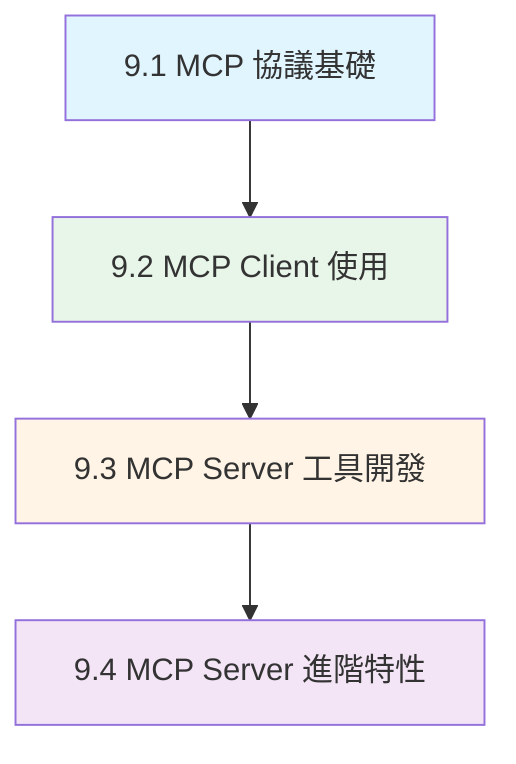

# 第9章 Model Context Protocol (MCP) 整合

> 從協議基礎到企業應用的完整 MCP 開發指南

---

## 📖 章節概覽

本章涵蓋 Spring AI 中 Model Context Protocol (MCP) 的完整知識體系，從協議基礎概念到企業級應用開發，幫助你建構標準化的 AI 工具生態系統。

**對應原文章**: Day23-Day27（規劃中）
**對應範例**: `chapter9-mcp-integration/` 三大專案

---

## 🗺️ 學習路徑



---

## 📚 章節導覽

### 🌟 基礎篇 (9.1)

#### [9.1 MCP 協議基礎](./9.1-MCP-協議基礎.md)
**難度**: ⭐⭐☆☆☆ | **時間**: 45分鐘

理解 MCP 的核心概念、架構設計和協議規範

**核心內容**:
- MCP 核心概念與設計理念
- Client-Server 架構設計
- JSON-RPC 2.0 協議規範
- MCP 在企業中的應用價值

**學習成果**: 完整理解 MCP 協議的工作原理和應用場景

---

### 🚀 Client 篇 (9.2)

#### [9.2 MCP Client 使用](./9.2-MCP-Client-使用.md)
**難度**: ⭐⭐⭐☆☆ | **時間**: 60分鐘

學習如何使用 Spring AI MCP Client 連接和調用 MCP Server

**核心內容**:
- MCP Client 配置（STDIO/SSE）
- 工具發現與調用
- 資源讀取與管理
- 與 ChatClient 整合

**對應範例**: `chapter9-mcp-client-basic`

**學習成果**: 能夠配置 MCP Client 並整合到 Spring AI 應用中

---

### 🛠️ Server 基礎篇 (9.3)

#### [9.3 MCP Server 工具開發](./9.3-MCP-Server-工具開發.md)
**難度**: ⭐⭐⭐☆☆ | **時間**: 75分鐘

開發 MCP Server 提供工具和資源服務

**核心內容**:
- MCP Server 基礎配置
- @Tool 註解開發工具
- ToolCallbackProvider 註冊
- 雙傳輸模式（STDIO/SSE）

**對應範例**: `chapter9-mcp-server-tools-resources`

**學習成果**: 能夠開發基礎的 MCP Server 提供工具服務

---

### 🎓 Server 進階篇 (9.4)

#### [9.4 MCP Server 進階特性](./9.4-MCP-Server-進階特性.md)
**難度**: ⭐⭐⭐⭐☆ | **時間**: 90分鐘

掌握 MCP Server 的進階功能和動態特性

**核心內容**:
- Prompts 智能提示系統
- Completions 自動完成
- 動態工具更新機制
- 客戶端處理器（Progress/Logging/Sampling）

**對應範例**: `chapter9-mcp-server-advanced`

**學習成果**: 能夠開發企業級 MCP Server 的完整功能

---

## 🎯 學習建議

### 初學者路徑 (3-4天)

```
Day 1: 理解 MCP 協議
  └─ 9.1 MCP 協議基礎 (45min)
  └─ 閱讀 MCP 規範文檔
  └─ 了解 Client-Server 架構

Day 2: 使用 MCP Client
  └─ 9.2 MCP Client 使用 (60min)
  └─ 實作: chapter9-mcp-client-basic
  └─ 整合到 ChatClient

Day 3: 開發 MCP Server
  └─ 9.3 MCP Server 工具開發 (75min)
  └─ 實作: chapter9-mcp-server-tools-resources
  └─ 開發自己的工具

Day 4: 進階功能
  └─ 9.4 MCP Server 進階特性 (90min)
  └─ 實作: chapter9-mcp-server-advanced
  └─ 開發完整的 MCP 生態
```

### 專業開發者路徑 (1-2天速成)

```
上午 (4小時):
  └─ 快速瀏覽 9.1 MCP 基礎
  └─ 深入研究 9.2 Client 使用
  └─ 實作: 連接現有 MCP Server

下午 (4小時):
  └─ 實作 9.3 Server 開發
  └─ 研究 9.4 進階特性
  └─ 整合到實際專案
```

---

## 🗂️ 對應範例專案

### chapter9-mcp-client-basic (MCP Client 基礎)
```
📦 功能:
  ✅ STDIO 和 SSE 連接
  ✅ Context7 文檔檢索
  ✅ Brave Search 整合
  ✅ ChatClient 整合
  ✅ 命令行交互

📁 位置: code-examples/chapter9-mcp-integration/chapter9-mcp-client-basic/

🚀 啟動:
  $env:OPENAI_API_KEY="your-key"
  mvn spring-boot:run

🔗 端口: N/A (命令行應用)
```

### chapter9-mcp-server-tools-resources (MCP Server 基礎)
```
📦 功能:
  ✅ @Tool 註解開發
  ✅ 天氣查詢工具
  ✅ 數學運算工具
  ✅ 文本處理工具
  ✅ 雙傳輸模式支援

📁 位置: code-examples/chapter9-mcp-integration/chapter9-mcp-server-tools-resources/

🚀 啟動:
  mvn spring-boot:run
  # 或 STDIO 模式:
  mvn spring-boot:run -Dspring-boot.run.arguments="--spring.ai.mcp.server.stdio=true"

🔗 端口: 8080 (SSE 模式)
```

### chapter9-mcp-server-advanced (MCP Server 進階)
```
📦 功能:
  ✅ @McpPrompt 智能提示
  ✅ @McpComplete 自動完成
  ✅ 動態工具註冊
  ✅ 客戶端處理器
  ✅ JPA 資料庫整合

📁 位置: code-examples/chapter9-mcp-integration/chapter9-mcp-server-advanced/

🚀 啟動:
  mvn spring-boot:run

🔗 端口: 8080
```

---

## 📊 核心概念對照表

| 概念 | 章節 | 對應範例 | 難度 |
|------|------|---------|------|
| MCP 協議基礎 | 9.1 | 理論 | ⭐⭐ |
| Client 配置 | 9.2 | client-basic | ⭐⭐⭐ |
| Server 工具開發 | 9.3 | server-tools-resources | ⭐⭐⭐ |
| Prompts 系統 | 9.4 | server-advanced | ⭐⭐⭐⭐ |
| 動態工具更新 | 9.4 | server-advanced | ⭐⭐⭐⭐ |

---

## 🔗 相關資源

### 官方文檔
- [Model Context Protocol 規範](https://spec.modelcontextprotocol.io/)
- [Spring AI MCP Documentation](https://docs.spring.io/spring-ai/reference/api/mcp/)
- [MCP Java SDK](https://github.com/modelcontextprotocol/java-sdk)

### 參考實現
- [Context7 MCP Server](https://mcp.context7.com/mcp)
- [MCP Servers Repository](https://github.com/modelcontextprotocol/servers)
- [Spring AI Examples - MCP](https://github.com/spring-projects/spring-ai-examples/tree/main/model-context-protocol)

---

## ❓ 常見問題

### Q1: MCP 與 Spring AI Function Calling 有什麼區別?

```
Spring AI Function Calling:
  - Spring AI 內建功能
  - 使用 @Tool 註解直接註冊
  - 適合單一應用內部工具

MCP (Model Context Protocol):
  - 標準化協議
  - 跨應用、跨平台
  - 適合工具共享和生態建設

建議: 兩者可以混用，內部工具用 Function Calling，外部工具用 MCP
```

### Q2: STDIO 和 SSE 傳輸方式如何選擇?

```
STDIO (標準輸入輸出):
  適用: 本地開發、命令行工具、測試環境
  優點: 低延遲、高效能、無需網絡
  缺點: 僅限本地、不支援遠端存取

SSE (Server-Sent Events):
  適用: 遠端服務、HTTP 整合、生產環境
  優點: 支援遠端、易於部署、標準 HTTP
  缺點: 需要網絡、相對較慢

建議: 開發時用 STDIO，生產環境用 SSE
```

### Q3: 如何管理多個 MCP Server?

```
使用 Spring AI MCP Client 配置:

spring.ai.mcp.client.sse.connections:
  server1:
    url: http://localhost:8080
  server2:
    url: http://localhost:8081

所有工具會自動聚合到 SyncMcpToolCallbackProvider
ChatClient 可以統一使用所有工具
```

---

## ✅ 學習檢查清單

完成本章後，你應該能夠:

- [ ] 解釋 MCP 協議的核心概念和工作原理
- [ ] 配置 MCP Client 連接多個 Server
- [ ] 將 MCP 工具整合到 ChatClient
- [ ] 使用 @Tool 註解開發 MCP 工具
- [ ] 配置 STDIO 和 SSE 雙傳輸模式
- [ ] 開發智能提示系統
- [ ] 實現動態工具更新
- [ ] 部署企業級 MCP Server

---

## 🚀 下一步

完成第9章後，你已經掌握了完整的 Spring AI 技術棧！

可以考慮:

1. **實戰專案**: 將所學應用到實際專案
2. **進階優化**: 研究 MCP 的性能優化和安全性
3. **生態貢獻**: 開發通用的 MCP Server 分享給社群

---

**最後更新**: 2025-01-02
**章節維護**: Kevin Tsai
**對應版本**: Spring AI 1.0.3, Spring Boot 3.5.7
