# Spring AI 書籍專案重構規格文件

## 1. 架構與選型

### 1.1 專案目標
將 Spring AI 書籍專案整理為標準化、可執行的教學範例專案，包括：
- ✅ 完整可執行的程式碼範例（code-examples）
- ✅ 精簡的 Markdown 文件（只保留重點片段）
- ✅ 與 Spring AI 官網內容一致性驗證

### 1.2 技術選型

**後端框架**：
- Spring Boot 3.2.x+
- Spring AI 1.0.0+
- Java 21

**建置工具**：
- Maven 3.9+

**AI 服務供應商**：
- OpenAI (GPT-5)
- Gemini (2.5 pro)
- Gemini (2.5 flash image (nano banana 圖形生成))
- Groq (Whisper 語音轉文字)

### 1.3 專案結構設計

```
Spring_AI_BOOK/
├── code-examples/              # 完整可執行程式碼
│   ├── chapter0-prerequisite/     # 第0章：前置知識
│   ├── chapter1-spring-boot-basics/   # 第1章：Spring Boot基礎
│   ├── chapter2-spring-mvc-api/       # 第2章：Spring MVC API
│   ├── chapter3-enterprise-features/  # 第3章：企業級功能
│   ├── chapter4-spring-ai-intro/      # 第4章：Spring AI入門
│   ├── chapter5-spring-ai-advanced/   # 第5章：Spring AI進階
│   ├── chapter6-ai-memory-enhancement/ # 第6章：AI記憶增強
│   ├── chapter7-rag-implementation/   # 第7章：RAG實作
│   ├── chapter8-advanced-rag/         # 第8章：進階RAG
│   └── chapter9-mcp-integration/      # 第9章：MCP整合
├── docs/                      # Markdown文件（精簡版）
│   ├── chapter0/
│   ├── chapter1/
│   ├── ...
│   └── chapter9/
└── images/                    # 圖片資源

```

---

## 2. 資料模型

### 2.1 章節對應關係

| 章節編號 | 章節主題 | Spring AI官網對應 | 程式碼範例類型 |
|---------|---------|------------------|--------------|
| 第0章 | 前置知識 | - | 環境配置、IDE設定 |
| 第1章 | Spring Boot基礎 | Getting Started | CRUD、DI、MVC基礎 |
| 第2章 | Spring MVC API | - | RESTful API、異常處理 |
| 第3章 | 企業級功能 | - | 驗證、檔案上傳、安全 |
| 第4章 | Spring AI入門 | Chat Models, API Keys | ChatClient基礎、流式響應 |
| 第5章 | Spring AI進階 | Prompts, Structured Output, Multimodality | PromptTemplate、Function Calling、多模態 |
| 第6章 | AI記憶增強 | Chat Memory, Advisors | 對話歷史、記憶優化 |
| 第7章 | RAG實作 | RAG, Vector Stores, Embeddings | 文檔處理、向量存儲、檢索 |
| 第8章 | 進階RAG | Advanced RAG Patterns | 查詢優化、重排序、監控 |
| 第9章 | MCP整合 | - | Model Context Protocol |

### 2.2 程式碼範例組織結構

**每個章節專案標準結構**：
```
chapterX-topic-name/
├── pom.xml                    # Maven配置
├── src/
│   ├── main/
│   │   ├── java/
│   │   │   └── com/example/springai/chapterX/
│   │   │       ├── config/       # 配置類
│   │   │       ├── controller/   # 控制器
│   │   │       ├── service/      # 服務層
│   │   │       ├── model/        # 資料模型
│   │   │       └── XxxApplication.java  # 主程式
│   │   └── resources/
│   │       ├── application.yml   # 應用配置
│   │       ├── prompts/          # 提示詞範本
│   │       └── static/           # 靜態資源
│   └── test/                     # 測試程式碼
├── README.md                  # 章節說明
└── .env.example              # 環境變數範例
```

---

## 3. 關鍵流程

### 3.1 專案重構流程

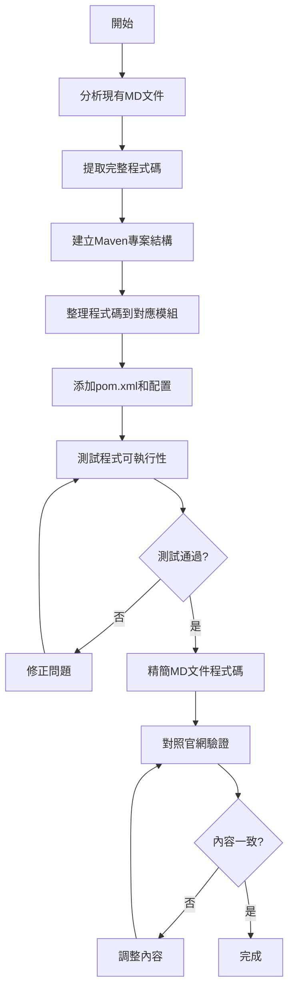

### 3.2 MD文件精簡流程

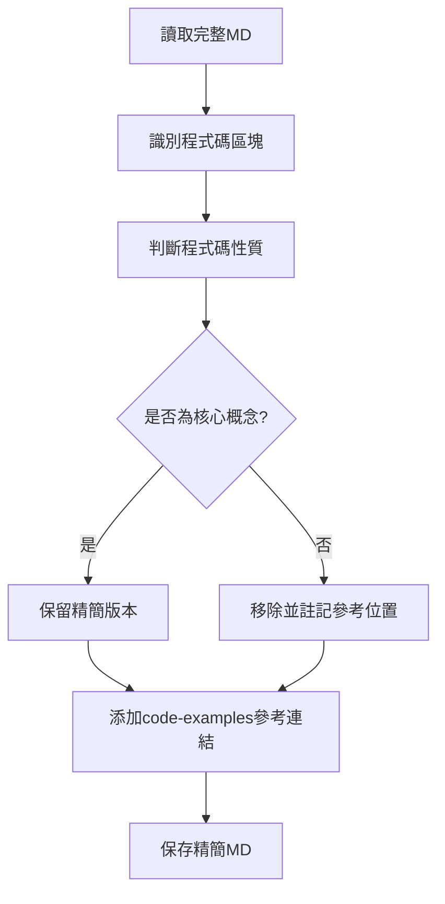

---

## 4. 虛擬碼

### 4.1 程式碼提取與整理

```pseudocode
FUNCTION extractCodeFromMarkdown(mdFile):
    content = READ_FILE(mdFile)
    codeBlocks = EXTRACT_CODE_BLOCKS(content)

    FOR EACH block IN codeBlocks:
        language = GET_LANGUAGE(block)
        fileName = INFER_FILE_NAME(block)
        packagePath = INFER_PACKAGE_PATH(block)

        IF language == "java":
            targetPath = BUILD_PATH(chapterDir, packagePath, fileName)
            WRITE_FILE(targetPath, block.content)
        ELSE IF language == "yaml" OR language == "properties":
            targetPath = BUILD_PATH(chapterDir, "resources", fileName)
            WRITE_FILE(targetPath, block.content)
        ELSE IF language == "xml" AND fileName == "pom.xml":
            targetPath = BUILD_PATH(chapterDir, fileName)
            WRITE_FILE(targetPath, block.content)

    RETURN extractedFiles
END FUNCTION

FUNCTION simplifyMarkdown(mdFile, codeExamplesPath):
    content = READ_FILE(mdFile)
    sections = SPLIT_BY_SECTIONS(content)

    FOR EACH section IN sections:
        codeBlocks = EXTRACT_CODE_BLOCKS(section)

        FOR EACH block IN codeBlocks:
            IF IS_CORE_CONCEPT(block):
                simplified = EXTRACT_KEY_LINES(block, maxLines=20)
                referenceLink = BUILD_REFERENCE_LINK(codeExamplesPath, block)
                REPLACE_BLOCK(section, block, simplified + referenceLink)
            ELSE:
                referenceLink = BUILD_REFERENCE_LINK(codeExamplesPath, block)
                REPLACE_BLOCK(section, block, referenceLink)

    WRITE_FILE(mdFile, REBUILD_CONTENT(sections))
END FUNCTION
```

### 4.2 內容驗證流程

```pseudocode
FUNCTION validateAgainstOfficialDocs(chapterContent, officialDocsUrl):
    officialContent = FETCH_DOCS(officialDocsUrl)

    // 提取關鍵API使用方式
    chapterAPIs = EXTRACT_API_USAGE(chapterContent)
    officialAPIs = EXTRACT_API_USAGE(officialContent)

    differences = []

    FOR EACH api IN chapterAPIs:
        IF api NOT IN officialAPIs:
            differences.ADD({
                type: "API_NOT_IN_OFFICIAL",
                api: api
            })
        ELSE IF NOT IS_USAGE_CORRECT(api, officialAPIs[api]):
            differences.ADD({
                type: "INCORRECT_USAGE",
                api: api,
                expected: officialAPIs[api],
                actual: api
            })

    RETURN differences
END FUNCTION
```

---

## 5. 系統脈絡圖

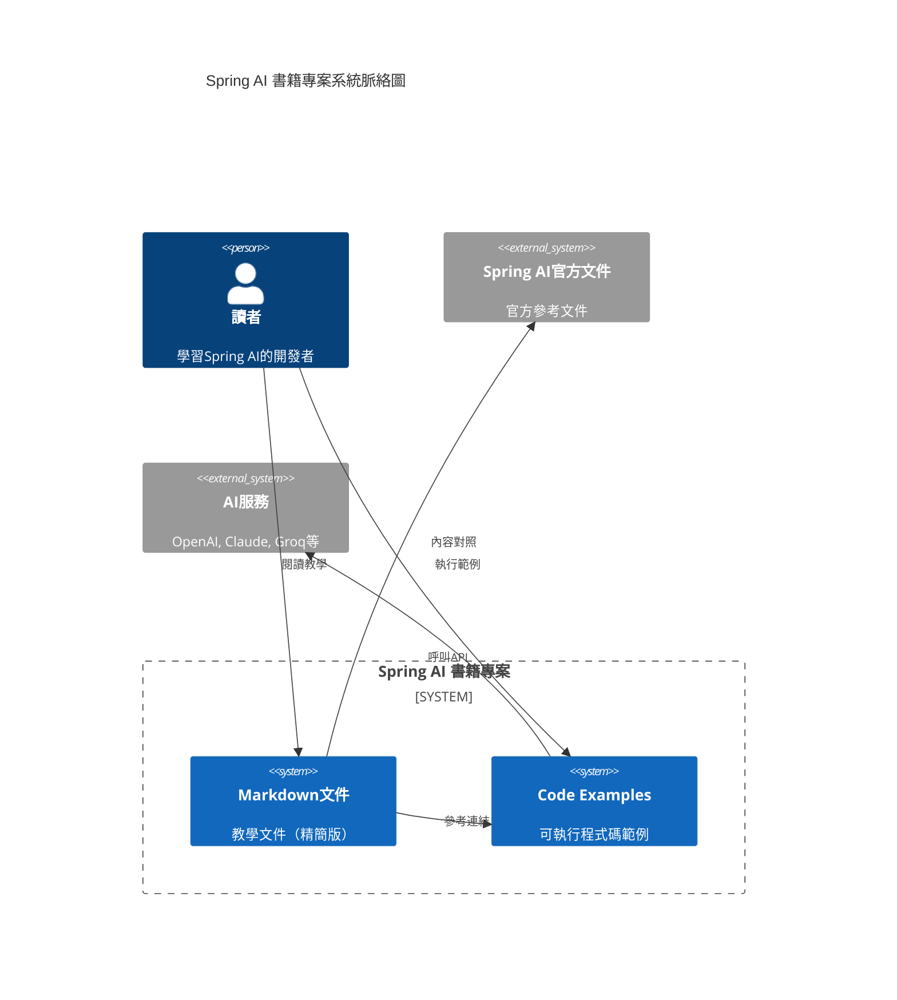

---

## 6. 容器/部署概觀

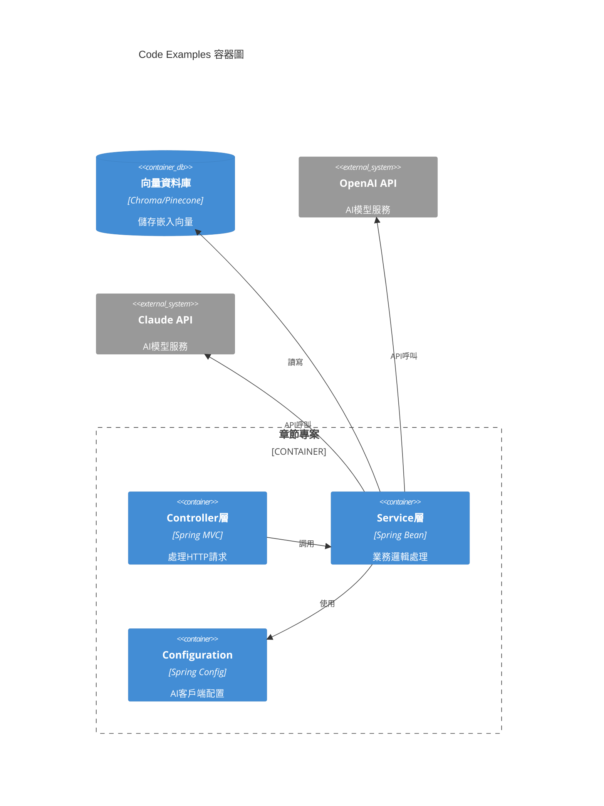

---

## 7. 模組關係圖

### 7.1 Backend模組關係

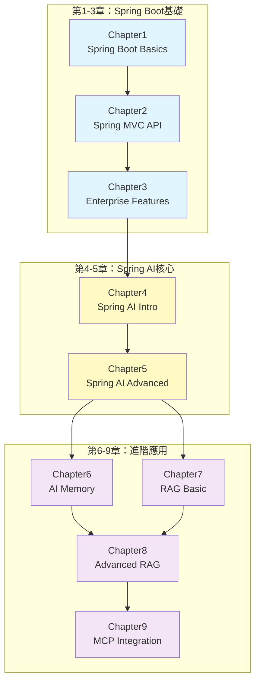

---

## 8. 序列圖

### 8.1 讀者學習流程

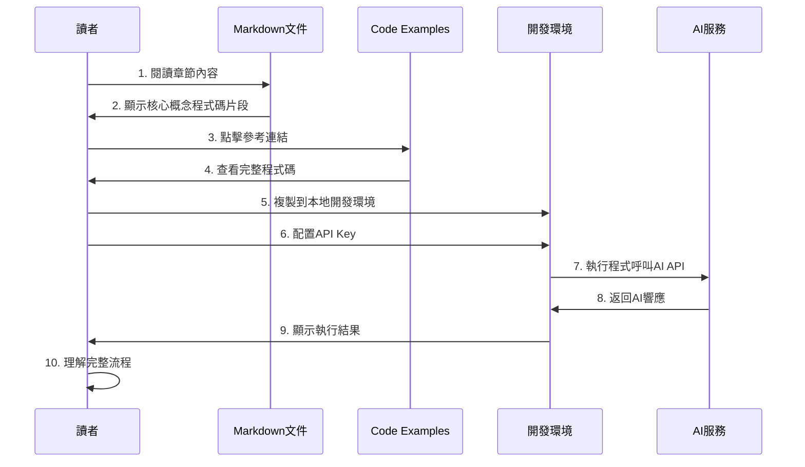

### 8.2 程式碼重構流程

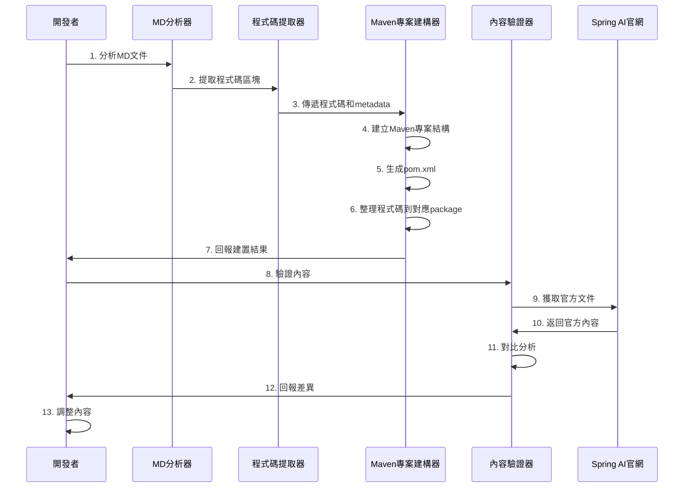

---

## 9. ER圖

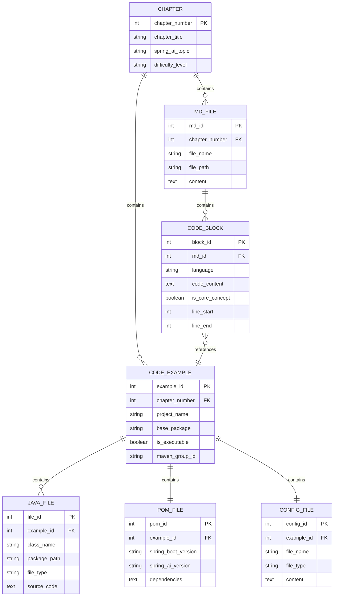

---

## 10. 類別圖（後端關鍵類別）

### 10.1 第4章：Spring AI基礎類別

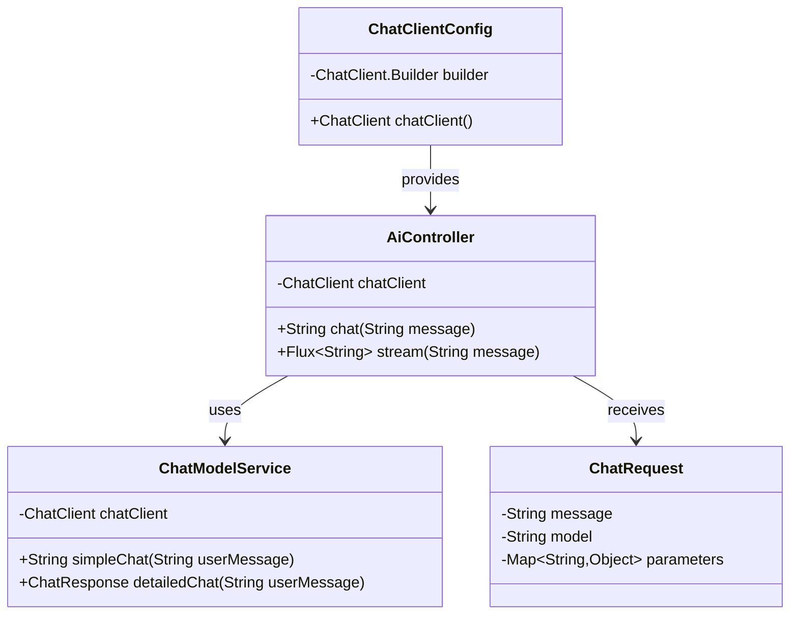

### 10.2 第5章：Spring AI進階類別

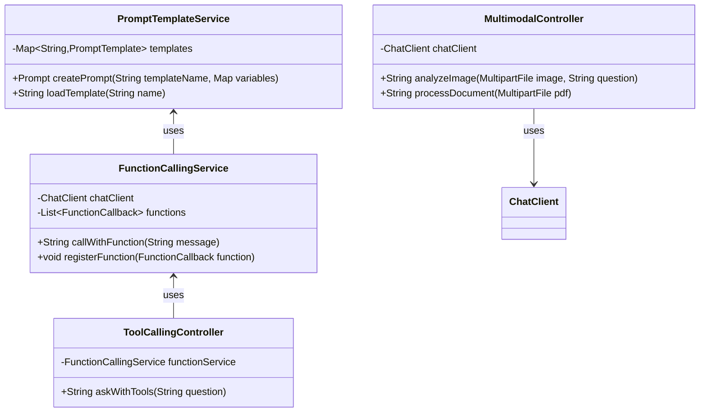

### 10.3 第7章：RAG實作類別

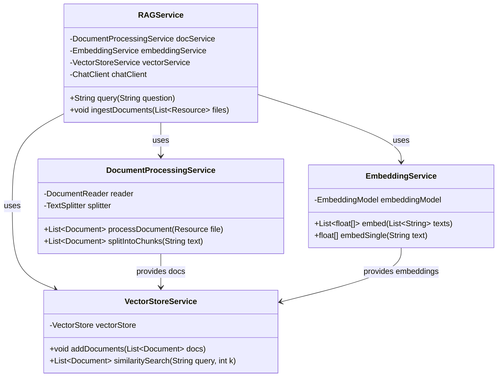

---

## 11. 流程圖

### 11.1 專案重構整體流程

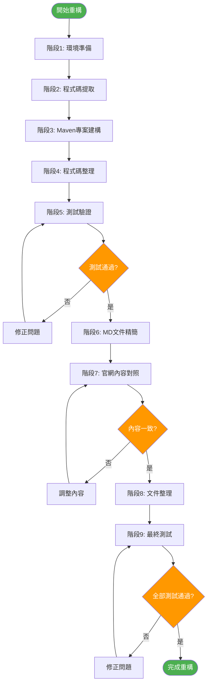

### 11.2 單章節處理流程

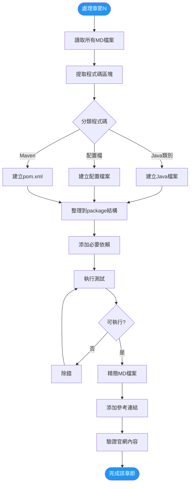

---

## 12. 狀態圖

### 12.1 章節重構狀態機

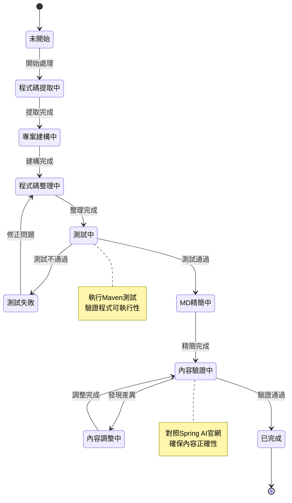

### 12.2 程式碼範例執行狀態

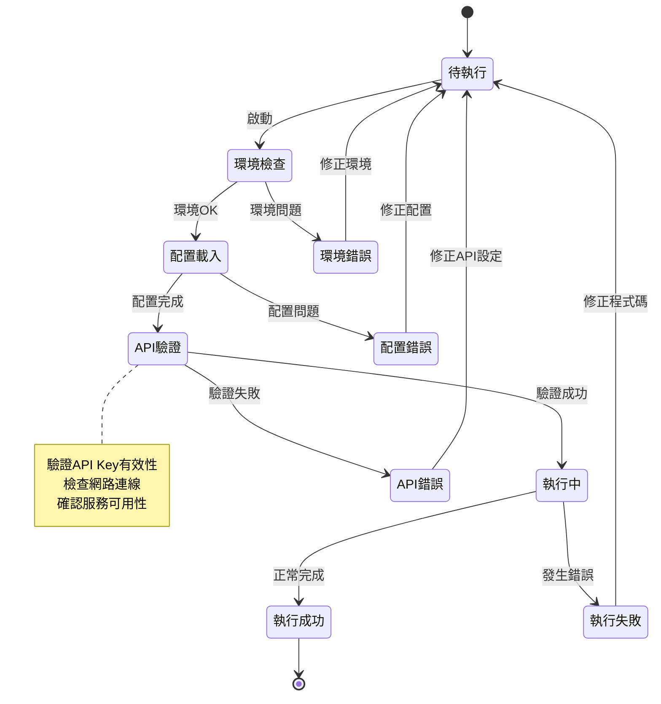

---

## 13. 實施計畫

### 13.1 階段劃分

#### **階段1：環境準備與分析（1天）**
- [ ] 分析所有MD檔案，建立章節清單
- [ ] 對照Spring AI官網，建立主題對應表
- [ ] 準備Maven專案範本
- [ ] 設定開發環境和工具

#### **階段2：第1-3章基礎章節重構（2天）**
- [ ] Chapter 1: Spring Boot Basics
  - [ ] 提取程式碼
  - [ ] 建立Maven專案
  - [ ] 測試執行
  - [ ] 精簡MD
- [ ] Chapter 2: Spring MVC API
- [ ] Chapter 3: Enterprise Features

#### **階段3：第4-5章 Spring AI核心（3天）**
- [ ] Chapter 4: Spring AI Intro
  - [ ] 對照官網Chat Client API
  - [ ] 提取並整理程式碼
  - [ ] 配置AI服務
  - [ ] 測試API呼叫
  - [ ] 精簡MD文件
- [ ] Chapter 5: Spring AI Advanced
  - [ ] 對照官網Prompts、Function Calling
  - [ ] 整理進階範例

#### **階段4：第6章 AI記憶（2天）**
- [ ] 對照官網Chat Memory文件
- [ ] 實作記憶管理範例
- [ ] 測試Advisor功能

#### **階段5：第7-8章 RAG實作（4天）**
- [ ] Chapter 7: RAG Implementation
  - [ ] 對照官網RAG、Vector Stores文件
  - [ ] 實作文檔處理
  - [ ] 實作向量存儲
  - [ ] 測試檢索功能
- [ ] Chapter 8: Advanced RAG
  - [ ] 實作查詢優化
  - [ ] 實作重排序

#### **階段6：第9章 MCP整合（2天）**
- [ ] 實作MCP客戶端
- [ ] 測試整合功能

#### **階段7：整合測試與文件（2天）**
- [ ] 全部章節執行測試
- [ ] 更新README文件
- [ ] 建立總體說明文件
- [ ] Git提交與推送

### 13.2 驗收標準

**程式碼範例**：
- ✅ 每個章節都有完整的Maven專案
- ✅ 所有專案可獨立執行
- ✅ 包含必要的README和配置說明
- ✅ 遵循統一的程式碼規範
- ✅ 通過基本功能測試

**Markdown文件**：
- ✅ 只保留核心概念的精簡程式碼（≤20行）
- ✅ 包含code-examples參考連結
- ✅ 保持文件可讀性和教學價值
- ✅ 與官網內容一致

**內容驗證**：
- ✅ API使用方式符合官網文件
- ✅ 範例程式碼使用最佳實踐
- ✅ 配置方式與官網建議一致
- ✅ 術語和概念正確

---

## 14. 風險與挑戰

### 14.1 潛在風險

| 風險項目 | 影響等級 | 應對策略 |
|---------|---------|---------|
| API Key配置複雜 | 中 | 提供.env.example範本，詳細說明文件 |
| 依賴版本衝突 | 高 | 統一使用Spring Boot BOM管理版本 |
| 官網文件變更 | 中 | 記錄驗證時間點，定期更新 |
| 範例無法執行 | 高 | 每個範例都進行實際測試 |
| MD精簡過度 | 中 | 保留關鍵概念，添加詳細參考連結 |

### 14.2 技術挑戰

1. **向量資料庫選擇**：不同章節可能使用不同向量資料庫，需要統一或提供多種選擇
2. **AI服務成本**：測試時控制API呼叫次數，避免產生過多費用
3. **環境差異**：確保範例在Windows/Mac/Linux都能執行
4. **Java版本相容**：確保Java 21的新特性使用適當

---

## 15. 附錄

### 15.1 參考資源

- [Spring AI 官方文件](https://docs.spring.io/spring-ai/reference/index.html)
- [Spring Boot 官方文件](https://docs.spring.io/spring-boot/docs/current/reference/html/)
- [OpenAI API 文件](https://platform.openai.com/docs)
- [Anthropic Claude API 文件](https://docs.anthropic.com/)

### 15.2 工具與依賴

**開發工具**：
- IntelliJ IDEA / Eclipse / VS Code
- Maven 3.9+
- Git
- Postman / curl（API測試）

**必要依賴**：
```xml
<dependency>
    <groupId>org.springframework.boot</groupId>
    <artifactId>spring-boot-starter-web</artifactId>
</dependency>
<dependency>
    <groupId>org.springframework.ai</groupId>
    <artifactId>spring-ai-openai-spring-boot-starter</artifactId>
</dependency>
```

---

**文件版本**：v1.0
**建立日期**：2025-10-23
**最後更新**：2025-10-23
