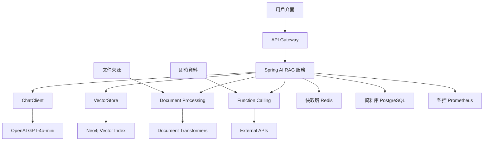

# 使用 Spring AI 打造企業 RAG 知識庫【34】- 最終整合和最佳實踐

## 旅程的終點，也是新的起點


經過前面33天的深入探討，我們已經完整了解了 Spring AI 1.1-SNAPSHOT 的各種功能。今天作為最後一天，將整合所有技術要點，建立一個完整的企業級 RAG 知識庫系統，並分享實戰經驗和最佳實踐。

## 完整系統架構回顧

### 1. 系統架構圖



### 2. 核心元件整合

建立一個統合所有功能的核心服務：

`EnterpriseRagService.java`

```java
@Service
@RequiredArgsConstructor
@Slf4j
public class EnterpriseRagService {
    
    private final ChatClient chatClient;
    private final VectorStore vectorStore;
    private final DocumentProcessingService documentService;
    private final WeatherService weatherService;
    private final IssueService issueService;
    private final EmbeddingService embeddingService;
    private final MeterRegistry meterRegistry;
    
    /**
     * 統一的RAG查詢入口點
     */
    public RagResponse query(RagRequest request) {
        Timer.Sample sample = Timer.start(meterRegistry);
        
        try {
            // 1. 輸入驗證和預處理
            String processedQuery = preprocessQuery(request.getQuery());
            
            // 2. 根據查詢類型選擇策略
            RagStrategy strategy = selectStrategy(processedQuery, request);
            
            // 3. 執行查詢
            RagResponse response = strategy.execute(processedQuery, request);
            
            // 4. 後處理和結果優化
            response = postProcessResponse(response, request);
            
            // 5. 記錄指標
            recordMetrics(request, response, sample);
            
            return response;
            
        } catch (Exception e) {
            log.error("RAG query failed: {}", e.getMessage(), e);
            meterRegistry.counter("rag.query.error").increment();
            throw new RagException("Query processing failed", e);
        }
    }
    
    private String preprocessQuery(String query) {
        // 查詢預處理：清理、正規化等
        return chatClient.prompt()
            .system("""
                請將以下用戶查詢優化為更適合搜索的格式：
                1. 修正錯字
                2. 提取關鍵概念
                3. 保持原意但使語言更精確
                只返回優化後的查詢，不要額外說明。
                """)
            .user(query)
            .call()
            .content();
    }
    
    private RagStrategy selectStrategy(String query, RagRequest request) {
        // 智能策略選擇
        if (containsWeatherKeywords(query)) {
            return new WeatherRagStrategy(chatClient, weatherService);
        } else if (containsTechnicalKeywords(query)) {
            return new TechnicalRagStrategy(chatClient, vectorStore, issueService);
        } else if (request.isEnableAdvancedRag()) {
            return new AdvancedRagStrategy(chatClient, vectorStore, embeddingService);
        } else {
            return new StandardRagStrategy(chatClient, vectorStore);
        }
    }
    
    private RagResponse postProcessResponse(RagResponse response, RagRequest request) {
        if (request.isEnableFactChecking()) {
            // 事實檢查
            response = performFactChecking(response);
        }
        
        if (request.isEnableResponseOptimization()) {
            // 回應優化
            response = optimizeResponse(response);
        }
        
        return response;
    }
    
    private boolean containsWeatherKeywords(String query) {
        String[] weatherKeywords = {"天氣", "氣溫", "溫度", "下雨", "晴天", "陰天"};
        return Arrays.stream(weatherKeywords)
            .anyMatch(keyword -> query.contains(keyword));
    }
    
    private boolean containsTechnicalKeywords(String query) {
        String[] techKeywords = {"程式", "錯誤", "bug", "系統", "技術", "開發"};
        return Arrays.stream(techKeywords)
            .anyMatch(keyword -> query.contains(keyword));
    }
}
```

### 3. 策略模式實現

`RagStrategy.java`

```java
public interface RagStrategy {
    RagResponse execute(String query, RagRequest request);
}

@Component
@RequiredArgsConstructor
public class AdvancedRagStrategy implements RagStrategy {
    
    private final ChatClient chatClient;
    private final VectorStore vectorStore;
    private final EmbeddingService embeddingService;
    
    @Override
    public RagResponse execute(String query, RagRequest request) {
        // 1. 多階段檢索
        List<Document> primaryResults = vectorStore.similaritySearch(
            SearchRequest.query(query).withTopK(50)
        );
        
        // 2. 使用最佳Embedding模型重新計算相似度
        List<Document> rerankedResults = reRankWithBestModel(query, primaryResults);
        
        // 3. 混合搜索結果
        List<Document> hybridResults = performHybridSearch(query, rerankedResults);
        
        // 4. 構建增強上下文
        String enhancedContext = buildEnhancedContext(hybridResults, query);
        
        // 5. 生成回應
        String response = chatClient.prompt()
            .system(ADVANCED_SYSTEM_PROMPT)
            .user(buildAdvancedUserPrompt(query, enhancedContext))
            .call()
            .content();
        
        return RagResponse.builder()
            .answer(response)
            .sources(convertToSources(hybridResults))
            .confidence(calculateConfidence(hybridResults))
            .strategy("advanced")
            .build();
    }
    
    private List<Document> reRankWithBestModel(String query, List<Document> documents) {
        // 使用最佳embedding模型重新排序
        return embeddingService.reRankDocuments(query, documents);
    }
    
    private List<Document> performHybridSearch(String query, List<Document> vectorResults) {
        // 結合關鍵字搜索和向量搜索
        // 實現細節省略...
        return vectorResults;
    }
    
    private String buildEnhancedContext(List<Document> documents, String query) {
        StringBuilder context = new StringBuilder();
        
        for (int i = 0; i < documents.size(); i++) {
            Document doc = documents.get(i);
            
            // 添加文檔相關性分數
            double relevanceScore = calculateRelevanceScore(doc, query);
            
            context.append(String.format("文檔 %d (相關性: %.2f):\n", i + 1, relevanceScore));
            context.append(String.format("來源: %s\n", getDocumentSource(doc)));
            context.append(String.format("內容: %s\n\n", doc.getContent()));
        }
        
        return context.toString();
    }
    
    private static final String ADVANCED_SYSTEM_PROMPT = """
        你是一個專業的AI助手，擅長基於提供的文檔回答問題。
        
        指導原則：
        1. 優先使用相關性分數高的文檔
        2. 如果多個文檔有衝突資訊，請指出差異
        3. 明確標示資訊來源
        4. 對不確定的資訊表達適當的不確定性
        5. 如果文檔中沒有相關資訊，誠實地說明
        
        請基於提供的文檔回答用戶問題，並在回答中包含適當的來源引用。
        """;
}

@Component  
@RequiredArgsConstructor
public class WeatherRagStrategy implements RagStrategy {
    
    private final ChatClient chatClient;
    private final WeatherService weatherService;
    
    @Override
    public RagResponse execute(String query, RagRequest request) {
        // 使用Function Calling處理天氣查詢
        String response = chatClient.prompt()
            .user(query)
            .functions("getCurrentWeather", "getTemperatureRanking", "getWeatherForecast")
            .call()
            .content();
        
        return RagResponse.builder()
            .answer(response)
            .strategy("weather")
            .confidence(0.95) // 天氣API通常很準確
            .build();
    }
}
```

### 4. 統一請求回應模型

`RagModels.java`

```java
@Data
@Builder
@AllArgsConstructor
@NoArgsConstructor
public class RagRequest {
    private String query;
    private String userId;
    private String sessionId;
    private boolean enableAdvancedRag = false;
    private boolean enableFactChecking = false;
    private boolean enableResponseOptimization = false;
    private int maxResults = 5;
    private double similarityThreshold = 0.7;
    private List<String> preferredSources;
    private Map<String, Object> metadata = new HashMap<>();
}

@Data
@Builder
@AllArgsConstructor
@NoArgsConstructor
public class RagResponse {
    private String answer;
    private List<DocumentSource> sources;
    private double confidence;
    private String strategy;
    private long responseTimeMs;
    private Map<String, Object> metadata = new HashMap<>();
    private List<String> warnings = new ArrayList<>();
}

@Data
@Builder
@AllArgsConstructor
@NoArgsConstructor
public class DocumentSource {
    private String id;
    private String title;
    private String source;
    private String preview;
    private double relevanceScore;
    private String url;
}
```

## 企業級控制器

### 1. RESTful API 設計

`EnterpriseRagController.java`

```java
@RestController
@RequestMapping("/api/v1/rag")
@RequiredArgsConstructor
@Validated
@Tag(name = "Enterprise RAG API", description = "企業級RAG知識庫查詢接口")
public class EnterpriseRagController {
    
    private final EnterpriseRagService ragService;
    private final UserService userService;
    private final AuditService auditService;
    
    @PostMapping("/query")
    @Operation(summary = "執行RAG查詢", description = "基於企業知識庫回答用戶問題")
    @PreAuthorize("hasRole('USER')")
    public ResponseEntity<RagResponse> query(
            @Valid @RequestBody RagRequest request,
            Authentication authentication) {
        
        Instant startTime = Instant.now();
        
        try {
            // 設置用戶信息
            String userId = authentication.getName();
            request.setUserId(userId);
            
            // 用戶權限檢查
            validateUserPermissions(userId, request);
            
            // 執行查詢
            RagResponse response = ragService.query(request);
            response.setResponseTimeMs(Duration.between(startTime, Instant.now()).toMillis());
            
            // 審計日誌
            auditService.logRagQuery(userId, request, response);
            
            return ResponseEntity.ok(response);
            
        } catch (RagException e) {
            log.error("RAG query failed for user {}: {}", 
                authentication.getName(), e.getMessage(), e);
            return ResponseEntity.status(HttpStatus.INTERNAL_SERVER_ERROR)
                .body(RagResponse.builder()
                    .answer("抱歉，查詢處理失敗，請稍後再試。")
                    .confidence(0.0)
                    .responseTimeMs(Duration.between(startTime, Instant.now()).toMillis())
                    .warnings(List.of("系統暫時無法處理您的查詢"))
                    .build());
        }
    }
    
    @PostMapping("/batch-query")
    @Operation(summary = "批次查詢", description = "一次處理多個查詢")
    @PreAuthorize("hasRole('ADMIN')")
    public ResponseEntity<List<RagResponse>> batchQuery(
            @Valid @RequestBody BatchRagRequest request,
            Authentication authentication) {
        
        List<RagResponse> responses = request.getQueries().stream()
            .map(query -> {
                RagRequest ragRequest = RagRequest.builder()
                    .query(query)
                    .userId(authentication.getName())
                    .build();
                return ragService.query(ragRequest);
            })
            .collect(Collectors.toList());
        
        return ResponseEntity.ok(responses);
    }
    
    @GetMapping("/health")
    @Operation(summary = "系統健康檢查")
    public ResponseEntity<HealthStatus> health() {
        HealthStatus status = ragService.checkHealth();
        
        if (status.isHealthy()) {
            return ResponseEntity.ok(status);
        } else {
            return ResponseEntity.status(HttpStatus.SERVICE_UNAVAILABLE).body(status);
        }
    }
    
    @GetMapping("/metrics")
    @Operation(summary = "系統指標")
    @PreAuthorize("hasRole('ADMIN')")
    public ResponseEntity<SystemMetrics> metrics() {
        SystemMetrics metrics = ragService.getSystemMetrics();
        return ResponseEntity.ok(metrics);
    }
    
    private void validateUserPermissions(String userId, RagRequest request) {
        User user = userService.findByUsername(userId);
        
        if (request.isEnableAdvancedRag() && !user.hasRole("PREMIUM")) {
            throw new RagException("Advanced RAG requires premium subscription");
        }
        
        if (request.getPreferredSources() != null) {
            List<String> allowedSources = userService.getAllowedSources(userId);
            boolean hasUnauthorizedSource = request.getPreferredSources().stream()
                .anyMatch(source -> !allowedSources.contains(source));
            
            if (hasUnauthorizedSource) {
                throw new RagException("Access denied to some requested sources");
            }
        }
    }
}
```

### 2. WebSocket 即時互動

`RagWebSocketController.java`

```java
@Controller
@RequiredArgsConstructor
@Slf4j
public class RagWebSocketController {
    
    private final EnterpriseRagService ragService;
    private final SimpMessagingTemplate messagingTemplate;
    
    @MessageMapping("/rag/query")
    @SendTo("/topic/rag/responses")
    public RagResponse handleRagQuery(RagRequest request, Principal principal) {
        request.setUserId(principal.getName());
        return ragService.query(request);
    }
    
    @MessageMapping("/rag/stream")
    public void handleStreamQuery(RagRequest request, Principal principal) {
        request.setUserId(principal.getName());
        
        // 使用流式回應
        ragService.queryStream(request)
            .subscribe(chunk -> {
                messagingTemplate.convertAndSendToUser(
                    principal.getName(),
                    "/queue/rag/stream",
                    chunk
                );
            });
    }
}
```

## 快取和效能優化

### 1. 多層快取策略

`RagCacheConfiguration.java`

```java
@Configuration
@EnableCaching
@RequiredArgsConstructor
public class RagCacheConfiguration {
    
    @Bean("ragCacheManager")
    public CacheManager ragCacheManager() {
        RedisCacheManager.Builder builder = RedisCacheManager
            .RedisCacheManagerBuilder
            .fromConnectionFactory(redisConnectionFactory())
            .cacheDefaults(defaultCacheConfiguration());
            
        // 不同類型的查詢使用不同的快取策略
        Map<String, RedisCacheConfiguration> cacheConfigurations = Map.of(
            "rag-queries", RedisCacheConfiguration.defaultCacheConfig()
                .entryTtl(Duration.ofMinutes(30))
                .prefixCacheNameWith("rag:query:")
                .serializeKeysWith(stringSerializer())
                .serializeValuesWith(jsonSerializer()),
            
            "rag-embeddings", RedisCacheConfiguration.defaultCacheConfig()
                .entryTtl(Duration.ofHours(24))
                .prefixCacheNameWith("rag:embed:")
                .serializeKeysWith(stringSerializer())
                .serializeValuesWith(jsonSerializer()),
                
            "rag-documents", RedisCacheConfiguration.defaultCacheConfig()
                .entryTtl(Duration.ofHours(6))
                .prefixCacheNameWith("rag:doc:")
                .serializeKeysWith(stringSerializer())
                .serializeValuesWith(jsonSerializer())
        );
        
        return builder.withInitialCacheConfigurations(cacheConfigurations).build();
    }
    
    private RedisCacheConfiguration defaultCacheConfiguration() {
        return RedisCacheConfiguration.defaultCacheConfig()
            .entryTtl(Duration.ofMinutes(15))
            .serializeKeysWith(stringSerializer())
            .serializeValuesWith(jsonSerializer())
            .disableCachingNullValues();
    }
}

@Service
@RequiredArgsConstructor
public class CachedRagService {
    
    private final EnterpriseRagService ragService;
    
    @Cacheable(value = "rag-queries", key = "#request.query + '_' + #request.userId", 
               cacheManager = "ragCacheManager")
    public RagResponse queryWithCache(RagRequest request) {
        return ragService.query(request);
    }
    
    @Cacheable(value = "rag-embeddings", key = "#text.hashCode()", 
               cacheManager = "ragCacheManager")
    public List<Double> getEmbeddingWithCache(String text) {
        return ragService.getEmbedding(text);
    }
    
    @CacheEvict(value = {"rag-queries", "rag-documents"}, allEntries = true,
               cacheManager = "ragCacheManager")
    public void clearCache() {
        log.info("RAG cache cleared");
    }
}
```

### 2. 連接池優化

`DatabaseOptimizationConfig.java`

```java
@Configuration
@RequiredArgsConstructor
public class DatabaseOptimizationConfig {
    
    @Bean
    @Primary
    public DataSource optimizedDataSource() {
        HikariConfig config = new HikariConfig();
        
        // 基本連接設置
        config.setJdbcUrl(jdbcUrl);
        config.setUsername(username);
        config.setPassword(password);
        config.setDriverClassName("org.postgresql.Driver");
        
        // 連接池大小調優
        config.setMaximumPoolSize(50);
        config.setMinimumIdle(10);
        config.setConnectionTimeout(30000);
        config.setIdleTimeout(600000);
        config.setMaxLifetime(3600000);
        config.setLeakDetectionThreshold(60000);
        
        // PostgreSQL 專用優化
        config.addDataSourceProperty("cachePrepStmts", "true");
        config.addDataSourceProperty("prepStmtCacheSize", "250");
        config.addDataSourceProperty("prepStmtCacheSqlLimit", "2048");
        config.addDataSourceProperty("useServerPrepStmts", "true");
        config.addDataSourceProperty("useLocalSessionState", "true");
        config.addDataSourceProperty("rewriteBatchedStatements", "true");
        config.addDataSourceProperty("cacheResultSetMetadata", "true");
        config.addDataSourceProperty("cacheServerConfiguration", "true");
        config.addDataSourceProperty("elideSetAutoCommits", "true");
        config.addDataSourceProperty("maintainTimeStats", "false");
        
        return new HikariDataSource(config);
    }
}
```

## 監控和告警系統

### 1. 全面指標收集

`RagMetricsCollector.java`

```java
@Component
@RequiredArgsConstructor
public class RagMetricsCollector {
    
    private final MeterRegistry meterRegistry;
    
    // 計數器
    private final Counter totalQueries;
    private final Counter successfulQueries;
    private final Counter failedQueries;
    
    // 計時器
    private final Timer queryDuration;
    private final Timer embeddingDuration;
    private final Timer vectorSearchDuration;
    
    // 儀表板
    private final Gauge activeConnections;
    private final Gauge cacheHitRate;
    
    @PostConstruct
    public void initializeMetrics() {
        this.totalQueries = Counter.builder("rag.queries.total")
            .description("Total number of RAG queries")
            .register(meterRegistry);
            
        this.successfulQueries = Counter.builder("rag.queries.successful")
            .description("Number of successful RAG queries")
            .register(meterRegistry);
            
        this.failedQueries = Counter.builder("rag.queries.failed")
            .description("Number of failed RAG queries")
            .register(meterRegistry);
            
        this.queryDuration = Timer.builder("rag.query.duration")
            .description("RAG query duration")
            .register(meterRegistry);
            
        this.embeddingDuration = Timer.builder("rag.embedding.duration")
            .description("Embedding generation duration")
            .register(meterRegistry);
            
        this.vectorSearchDuration = Timer.builder("rag.vectorsearch.duration")
            .description("Vector search duration")
            .register(meterRegistry);
            
        this.activeConnections = Gauge.builder("rag.connections.active")
            .description("Active RAG connections")
            .register(meterRegistry, this, RagMetricsCollector::getActiveConnections);
            
        this.cacheHitRate = Gauge.builder("rag.cache.hit.rate")
            .description("RAG cache hit rate")
            .register(meterRegistry, this, RagMetricsCollector::getCacheHitRate);
    }
    
    public void recordQuery(String strategy, String status, Duration duration) {
        totalQueries.increment(Tags.of("strategy", strategy, "status", status));
        
        if ("success".equals(status)) {
            successfulQueries.increment(Tags.of("strategy", strategy));
        } else {
            failedQueries.increment(Tags.of("strategy", strategy, "error", status));
        }
        
        queryDuration.record(duration, Tags.of("strategy", strategy));
    }
    
    public void recordEmbedding(String model, Duration duration) {
        embeddingDuration.record(duration, Tags.of("model", model));
    }
    
    public void recordVectorSearch(int resultCount, Duration duration) {
        vectorSearchDuration.record(duration, Tags.of("result_count", String.valueOf(resultCount)));
    }
    
    private double getActiveConnections() {
        // 實現獲取活躍連接數的邏輯
        return 0.0;
    }
    
    private double getCacheHitRate() {
        // 實現獲取快取命中率的邏輯
        return 0.0;
    }
}
```

### 2. 告警配置

`monitoring/alert-rules.yml`

```yaml
groups:
  - name: rag-system-alerts
    rules:
      - alert: HighRAGQueryFailureRate
        expr: (rate(rag_queries_failed_total[5m]) / rate(rag_queries_total[5m])) > 0.1
        for: 2m
        labels:
          severity: warning
        annotations:
          summary: "High RAG query failure rate"
          description: "RAG query failure rate is {{ $value | humanizePercentage }} over the last 5 minutes"
          
      - alert: SlowRAGQueries
        expr: histogram_quantile(0.95, rate(rag_query_duration_bucket[5m])) > 10
        for: 5m
        labels:
          severity: warning
        annotations:
          summary: "Slow RAG queries"
          description: "95th percentile of RAG query duration is {{ $value }}s"
          
      - alert: LowCacheHitRate
        expr: rag_cache_hit_rate < 0.7
        for: 10m
        labels:
          severity: info
        annotations:
          summary: "Low cache hit rate"
          description: "RAG cache hit rate is {{ $value | humanizePercentage }}"
          
      - alert: VectorStoreDown
        expr: up{job="vectorstore"} == 0
        for: 1m
        labels:
          severity: critical
        annotations:
          summary: "Vector store is down"
          description: "Vector store has been down for more than 1 minute"
```

## 安全和合規

### 1. 資料隱私保護

`DataPrivacyService.java`

```java
@Service
@RequiredArgsConstructor
public class DataPrivacyService {
    
    private final RedisTemplate<String, Object> redisTemplate;
    
    @Value("${app.privacy.anonymization.enabled:true}")
    private boolean anonymizationEnabled;
    
    public String anonymizeQuery(String query, String userId) {
        if (!anonymizationEnabled) {
            return query;
        }
        
        // 移除個人識別資訊
        String anonymized = query
            .replaceAll("\\b\\d{10,}\\b", "[PHONE_NUMBER]") // 電話號碼
            .replaceAll("\\b[A-Za-z0-9._%+-]+@[A-Za-z0-9.-]+\\.[A-Z|a-z]{2,}\\b", "[EMAIL]") // 電子郵件
            .replaceAll("\\b\\d{4}[-\\s]?\\d{4}[-\\s]?\\d{4}[-\\s]?\\d{4}\\b", "[CARD_NUMBER]"); // 信用卡號
        
        // 記錄匿名化動作
        logAnonymization(userId, query, anonymized);
        
        return anonymized;
    }
    
    public void logQueryAccess(String userId, String query, RagResponse response) {
        AccessLog accessLog = AccessLog.builder()
            .userId(userId)
            .queryHash(hashQuery(query)) // 只記錄查詢的雜湊值
            .timestamp(Instant.now())
            .responseSource(response.getStrategy())
            .success(response.getConfidence() > 0.5)
            .build();
        
        // 存儲到審計日誌
        redisTemplate.opsForList().leftPush("access_logs", accessLog);
        
        // 保留最近1000筆記錄
        redisTemplate.opsForList().trim("access_logs", 0, 999);
    }
    
    private String hashQuery(String query) {
        return DigestUtils.sha256Hex(query);
    }
    
    private void logAnonymization(String userId, String original, String anonymized) {
        if (!original.equals(anonymized)) {
            log.info("Query anonymized for user {}: {} -> {}", 
                userId, hashQuery(original), hashQuery(anonymized));
        }
    }
}
```

### 2. 存取控制

`RagAccessControl.java`

```java
@Component
@RequiredArgsConstructor
public class RagAccessControl {
    
    private final UserService userService;
    private final RedisTemplate<String, Object> redisTemplate;
    
    @Value("${app.rate-limit.queries-per-minute:60}")
    private int queriesPerMinute;
    
    public boolean checkRateLimit(String userId) {
        String key = "rate_limit:" + userId + ":" + (System.currentTimeMillis() / 60000);
        
        Long count = redisTemplate.opsForValue().increment(key);
        if (count == 1) {
            redisTemplate.expire(key, Duration.ofMinutes(1));
        }
        
        return count <= queriesPerMinute;
    }
    
    public boolean checkResourceAccess(String userId, String resourceType) {
        User user = userService.findByUsername(userId);
        return user.hasPermission(resourceType);
    }
    
    public boolean checkQueryComplexity(RagRequest request) {
        // 檢查查詢複雜度
        int complexityScore = calculateComplexityScore(request);
        
        String userId = request.getUserId();
        User user = userService.findByUsername(userId);
        
        return complexityScore <= user.getMaxQueryComplexity();
    }
    
    private int calculateComplexityScore(RagRequest request) {
        int score = 0;
        
        // 查詢長度
        score += Math.min(request.getQuery().length() / 10, 10);
        
        // 進階功能
        if (request.isEnableAdvancedRag()) score += 5;
        if (request.isEnableFactChecking()) score += 3;
        if (request.isEnableResponseOptimization()) score += 2;
        
        // 結果數量
        score += Math.min(request.getMaxResults(), 10);
        
        return score;
    }
}
```

## 測試和驗證

### 1. 整合測試

`EnterpriseRagIntegrationTest.java`

```java
@SpringBootTest(webEnvironment = SpringBootTest.WebEnvironment.RANDOM_PORT)
@TestPropertySource(properties = {
    "spring.ai.openai.api-key=test-key",
    "app.test-mode=true"
})
class EnterpriseRagIntegrationTest {
    
    @Autowired
    private TestRestTemplate restTemplate;
    
    @Autowired
    private EnterpriseRagService ragService;
    
    @MockBean
    private VectorStore vectorStore;
    
    @MockBean
    private WeatherService weatherService;
    
    @Test
    @WithMockUser(roles = "USER")
    void testBasicRagQuery() {
        // Given
        RagRequest request = RagRequest.builder()
            .query("什麼是Spring AI？")
            .build();
        
        List<Document> mockDocs = List.of(
            Document.builder()
                .content("Spring AI是一個Java框架")
                .build()
        );
        
        when(vectorStore.similaritySearch(any(SearchRequest.class)))
            .thenReturn(mockDocs);
        
        // When
        RagResponse response = ragService.query(request);
        
        // Then
        assertThat(response.getAnswer()).isNotNull();
        assertThat(response.getConfidence()).isGreaterThan(0.0);
        assertThat(response.getStrategy()).isEqualTo("standard");
    }
    
    @Test
    @WithMockUser(roles = "USER")
    void testWeatherRagQuery() {
        // Given
        RagRequest request = RagRequest.builder()
            .query("台北今天天氣如何？")
            .build();
        
        WeatherService.WeatherInfo mockWeather = new WeatherService.WeatherInfo(
            "台北", 25.0, 70.0, "晴朗", 0.0, "東風", 2.0,
            LocalDateTime.now(), true, null
        );
        
        when(weatherService.getCurrentWeather("台北"))
            .thenReturn(mockWeather);
        
        // When
        RagResponse response = ragService.query(request);
        
        // Then
        assertThat(response.getAnswer()).contains("台北");
        assertThat(response.getStrategy()).isEqualTo("weather");
    }
    
    @Test
    @WithMockUser(roles = "ADMIN")
    void testBatchQuery() {
        // Given
        BatchRagRequest request = new BatchRagRequest(
            List.of("問題1", "問題2", "問題3")
        );
        
        // When
        ResponseEntity<List<RagResponse>> response = restTemplate
            .postForEntity("/api/v1/rag/batch-query", request, 
                new ParameterizedTypeReference<List<RagResponse>>() {}.getType());
        
        // Then
        assertThat(response.getStatusCode()).isEqualTo(HttpStatus.OK);
        assertThat(response.getBody()).hasSize(3);
    }
}
```

### 2. 效能測試

`RagPerformanceTest.java`

```java
@ExtendWith(SpringExtension.class)
@SpringBootTest
class RagPerformanceTest {
    
    @Autowired
    private EnterpriseRagService ragService;
    
    @Test
    @Timeout(value = 5, unit = TimeUnit.SECONDS)
    void testQueryPerformance() {
        RagRequest request = RagRequest.builder()
            .query("測試查詢效能")
            .build();
        
        StopWatch stopWatch = new StopWatch();
        stopWatch.start();
        
        RagResponse response = ragService.query(request);
        
        stopWatch.stop();
        
        assertThat(response).isNotNull();
        assertThat(stopWatch.getTotalTimeMillis()).isLessThan(5000);
    }
    
    @Test
    void testConcurrentQueries() throws InterruptedException {
        int threadCount = 10;
        int queriesPerThread = 5;
        CountDownLatch latch = new CountDownLatch(threadCount);
        List<CompletableFuture<Void>> futures = new ArrayList<>();
        
        for (int i = 0; i < threadCount; i++) {
            CompletableFuture<Void> future = CompletableFuture.runAsync(() -> {
                try {
                    for (int j = 0; j < queriesPerThread; j++) {
                        RagRequest request = RagRequest.builder()
                            .query("並發測試查詢 " + j)
                            .build();
                        
                        RagResponse response = ragService.query(request);
                        assertThat(response).isNotNull();
                    }
                } finally {
                    latch.countDown();
                }
            });
            futures.add(future);
        }
        
        latch.await(30, TimeUnit.SECONDS);
        
        futures.forEach(future -> {
            assertThat(future).succeedsWithin(Duration.ofSeconds(30));
        });
    }
}
```

## 部署和運維指南

### 1. 生產環境檢查清單

```markdown
## 部署前檢查清單

### 安全性
- [ ] API密鑰已正確配置環境變數
- [ ] JWT密鑰已設置且安全性足夠
- [ ] 所有敏感資訊已從程式碼中移除
- [ ] HTTPS已啟用且證書有效
- [ ] CORS政策已正確配置

### 資料庫
- [ ] 生產資料庫連接已配置
- [ ] 連接池大小已優化
- [ ] 資料庫索引已建立
- [ ] 備份策略已實施

### 快取
- [ ] Redis集群已配置
- [ ] 快取策略已優化
- [ ] 快取失效機制已測試

### 監控
- [ ] Prometheus指標已配置
- [ ] Grafana儀表板已設置
- [ ] 告警規則已配置
- [ ] 日誌聚合已設置

### 效能
- [ ] JVM參數已優化
- [ ] 負載測試已通過
- [ ] 自動擴展已配置
- [ ] CDN已設置(如適用)

### 容災
- [ ] 多地區部署已實施
- [ ] 故障轉移機制已測試
- [ ] 資料備份策略已驗證
- [ ] 恢復程序已文檔化
```

### 2. 運維腳本

`scripts/deploy.sh`

```bash
#!/bin/bash

# 部署腳本
set -e

# 環境變數檢查
check_env_vars() {
    required_vars=("OPENAI_API_KEY" "DB_PASSWORD" "JWT_SECRET" "REDIS_PASSWORD")
    
    for var in "${required_vars[@]}"; do
        if [ -z "${!var}" ]; then
            echo "錯誤: 環境變數 $var 未設置"
            exit 1
        fi
    done
    
    echo "✓ 所有必要環境變數已設置"
}

# 健康檢查
health_check() {
    local url="$1"
    local max_attempts=30
    local attempt=1
    
    echo "正在檢查服務健康狀態: $url"
    
    while [ $attempt -le $max_attempts ]; do
        if curl -f -s "$url/actuator/health" > /dev/null; then
            echo "✓ 服務健康檢查通過"
            return 0
        fi
        
        echo "嘗試 $attempt/$max_attempts - 等待服務啟動..."
        sleep 10
        ((attempt++))
    done
    
    echo "✗ 服務健康檢查失敗"
    return 1
}

# 主要部署流程
main() {
    echo "開始部署Spring AI RAG系統..."
    
    # 檢查環境變數
    check_env_vars
    
    # 建置Docker映像
    echo "建置Docker映像..."
    docker build -t spring-ai-rag:latest .
    
    # 停止舊版本
    echo "停止舊版本..."
    docker-compose down
    
    # 啟動新版本
    echo "啟動新版本..."
    docker-compose up -d
    
    # 等待服務啟動
    sleep 30
    
    # 健康檢查
    if health_check "http://localhost:8080"; then
        echo "✓ 部署成功完成"
    else
        echo "✗ 部署失敗，正在回滾..."
        docker-compose down
        docker-compose up -d --scale spring-ai-app=0
        exit 1
    fi
}

main "$@"
```

## 最佳實踐總結

### 1. 設計原則

1. **模組化設計**: 將不同功能分離到獨立的服務和元件中
2. **策略模式**: 使用策略模式處理不同類型的查詢
3. **快取優先**: 多層快取策略提升效能
4. **可觀察性**: 全方位監控和日誌記錄
5. **安全第一**: 資料隱私保護和存取控制

### 2. 效能優化

1. **連接池調優**: 根據負載調整資料庫和Redis連接池
2. **JVM優化**: 使用G1GC和適當的堆大小設置
3. **非同步處理**: 使用CompletableFuture處理耗時操作
4. **快取策略**: 合理的TTL和失效策略
5. **批次處理**: 減少API調用次數

### 3. 可靠性保證

1. **優雅降級**: 在服務不可用時提供備用方案
2. **熔斷器**: 防止連鎖故障
3. **重試機制**: 指數退避重試策略
4. **健康檢查**: 全面的健康檢查機制
5. **監控告警**: 主動監控和及時告警

## 回顧

經過34天的學習，我們完整掌握了：

- Spring AI 1.1-SNAPSHOT 最新功能和API
- ChatClient fluent API 的現代化使用方式
- @Tool 註解實現 Function Calling
- 企業級 RAG 系統的完整架構
- Vector Store 和 Embedding 的最佳實踐
- 監控、安全、部署等企業級考量
- 效能優化和故障處理策略

Spring AI 為企業級 AI 應用提供了強大的基礎，結合適當的架構設計和最佳實踐，可以建立出可靠、高效、安全的 RAG 知識庫系統。

## Source Code

程式碼下載: [https://github.com/kevintsai1202/SpringBoot-AI-Day34-Updated.git](https://github.com/kevintsai1202/SpringBoot-AI-Day34-Updated.git)