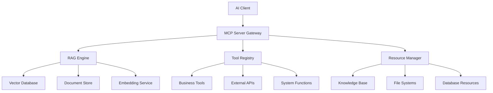

# 使用 Spring AI 打造企業 RAG 知識庫【40-1】- MCP 整合企業級 RAG 系統：智能與靈活的完美結合

## MCP + RAG：AI 企業應用的終極架構


在前一章節中，我們深入探討了 MCP Server 的開發實作，學習了如何建構企業級的智能服務提供者。今天我們將進入更深層的整合階段：將 Model Context Protocol (MCP) 與企業級 RAG (Retrieval-Augmented Generation) 系統完美結合。

這種整合代表了現代 AI 企業應用架構的最高境界。MCP 提供了標準化的協議規範，確保不同 AI 系統之間的互操作性；而 RAG 技術則解決了大型語言模型的知識時效性和領域專業性問題。當這兩種技術結合時，我們得到的不僅是一個功能強大的知識檢索系統，更是一個能夠動態調整、智能適應的企業級 AI 基礎設施。

### 為什麼需要 MCP-RAG 整合？

在傳統的企業 AI 應用中，我們常常面臨以下挑戰：

1. **知識孤島問題**：企業內部的知識散布在不同的系統和格式中，難以統一存取和利用
2. **介面標準化困難**：不同的 AI 工具和服務使用不同的 API 格式，整合成本高昂
3. **上下文理解不足**：傳統的檢索系統無法理解查詢的深層語意和業務背景
4. **動態適應能力弱**：系統無法根據用戶角色、使用情境動態調整服務內容

MCP-RAG 整合方案完美解決了這些問題。透過 MCP 的標準化協議，我們可以將各種 AI 功能包裝成統一的服務介面；而 RAG 技術則提供了智能化的知識檢索能力，能夠理解查詢意圖、關聯相關知識，並提供準確的回答。

### 整合架構的核心價值

這種整合架構帶來的價值遠超出技術層面：

**技術價值**：
- 提供標準化的 AI 服務介面，降低系統整合複雜度
- 實現智能化的知識檢索，提高資訊獲取的精確度和效率
- 支援多模態資源管理，統一處理文字、圖片、音視頻等不同類型的企業資產
- 具備動態適應能力，能夠根據使用情境自動優化服務內容

**業務價值**：
- 打破企業內部的知識孤島，實現知識資產的充分利用
- 提升員工工作效率，減少重複性的資訊搜尋工作
- 增強決策支援能力，提供基於數據的智能建議
- 降低培訓成本，新員工可以快速獲取所需的企業知識

**戰略價值**：
- 建立企業的 AI 基礎設施，為未來的數位轉型奠定基礎
- 提升企業的競爭優勢，在資訊化時代保持領先地位
- 創造新的商業模式，將知識資產轉化為商業價值
- 增強企業的創新能力，促進跨部門協作和知識共享

## ▋企業級 MCP-RAG 架構設計

### 核心架構概覽

在設計 MCP-RAG 整合架構時，我們需要考慮的不僅是技術層面的實現，更重要的是如何構建一個可擴展、高可用、易維護的企業級系統。下面的架構圖展示了整個系統的核心組件和它們之間的關係：



這個架構的設計理念基於以下幾個核心原則：

**1. 分層解耦原則**
系統採用分層架構，每一層都有明確的職責：
- **接入層（MCP Server Gateway）**：負責協議轉換、請求路由、安全驗證
- **服務層（RAG Engine, Tool Registry, Resource Manager）**：提供核心業務邏輯
- **數據層（Vector Database, Document Store等）**：負責數據持久化和檢索

**2. 微服務原則**
每個組件都可以獨立部署、擴展和維護，提高系統的靈活性和可用性。

**3. 標準化原則**
所有對外接口都遵循 MCP 協議標準，確保與不同客戶端的互操作性。

**4. 可觀測性原則**
內建完整的監控、日誌和追蹤機制，便於系統運維和問題排查。

### 詳細架構分析

**MCP Server Gateway（MCP 服務網關）**

MCP Server Gateway 是整個系統的入口，它的主要職責包括：

- **協議適配**：將不同傳輸協議（STDIO、SSE、WebSocket）的請求統一轉換為內部格式
- **路由分發**：根據請求類型將請求分發到相應的處理器
- **安全控制**：實施身份驗證、授權檢查、速率限制等安全措施
- **負載均衡**：在多個後端服務實例間分配請求負載
- **快取管理**：對常用的工具定義、資源列表等進行快取，提升響應速度

**RAG Engine（檢索增強生成引擎）**

RAG Engine 是系統的核心智能組件，負責：

- **語意理解**：利用大型語言模型理解用戶查詢的真實意圖
- **知識檢索**：從向量資料庫中檢索相關的文檔片段
- **上下文構建**：將檢索到的知識與用戶查詢組合成完整的上下文
- **答案生成**：基於增強的上下文生成準確、相關的回答
- **結果評估**：評估生成答案的質量和相關性

**Tool Registry（工具註冊中心）**

Tool Registry 管理系統中所有可用的工具：

- **工具發現**：自動發現和註冊新的工具服務
- **版本管理**：支援工具的版本控制和平滑升級
- **依賴管理**：處理工具間的依賴關係
- **執行調度**：智能調度工具執行，優化資源利用率
- **異常處理**：監控工具執行狀況，處理異常情況

**Resource Manager（資源管理器）**

Resource Manager 統一管理企業的各類資源：

- **資源發現**：自動掃描和索引各類企業資源
- **權限控制**：基於用戶角色和資源分類實施精細化權限控制
- **內容處理**：對不同格式的資源進行統一的內容提取和標準化
- **元數據管理**：維護資源的豐富元數據，支援高效的搜尋和分類
- **生命週期管理**：處理資源的建立、更新、歸檔和刪除

### 系統分層設計實現

讓我們來看看如何在 Spring AI 中實現這個架構的核心配置：

```java
@Configuration
@EnableMcpServer
public class EnterpriseRagMcpConfig {
    
    @Bean
    public McpServerProperties mcpServerProperties() {
        McpServerProperties props = new McpServerProperties();
        props.setName("enterprise-rag-server");
        props.setVersion("1.0.0");
        props.setDescription("企業級 RAG 知識庫 MCP 服務");
        return props;
    }
    
    @Bean
    public RagMcpIntegrationService ragMcpService(
            VectorStore vectorStore,
            ChatClient chatClient,
            DocumentReaderService documentReader,
            ToolRegistry toolRegistry) {
        return new RagMcpIntegrationService(
            vectorStore, chatClient, documentReader, toolRegistry);
    }
}
```

## ▋智能工具整合：RAG 增強的 MCP Tools

在 MCP-RAG 整合架構中，工具系統扮演著至關重要的角色。它不僅提供基本的功能調用能力，更重要的是能夠利用 RAG 技術進行智能化的知識檢索和推理。這種整合讓工具從簡單的功能執行器演變為真正的智能助手。

### 智能工具設計理念

傳統的工具系統通常是靜態的、功能單一的。而在 MCP-RAG 架構中，我們的工具具有以下特性：

1. **上下文感知**：工具能夠理解當前的對話上下文和業務場景
2. **知識增強**：工具能夠主動檢索相關知識來增強其處理能力
3. **自適應優化**：工具能夠根據使用情況和反饋自動優化其行為
4. **協作能力**：工具之間能夠協同工作，形成更複雜的業務流程

### 1. 智能文檔檢索工具深度解析

智能文檔檢索工具是 MCP-RAG 系統的核心組件之一，它展示了如何將先進的檢索技術與實用的業務需求相結合。

#### 工具設計思路

這個工具的設計基於現代資訊檢索的最佳實踐：

**多階段檢索策略**：
- 第一階段使用向量相似度進行粗篩，快速獲取候選文檔
- 第二階段使用混合檢索技術，結合關鍵詞匹配和語意相似度
- 第三階段進行精細化重排序，考慮文檔的權威性、時效性等因素

**查詢增強技術**：
- 利用 LLM 理解查詢意圖，補充相關的專業術語和同義詞
- 根據業務領域添加上下文信息，提高檢索精度
- 支援自然語言查詢，讓非技術用戶也能輕鬆使用

**結果優化處理**：
- 自動生成結構化的回答，包含摘要、來源、相關度評分
- 提供多維度的排序選項，滿足不同場景的需求
- 支援結果的二次篩選和細化

```java
@Component
@Slf4j
public class IntelligentDocumentRetrievalTool {

    private final VectorStore vectorStore;
    private final ChatClient chatClient;
    private final DocumentMetadataService metadataService;
    
    public IntelligentDocumentRetrievalTool(
            VectorStore vectorStore,
            ChatClient chatClient,
            DocumentMetadataService metadataService) {
        this.vectorStore = vectorStore;
        this.chatClient = chatClient;
        this.metadataService = metadataService;
    }

    @McpTool(
        name = "intelligent_document_search",
        description = "使用 RAG 技術進行智能文檔檢索，支援多模態查詢和語意理解"
    )
    public String intelligentDocumentSearch(
            @McpToolParameter(name = "query", description = "查詢問題或關鍵詞") String query,
            @McpToolParameter(name = "domain", description = "專業領域過濾", required = false) String domain,
            @McpToolParameter(name = "max_results", description = "最大結果數量", required = false) @DefaultValue("5") int maxResults,
            @McpToolParameter(name = "similarity_threshold", description = "相似度閾值", required = false) @DefaultValue("0.7") double threshold) {
        
        try {
            // 查詢預處理和增強
            String enhancedQuery = enhanceQuery(query, domain);
            
            // 多階段檢索策略
            List<Document> documents = performMultiStageRetrieval(
                enhancedQuery, domain, maxResults, threshold);
            
            // 結果後處理和排序
            List<EnhancedDocument> rankedDocs = reRankDocuments(documents, query);
            
            // 生成結構化回應
            return generateStructuredResponse(rankedDocs, query);
            
        } catch (Exception e) {
            log.error("智能文檔檢索失敗: query={}", query, e);
            return createErrorResponse("檢索失敗: " + e.getMessage());
        }
    }
    
    private String enhanceQuery(String originalQuery, String domain) {
        if (domain == null) {
            return originalQuery;
        }
        
        return chatClient.prompt()
            .user(String.format("""
                請將以下查詢增強為更精確的搜尋詞彙，針對 %s 領域：
                
                原始查詢：%s
                
                要求：
                1. 添加相關的專業術語
                2. 擴展同義詞和相關概念
                3. 保持查詢意圖不變
                4. 僅返回增強後的查詢文字
                """, domain, originalQuery))
            .call()
            .content();
    }
    
    private List<Document> performMultiStageRetrieval(
            String query, String domain, int maxResults, double threshold) {
        
        // 第一階段：向量相似度檢索
        SearchRequest.Builder searchBuilder = SearchRequest.defaults()
            .withQuery(query)
            .withTopK(Math.min(maxResults * 3, 50))
            .withSimilarityThreshold(threshold);
            
        // 添加領域過濾
        if (domain != null) {
            searchBuilder.withFilterExpression("domain == '" + domain + "'");
        }
        
        List<Document> vectorResults = vectorStore.similaritySearch(searchBuilder.build());
        
        // 第二階段：混合檢索（如果向量結果不足）
        if (vectorResults.size() < maxResults) {
            List<Document> hybridResults = performHybridRetrieval(query, domain, maxResults);
            vectorResults.addAll(hybridResults);
        }
        
        return vectorResults.stream()
            .distinct()
            .limit(maxResults)
            .collect(Collectors.toList());
    }
    
    private List<EnhancedDocument> reRankDocuments(List<Document> documents, String query) {
        return documents.stream()
            .map(doc -> {
                double relevanceScore = calculateRelevanceScore(doc, query);
                double freshnessScore = calculateFreshnessScore(doc);
                double authorityScore = calculateAuthorityScore(doc);
                double combinedScore = relevanceScore * 0.6 + freshnessScore * 0.2 + authorityScore * 0.2;
                
                return new EnhancedDocument(doc, combinedScore, relevanceScore, freshnessScore, authorityScore);
            })
            .sorted(Comparator.comparingDouble(EnhancedDocument::getCombinedScore).reversed())
            .collect(Collectors.toList());
    }
    
    private String generateStructuredResponse(List<EnhancedDocument> documents, String query) {
        StringBuilder response = new StringBuilder();
        response.append("# 智能檢索結果\n\n");
        response.append(String.format("**查詢：** %s\n", query));
        response.append(String.format("**找到 %d 個相關文檔**\n\n", documents.size()));
        
        for (int i = 0; i < documents.size(); i++) {
            EnhancedDocument doc = documents.get(i);
            response.append(String.format("## %d. %s\n", i + 1, 
                doc.getDocument().getMetadata().getOrDefault("title", "未命名文檔")));
            response.append(String.format("**相關度：** %.2f | **新鮮度：** %.2f | **權威性：** %.2f\n", 
                doc.getRelevanceScore(), doc.getFreshnessScore(), doc.getAuthorityScore()));
            response.append(String.format("**來源：** %s\n", 
                doc.getDocument().getMetadata().getOrDefault("source", "未知")));
            
            String summary = extractSummary(doc.getDocument().getContent(), 200);
            response.append(String.format("**摘要：** %s\n\n", summary));
        }
        
        return response.toString();
    }
}
```

### 2. 動態知識庫管理工具：企業知識的智能管家

動態知識庫管理工具代表了企業知識管理的未來方向。它不僅能夠自動化地處理知識的增刪改查，更重要的是能夠智能地理解知識的內容、自動建立關聯、並持續優化知識結構。

#### 核心功能特性

**智能內容分析**：
當新文檔被添加到知識庫時，系統會自動進行深度分析：
- 使用 NLP 技術提取關鍵概念和實體
- 自動生成多層次的摘要（簡短摘要、詳細摘要、技術摘要）
- 識別文檔的主題分類和專業領域
- 檢測文檔的質量和可信度

**智能分塊策略**：
傳統的固定長度分塊往往會破壞內容的語意完整性，我們的智能分塊策略則不同：
- 基於語意邊界進行分塊，保持內容的邏輯完整性
- 動態調整分塊大小，根據內容類型優化向量化效果
- 保持重要的上下文關聯，確保檢索時能獲得完整的信息
- 支援層次化分塊，適應不同粒度的檢索需求

**知識關聯建立**：
系統會自動分析新添加的知識與現有知識庫的關聯關係：
- 識別相似主題的文檔，建立主題聚類
- 發現文檔間的引用和依賴關係
- 構建概念的語意網絡，支援知識圖譜查詢
- 追蹤知識的演化歷程，支援版本對比

**品質控制機制**：
為了確保知識庫的高質量，系統內建了多重品質控制機制：
- 內容去重，避免重複信息的冗餘
- 事實性檢驗，標記可能存在錯誤的信息
- 時效性監控，自動標記過時的內容
- 完整性檢查，確保關鍵信息的完整性

```java
@Component
@Slf4j
public class DynamicKnowledgeBaseTool {

    private final VectorStore vectorStore;
    private final DocumentReaderService documentReader;
    private final EmbeddingModel embeddingModel;
    private final ChatClient chatClient;
    
    @McpTool(
        name = "knowledge_base_manager",
        description = "動態管理企業知識庫，支援文檔上傳、更新、刪除和批次處理"
    )
    public String manageKnowledgeBase(
            @McpToolParameter(name = "action", description = "操作類型：add, update, delete, batch_process") String action,
            @McpToolParameter(name = "content", description = "文檔內容或檔案路徑", required = false) String content,
            @McpToolParameter(name = "metadata", description = "文檔元數據 JSON", required = false) String metadataJson,
            @McpToolParameter(name = "document_id", description = "文檔唯一標識", required = false) String documentId) {
        
        try {
            switch (action.toLowerCase()) {
                case "add":
                    return addDocument(content, metadataJson);
                case "update":
                    return updateDocument(documentId, content, metadataJson);
                case "delete":
                    return deleteDocument(documentId);
                case "batch_process":
                    return batchProcessDocuments(content);
                default:
                    return createErrorResponse("不支援的操作類型: " + action);
            }
        } catch (Exception e) {
            log.error("知識庫管理操作失敗: action={}, documentId={}", action, documentId, e);
            return createErrorResponse("操作失敗: " + e.getMessage());
        }
    }
    
    private String addDocument(String content, String metadataJson) {
        Map<String, Object> metadata = parseMetadata(metadataJson);
        
        // 自動生成文檔摘要
        String summary = generateDocumentSummary(content);
        metadata.put("summary", summary);
        metadata.put("created_at", Instant.now().toString());
        metadata.put("last_updated", Instant.now().toString());
        
        // 分塊處理
        List<Document> chunks = chunkDocument(content, metadata);
        
        // 向量化並存儲
        vectorStore.add(chunks);
        
        return String.format("""
            文檔添加成功！
            - 文檔 ID: %s
            - 分塊數量: %d
            - 摘要: %s
            - 創建時間: %s
            """, 
            metadata.get("id"), 
            chunks.size(), 
            summary, 
            metadata.get("created_at"));
    }
    
    private String generateDocumentSummary(String content) {
        return chatClient.prompt()
            .user(String.format("""
                請為以下文檔生成簡潔的摘要（不超過100字）：
                
                %s
                
                摘要應包含：
                1. 主要主題
                2. 關鍵概念
                3. 適用範圍
                """, content.length() > 2000 ? content.substring(0, 2000) + "..." : content))
            .call()
            .content();
    }
    
    private List<Document> chunkDocument(String content, Map<String, Object> metadata) {
        // 智能分塊策略
        TokenTextSplitter splitter = new TokenTextSplitter(
            500,    // chunk size
            100,    // overlap
            true,   // keep separator
            true    // strip whitespace
        );
        
        List<String> chunks = splitter.split(content);
        List<Document> documents = new ArrayList<>();
        
        for (int i = 0; i < chunks.size(); i++) {
            Map<String, Object> chunkMetadata = new HashMap<>(metadata);
            chunkMetadata.put("chunk_index", i);
            chunkMetadata.put("total_chunks", chunks.size());
            chunkMetadata.put("chunk_id", metadata.get("id") + "_chunk_" + i);
            
            documents.add(new Document(chunks.get(i), chunkMetadata));
        }
        
        return documents;
    }
}
```