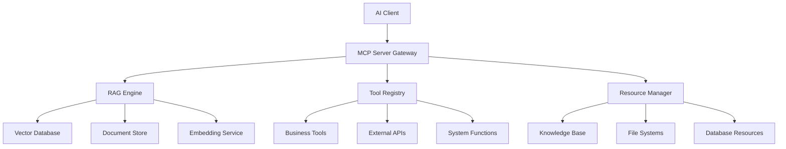

# 使用 Spring AI 打造企業 RAG 知識庫【40】- MCP 整合企業級 RAG 系統：智能與靈活的完美結合

## MCP + RAG：AI 企業應用的終極架構


在前一章節中，我們深入探討了 MCP Server 的開發實作，學習了如何建構企業級的智能服務提供者。今天我們將進入更深層的整合階段：將 Model Context Protocol (MCP) 與企業級 RAG (Retrieval-Augmented Generation) 系統完美結合。

這種整合代表了現代 AI 企業應用架構的最高境界。MCP 提供了標準化的協議規範，確保不同 AI 系統之間的互操作性；而 RAG 技術則解決了大型語言模型的知識時效性和領域專業性問題。當這兩種技術結合時，我們得到的不僅是一個功能強大的知識檢索系統，更是一個能夠動態調整、智能適應的企業級 AI 基礎設施。

### 為什麼需要 MCP-RAG 整合？

在傳統的企業 AI 應用中，我們常常面臨以下挑戰：

1. **知識孤島問題**：企業內部的知識散布在不同的系統和格式中，難以統一存取和利用
2. **介面標準化困難**：不同的 AI 工具和服務使用不同的 API 格式，整合成本高昂
3. **上下文理解不足**：傳統的檢索系統無法理解查詢的深層語意和業務背景
4. **動態適應能力弱**：系統無法根據用戶角色、使用情境動態調整服務內容

MCP-RAG 整合方案完美解決了這些問題。透過 MCP 的標準化協議，我們可以將各種 AI 功能包裝成統一的服務介面；而 RAG 技術則提供了智能化的知識檢索能力，能夠理解查詢意圖、關聯相關知識，並提供準確的回答。

### 整合架構的核心價值

這種整合架構帶來的價值遠超出技術層面：

**技術價值**：
- 提供標準化的 AI 服務介面，降低系統整合複雜度
- 實現智能化的知識檢索，提高資訊獲取的精確度和效率
- 支援多模態資源管理，統一處理文字、圖片、音視頻等不同類型的企業資產
- 具備動態適應能力，能夠根據使用情境自動優化服務內容

**業務價值**：
- 打破企業內部的知識孤島，實現知識資產的充分利用
- 提升員工工作效率，減少重複性的資訊搜尋工作
- 增強決策支援能力，提供基於數據的智能建議
- 降低培訓成本，新員工可以快速獲取所需的企業知識

**戰略價值**：
- 建立企業的 AI 基礎設施，為未來的數位轉型奠定基礎
- 提升企業的競爭優勢，在資訊化時代保持領先地位
- 創造新的商業模式，將知識資產轉化為商業價值
- 增強企業的創新能力，促進跨部門協作和知識共享

## ▋企業級 MCP-RAG 架構設計

### 核心架構概覽

在設計 MCP-RAG 整合架構時，我們需要考慮的不僅是技術層面的實現，更重要的是如何構建一個可擴展、高可用、易維護的企業級系統。下面的架構圖展示了整個系統的核心組件和它們之間的關係：



這個架構的設計理念基於以下幾個核心原則：

**1. 分層解耦原則**
系統採用分層架構，每一層都有明確的職責：
- **接入層（MCP Server Gateway）**：負責協議轉換、請求路由、安全驗證
- **服務層（RAG Engine, Tool Registry, Resource Manager）**：提供核心業務邏輯
- **數據層（Vector Database, Document Store等）**：負責數據持久化和檢索

**2. 微服務原則**
每個組件都可以獨立部署、擴展和維護，提高系統的靈活性和可用性。

**3. 標準化原則**
所有對外接口都遵循 MCP 協議標準，確保與不同客戶端的互操作性。

**4. 可觀測性原則**
內建完整的監控、日誌和追蹤機制，便於系統運維和問題排查。

### 詳細架構分析

**MCP Server Gateway（MCP 服務網關）**

MCP Server Gateway 是整個系統的入口，它的主要職責包括：

- **協議適配**：將不同傳輸協議（STDIO、SSE、WebSocket）的請求統一轉換為內部格式
- **路由分發**：根據請求類型將請求分發到相應的處理器
- **安全控制**：實施身份驗證、授權檢查、速率限制等安全措施
- **負載均衡**：在多個後端服務實例間分配請求負載
- **快取管理**：對常用的工具定義、資源列表等進行快取，提升響應速度

**RAG Engine（檢索增強生成引擎）**

RAG Engine 是系統的核心智能組件，負責：

- **語意理解**：利用大型語言模型理解用戶查詢的真實意圖
- **知識檢索**：從向量資料庫中檢索相關的文檔片段
- **上下文構建**：將檢索到的知識與用戶查詢組合成完整的上下文
- **答案生成**：基於增強的上下文生成準確、相關的回答
- **結果評估**：評估生成答案的質量和相關性

**Tool Registry（工具註冊中心）**

Tool Registry 管理系統中所有可用的工具：

- **工具發現**：自動發現和註冊新的工具服務
- **版本管理**：支援工具的版本控制和平滑升級
- **依賴管理**：處理工具間的依賴關係
- **執行調度**：智能調度工具執行，優化資源利用率
- **異常處理**：監控工具執行狀況，處理異常情況

**Resource Manager（資源管理器）**

Resource Manager 統一管理企業的各類資源：

- **資源發現**：自動掃描和索引各類企業資源
- **權限控制**：基於用戶角色和資源分類實施精細化權限控制
- **內容處理**：對不同格式的資源進行統一的內容提取和標準化
- **元數據管理**：維護資源的豐富元數據，支援高效的搜尋和分類
- **生命週期管理**：處理資源的建立、更新、歸檔和刪除

### 系統分層設計實現

讓我們來看看如何在 Spring AI 中實現這個架構的核心配置：

```java
@Configuration
@EnableMcpServer
public class EnterpriseRagMcpConfig {
    
    @Bean
    public McpServerProperties mcpServerProperties() {
        McpServerProperties props = new McpServerProperties();
        props.setName("enterprise-rag-server");
        props.setVersion("1.0.0");
        props.setDescription("企業級 RAG 知識庫 MCP 服務");
        return props;
    }
    
    @Bean
    public RagMcpIntegrationService ragMcpService(
            VectorStore vectorStore,
            ChatClient chatClient,
            DocumentReaderService documentReader,
            ToolRegistry toolRegistry) {
        return new RagMcpIntegrationService(
            vectorStore, chatClient, documentReader, toolRegistry);
    }
}
```

## ▋智能工具整合：RAG 增強的 MCP Tools

在 MCP-RAG 整合架構中，工具系統扮演著至關重要的角色。它不僅提供基本的功能調用能力，更重要的是能夠利用 RAG 技術進行智能化的知識檢索和推理。這種整合讓工具從簡單的功能執行器演變為真正的智能助手。

### 智能工具設計理念

傳統的工具系統通常是靜態的、功能單一的。而在 MCP-RAG 架構中，我們的工具具有以下特性：

1. **上下文感知**：工具能夠理解當前的對話上下文和業務場景
2. **知識增強**：工具能夠主動檢索相關知識來增強其處理能力
3. **自適應優化**：工具能夠根據使用情況和反饋自動優化其行為
4. **協作能力**：工具之間能夠協同工作，形成更複雜的業務流程

### 1. 智能文檔檢索工具深度解析

智能文檔檢索工具是 MCP-RAG 系統的核心組件之一，它展示了如何將先進的檢索技術與實用的業務需求相結合。

#### 工具設計思路

這個工具的設計基於現代資訊檢索的最佳實踐：

**多階段檢索策略**：
- 第一階段使用向量相似度進行粗篩，快速獲取候選文檔
- 第二階段使用混合檢索技術，結合關鍵詞匹配和語意相似度
- 第三階段進行精細化重排序，考慮文檔的權威性、時效性等因素

**查詢增強技術**：
- 利用 LLM 理解查詢意圖，補充相關的專業術語和同義詞
- 根據業務領域添加上下文信息，提高檢索精度
- 支援自然語言查詢，讓非技術用戶也能輕鬆使用

**結果優化處理**：
- 自動生成結構化的回答，包含摘要、來源、相關度評分
- 提供多維度的排序選項，滿足不同場景的需求
- 支援結果的二次篩選和細化

```java
@Component
@Slf4j
public class IntelligentDocumentRetrievalTool {

    private final VectorStore vectorStore;
    private final ChatClient chatClient;
    private final DocumentMetadataService metadataService;
    
    public IntelligentDocumentRetrievalTool(
            VectorStore vectorStore,
            ChatClient chatClient,
            DocumentMetadataService metadataService) {
        this.vectorStore = vectorStore;
        this.chatClient = chatClient;
        this.metadataService = metadataService;
    }

    @McpTool(
        name = "intelligent_document_search",
        description = "使用 RAG 技術進行智能文檔檢索，支援多模態查詢和語意理解"
    )
    public String intelligentDocumentSearch(
            @McpToolParameter(name = "query", description = "查詢問題或關鍵詞") String query,
            @McpToolParameter(name = "domain", description = "專業領域過濾", required = false) String domain,
            @McpToolParameter(name = "max_results", description = "最大結果數量", required = false) @DefaultValue("5") int maxResults,
            @McpToolParameter(name = "similarity_threshold", description = "相似度閾值", required = false) @DefaultValue("0.7") double threshold) {
        
        try {
            // 查詢預處理和增強
            String enhancedQuery = enhanceQuery(query, domain);
            
            // 多階段檢索策略
            List<Document> documents = performMultiStageRetrieval(
                enhancedQuery, domain, maxResults, threshold);
            
            // 結果後處理和排序
            List<EnhancedDocument> rankedDocs = reRankDocuments(documents, query);
            
            // 生成結構化回應
            return generateStructuredResponse(rankedDocs, query);
            
        } catch (Exception e) {
            log.error("智能文檔檢索失敗: query={}", query, e);
            return createErrorResponse("檢索失敗: " + e.getMessage());
        }
    }
    
    private String enhanceQuery(String originalQuery, String domain) {
        if (domain == null) {
            return originalQuery;
        }
        
        return chatClient.prompt()
            .user(String.format("""
                請將以下查詢增強為更精確的搜尋詞彙，針對 %s 領域：
                
                原始查詢：%s
                
                要求：
                1. 添加相關的專業術語
                2. 擴展同義詞和相關概念
                3. 保持查詢意圖不變
                4. 僅返回增強後的查詢文字
                """, domain, originalQuery))
            .call()
            .content();
    }
    
    private List<Document> performMultiStageRetrieval(
            String query, String domain, int maxResults, double threshold) {
        
        // 第一階段：向量相似度檢索
        SearchRequest.Builder searchBuilder = SearchRequest.defaults()
            .withQuery(query)
            .withTopK(Math.min(maxResults * 3, 50))
            .withSimilarityThreshold(threshold);
            
        // 添加領域過濾
        if (domain != null) {
            searchBuilder.withFilterExpression("domain == '" + domain + "'");
        }
        
        List<Document> vectorResults = vectorStore.similaritySearch(searchBuilder.build());
        
        // 第二階段：混合檢索（如果向量結果不足）
        if (vectorResults.size() < maxResults) {
            List<Document> hybridResults = performHybridRetrieval(query, domain, maxResults);
            vectorResults.addAll(hybridResults);
        }
        
        return vectorResults.stream()
            .distinct()
            .limit(maxResults)
            .collect(Collectors.toList());
    }
    
    private List<EnhancedDocument> reRankDocuments(List<Document> documents, String query) {
        return documents.stream()
            .map(doc -> {
                double relevanceScore = calculateRelevanceScore(doc, query);
                double freshnessScore = calculateFreshnessScore(doc);
                double authorityScore = calculateAuthorityScore(doc);
                double combinedScore = relevanceScore * 0.6 + freshnessScore * 0.2 + authorityScore * 0.2;
                
                return new EnhancedDocument(doc, combinedScore, relevanceScore, freshnessScore, authorityScore);
            })
            .sorted(Comparator.comparingDouble(EnhancedDocument::getCombinedScore).reversed())
            .collect(Collectors.toList());
    }
    
    private String generateStructuredResponse(List<EnhancedDocument> documents, String query) {
        StringBuilder response = new StringBuilder();
        response.append("# 智能檢索結果\n\n");
        response.append(String.format("**查詢：** %s\n", query));
        response.append(String.format("**找到 %d 個相關文檔**\n\n", documents.size()));
        
        for (int i = 0; i < documents.size(); i++) {
            EnhancedDocument doc = documents.get(i);
            response.append(String.format("## %d. %s\n", i + 1, 
                doc.getDocument().getMetadata().getOrDefault("title", "未命名文檔")));
            response.append(String.format("**相關度：** %.2f | **新鮮度：** %.2f | **權威性：** %.2f\n", 
                doc.getRelevanceScore(), doc.getFreshnessScore(), doc.getAuthorityScore()));
            response.append(String.format("**來源：** %s\n", 
                doc.getDocument().getMetadata().getOrDefault("source", "未知")));
            
            String summary = extractSummary(doc.getDocument().getContent(), 200);
            response.append(String.format("**摘要：** %s\n\n", summary));
        }
        
        return response.toString();
    }
}
```

### 2. 動態知識庫管理工具：企業知識的智能管家

動態知識庫管理工具代表了企業知識管理的未來方向。它不僅能夠自動化地處理知識的增刪改查，更重要的是能夠智能地理解知識的內容、自動建立關聯、並持續優化知識結構。

#### 核心功能特性

**智能內容分析**：
當新文檔被添加到知識庫時，系統會自動進行深度分析：
- 使用 NLP 技術提取關鍵概念和實體
- 自動生成多層次的摘要（簡短摘要、詳細摘要、技術摘要）
- 識別文檔的主題分類和專業領域
- 檢測文檔的質量和可信度

**智能分塊策略**：
傳統的固定長度分塊往往會破壞內容的語意完整性，我們的智能分塊策略則不同：
- 基於語意邊界進行分塊，保持內容的邏輯完整性
- 動態調整分塊大小，根據內容類型優化向量化效果
- 保持重要的上下文關聯，確保檢索時能獲得完整的信息
- 支援層次化分塊，適應不同粒度的檢索需求

**知識關聯建立**：
系統會自動分析新添加的知識與現有知識庫的關聯關係：
- 識別相似主題的文檔，建立主題聚類
- 發現文檔間的引用和依賴關係
- 構建概念的語意網絡，支援知識圖譜查詢
- 追蹤知識的演化歷程，支援版本對比

**品質控制機制**：
為了確保知識庫的高質量，系統內建了多重品質控制機制：
- 內容去重，避免重複信息的冗餘
- 事實性檢驗，標記可能存在錯誤的信息
- 時效性監控，自動標記過時的內容
- 完整性檢查，確保關鍵信息的完整性

```java
@Component
@Slf4j
public class DynamicKnowledgeBaseTool {

    private final VectorStore vectorStore;
    private final DocumentReaderService documentReader;
    private final EmbeddingModel embeddingModel;
    private final ChatClient chatClient;
    
    @McpTool(
        name = "knowledge_base_manager",
        description = "動態管理企業知識庫，支援文檔上傳、更新、刪除和批次處理"
    )
    public String manageKnowledgeBase(
            @McpToolParameter(name = "action", description = "操作類型：add, update, delete, batch_process") String action,
            @McpToolParameter(name = "content", description = "文檔內容或檔案路徑", required = false) String content,
            @McpToolParameter(name = "metadata", description = "文檔元數據 JSON", required = false) String metadataJson,
            @McpToolParameter(name = "document_id", description = "文檔唯一標識", required = false) String documentId) {
        
        try {
            switch (action.toLowerCase()) {
                case "add":
                    return addDocument(content, metadataJson);
                case "update":
                    return updateDocument(documentId, content, metadataJson);
                case "delete":
                    return deleteDocument(documentId);
                case "batch_process":
                    return batchProcessDocuments(content);
                default:
                    return createErrorResponse("不支援的操作類型: " + action);
            }
        } catch (Exception e) {
            log.error("知識庫管理操作失敗: action={}, documentId={}", action, documentId, e);
            return createErrorResponse("操作失敗: " + e.getMessage());
        }
    }
    
    private String addDocument(String content, String metadataJson) {
        Map<String, Object> metadata = parseMetadata(metadataJson);
        
        // 自動生成文檔摘要
        String summary = generateDocumentSummary(content);
        metadata.put("summary", summary);
        metadata.put("created_at", Instant.now().toString());
        metadata.put("last_updated", Instant.now().toString());
        
        // 分塊處理
        List<Document> chunks = chunkDocument(content, metadata);
        
        // 向量化並存儲
        vectorStore.add(chunks);
        
        return String.format("""
            文檔添加成功！
            - 文檔 ID: %s
            - 分塊數量: %d
            - 摘要: %s
            - 創建時間: %s
            """, 
            metadata.get("id"), 
            chunks.size(), 
            summary, 
            metadata.get("created_at"));
    }
    
    private String generateDocumentSummary(String content) {
        return chatClient.prompt()
            .user(String.format("""
                請為以下文檔生成簡潔的摘要（不超過100字）：
                
                %s
                
                摘要應包含：
                1. 主要主題
                2. 關鍵概念
                3. 適用範圍
                """, content.length() > 2000 ? content.substring(0, 2000) + "..." : content))
            .call()
            .content();
    }
    
    private List<Document> chunkDocument(String content, Map<String, Object> metadata) {
        // 智能分塊策略
        TokenTextSplitter splitter = new TokenTextSplitter(
            500,    // chunk size
            100,    // overlap
            true,   // keep separator
            true    // strip whitespace
        );
        
        List<String> chunks = splitter.split(content);
        List<Document> documents = new ArrayList<>();
        
        for (int i = 0; i < chunks.size(); i++) {
            Map<String, Object> chunkMetadata = new HashMap<>(metadata);
            chunkMetadata.put("chunk_index", i);
            chunkMetadata.put("total_chunks", chunks.size());
            chunkMetadata.put("chunk_id", metadata.get("id") + "_chunk_" + i);
            
            documents.add(new Document(chunks.get(i), chunkMetadata));
        }
        
        return documents;
    }
}
```

## ▋資源統一管理：多模態內容整合的企業級解決方案

在現代企業環境中，資訊資產以各種形式存在：文字文檔、圖像、音視頻、數據表格、程式碼等等。這些多樣化的資源形式對於 AI 系統來說既是機遇也是挑戰。MCP-RAG 整合架構通過統一的資源管理系統，實現了對這些異構資源的智能化處理和統一存取。

### 多模態資源處理的挑戰

**格式異構性**：
企業資源包含各種格式：PDF、Word、Excel、PowerPoint、圖片、音視頻等，每種格式都需要專門的處理方法。

**語意理解複雜性**：
不同類型的資源承載著不同層次的語意信息，從純文字的直接語意到圖像的視覺語意，再到音頻的聽覺語意。

**存取權限多樣性**：
企業資源涉及不同的安全等級和存取權限，需要細緻的權限控制機制。

**實時性要求**：
一些資源需要實時更新和同步，系統必須能夠快速響應變化。

### 統一資源管理架構

我們的資源管理系統採用分層架構，每一層都有明確的職責：

**抽象層（Resource Abstraction Layer）**：
- 為所有類型的資源提供統一的抽象介面
- 定義標準的資源元數據模型
- 實現資源的生命週期管理

**適配層（Resource Adapter Layer）**：
- 為不同類型的資源提供專門的處理適配器
- 實現格式轉換和內容提取
- 處理特定格式的技術細節

**服務層（Resource Service Layer）**：
- 提供資源的CRUD操作
- 實現資源的搜尋和發現功能
- 管理資源的權限和安全

**存儲層（Resource Storage Layer）**：
- 實現資源的物理存儲
- 提供高效的檢索機制
- 確保資源的可靠性和持久性

### 智能內容處理引擎

資源管理系統的核心是智能內容處理引擎，它能夠：

**自動內容提取**：
- 從PDF、Word等文檔中提取純文字內容
- 使用OCR技術處理掃描文檔和圖片中的文字
- 利用語音識別技術轉錄音頻內容
- 從表格中提取結構化數據

**多模態內容理解**：
- 使用計算機視覺技術分析圖像內容
- 結合文字和圖像信息進行多模態理解
- 從視頻中提取關鍵幀和字幕信息
- 分析文檔的結構和布局信息

**語意增強處理**：
- 利用自然語言處理技術提取關鍵概念
- 自動生成內容摘要和標籤
- 識別實體和關係，構建知識圖譜
- 根據內容特性推薦相關資源

### 權限與安全管理

企業資源管理必須考慮嚴格的安全和權限控制：

**細粒度權限控制**：
- 基於角色的存取控制（RBAC）
- 基於屬性的存取控制（ABAC）
- 動態權限評估和調整
- 資源級別的精細化權限設定

**數據安全保護**：
- 敏感信息的自動識別和標記
- 數據加密和安全傳輸
- 存取日誌和審計追蹤
- 合規性檢查和報告

**隱私保護機制**：
- 個人信息的自動識別和保護
- 數據去識別化處理
- 隱私影響評估
- GDPR和其他隱私法規的合規支援

```java
@Component
@Slf4j
public class EnterpriseResourceManager {

    private final List<ResourceProvider> resourceProviders;
    private final DocumentIndexService indexService;
    private final SecurityService securityService;
    
    @EventListener
    public void handleListResources(ListResourcesEvent event) {
        try {
            String userContext = extractUserContext(event);
            List<McpSchema.Resource> allResources = new ArrayList<>();
            
            // 並行獲取各種資源
            List<CompletableFuture<List<McpSchema.Resource>>> futures = resourceProviders.stream()
                .map(provider -> CompletableFuture.supplyAsync(() -> 
                    provider.getAccessibleResources(userContext)))
                .collect(Collectors.toList());
            
            // 等待所有資源獲取完成
            CompletableFuture.allOf(futures.toArray(new CompletableFuture[0]))
                .thenApply(v -> futures.stream()
                    .map(CompletableFuture::join)
                    .flatMap(List::stream)
                    .collect(Collectors.toList()))
                .thenAccept(allResources::addAll)
                .join();
            
            // 資源過濾和排序
            List<McpSchema.Resource> filteredResources = filterAndSortResources(allResources, userContext);
            
            event.addResources(filteredResources);
            
        } catch (Exception e) {
            log.error("列出企業資源失敗", e);
        }
    }
    
    @EventListener
    public void handleReadResource(ReadResourceEvent event) {
        String uri = event.getRequest().uri();
        String userContext = extractUserContext(event);
        
        try {
            // 安全檢查
            if (!securityService.hasAccessPermission(userContext, uri)) {
                throw new SecurityException("無權限存取資源: " + uri);
            }
            
            // 智能內容處理
            ResourceContent content = processResourceContent(uri, userContext);
            
            event.setContents(List.of(new McpSchema.TextContent(
                content.getProcessedContent(),
                Optional.of("智能處理後的內容"),
                Optional.of("text/markdown")
            )));
            
        } catch (Exception e) {
            log.error("讀取企業資源失敗: uri={}", uri, e);
            event.setContents(List.of(new McpSchema.TextContent(
                "# 資源存取失敗\n\n錯誤: " + e.getMessage(),
                Optional.of("錯誤資訊"),
                Optional.of("text/markdown")
            )));
        }
    }
    
    private ResourceContent processResourceContent(String uri, String userContext) {
        // 根據資源類型選擇處理策略
        ResourceProcessor processor = getResourceProcessor(uri);
        
        // 基礎內容提取
        String rawContent = processor.extractContent(uri);
        
        // AI 增強處理
        String enhancedContent = enhanceContentWithAI(rawContent, userContext);
        
        // 相關資源推薦
        List<String> relatedResources = findRelatedResources(uri, rawContent);
        
        return new ResourceContent(rawContent, enhancedContent, relatedResources);
    }
    
    private String enhanceContentWithAI(String content, String userContext) {
        return chatClient.prompt()
            .system("""
                你是一個企業知識助手。請根據用戶背景優化內容呈現：
                1. 添加結構化標題
                2. 提取關鍵要點
                3. 添加實用的總結
                4. 標註重要概念
                """)
            .user(String.format("""
                用戶背景：%s
                
                請優化以下內容的呈現：
                
                %s
                """, userContext, content))
            .call()
            .content();
    }
}
```

## ▋提示系統整合：上下文感知的智能提示引擎

提示工程是現代 AI 系統成功的關鍵因素之一。在 MCP-RAG 整合架構中，提示系統不僅要提供基本的提示管理功能，更要能夠智能地理解用戶的意圖、業務場景和知識需求，動態生成最適合的提示內容。

### 智能提示系統的設計理念

傳統的提示系統通常是靜態的，預先定義好的提示模板在不同情境下都使用相同的內容。而我們的智能提示系統則完全不同：

**上下文感知**：
系統能夠理解當前的對話上下文，包括：
- 用戶的歷史查詢記錄和偏好
- 當前正在討論的主題和焦點
- 業務流程的當前階段和狀態
- 相關的企業知識和規則

**角色定制化**：
根據用戶的角色和職責提供定制化的提示：
- 技術人員獲得技術導向的提示
- 管理人員獲得決策支援導向的提示
- 銷售人員獲得客戶服務導向的提示
- 新員工獲得培訓和學習導向的提示

**動態知識整合**：
提示內容會動態整合相關的企業知識：
- 自動檢索與當前任務相關的文檔和資料
- 整合最新的業務規則和政策變更
- 包含相關的案例研究和最佳實踐
- 提供背景知識和解釋性信息

**學習與優化**：
系統會持續學習和優化提示的效果：
- 追蹤提示的使用效果和用戶反饋
- 分析哪些提示能產生更好的結果
- 自動調整提示的內容和結構
- 發現新的提示模式和最佳實踐

### 提示生成的技術實現

我們的提示生成系統採用多層次的架構：

**意圖識別層**：
- 分析用戶的查詢和行為模式，識別真實意圖
- 理解任務的複雜度和所需的專業知識級別
- 確定最適合的提示類型和風格

**知識檢索層**：
- 從企業知識庫中檢索相關的背景知識
- 獲取最新的業務規則和操作指南
- 查找相關的案例和範例

**提示構建層**：
- 根據模板和規則構建基礎提示結構
- 整合檢索到的知識和上下文信息
- 調整語言風格和專業程度

**優化調整層**：
- 根據用戶特徵和偏好調整提示內容
- 優化提示的長度和結構
- 確保提示的清晰性和可執行性

### 提示模板的智能管理

我們的系統支援多種類型的智能提示模板：

**分析型提示**：
專門用於數據分析和洞察發現：
```
基於以下數據和背景知識，請進行深度分析：

數據來源：{data_source}
分析維度：{analysis_dimensions}
業務背景：{business_context}

相關知識：
{retrieved_knowledge}

請提供：
1. 數據概況和趨勢分析
2. 關鍵發現和異常點識別
3. 業務影響評估
4. 改進建議和行動計劃
```

**決策支援型提示**：
幫助管理人員進行決策：
```
決策情境：{decision_context}
可選方案：{available_options}

相關政策和規則：
{corporate_policies}

歷史案例參考：
{historical_cases}

請協助分析：
1. 各方案的優劣勢比較
2. 風險評估和緩解措施
3. 預期收益和投資回報
4. 推薦方案及理由
```

**學習型提示**：
專門為培訓和知識傳遞設計：
```
學習主題：{learning_topic}
學習者背景：{learner_profile}

相關知識資源：
{knowledge_resources}

學習目標：
{learning_objectives}

請設計學習方案：
1. 知識點梳理和結構化呈現
2. 實例和案例說明
3. 練習題和自我檢測
4. 進階學習路徑建議
```

### 個性化提示調優

系統會為每個用戶建立個性化的提示偏好檔案：

**語言風格偏好**：
- 正式 vs 非正式語調
- 技術性 vs 通俗化表達
- 簡潔 vs 詳細說明
- 直接 vs 引導式指導

**內容結構偏好**：
- 列表式 vs 段落式組織
- 圖表 vs 文字說明
- 步驟式 vs 概念式指導
- 理論 vs 實踐導向

**互動方式偏好**：
- 問答式 vs 陳述式
- 探索式 vs 指導式
- 協作式 vs 獨立式
- 即時反饋 vs 批次處理

```java
@Component
@Slf4j
public class ContextAwarePromptProvider {

    private final ChatClient chatClient;
    private final VectorStore vectorStore;
    private final UserContextService userContextService;
    
    @EventListener
    public void handleListPrompts(ListPromptsEvent event) {
        try {
            String userContext = extractUserContext(event);
            UserProfile profile = userContextService.getUserProfile(userContext);
            
            List<McpSchema.Prompt> prompts = generateContextualPrompts(profile);
            event.addPrompts(prompts);
            
        } catch (Exception e) {
            log.error("列出提示失敗", e);
        }
    }
    
    @EventListener  
    public void handleGetPrompt(GetPromptEvent event) {
        String promptName = event.getRequest().name();
        Map<String, Object> arguments = event.getRequest().arguments().orElse(Map.of());
        
        try {
            McpSchema.PromptMessage promptMessage = generateDynamicPrompt(promptName, arguments);
            event.setPrompt(new McpSchema.GetPromptResult(
                Optional.of(promptMessage.content()),
                List.of(promptMessage)
            ));
            
        } catch (Exception e) {
            log.error("獲取提示失敗: name={}", promptName, e);
        }
    }
    
    private List<McpSchema.Prompt> generateContextualPrompts(UserProfile profile) {
        List<McpSchema.Prompt> prompts = new ArrayList<>();
        
        // 基於用戶角色的提示
        if (profile.hasRole("developer")) {
            prompts.add(createPrompt(
                "code_review",
                "代碼審查助手",
                "幫助進行代碼審查和質量分析",
                List.of(
                    new McpSchema.PromptArgument("code", "代碼內容", Optional.of(true)),
                    new McpSchema.PromptArgument("language", "程式語言", Optional.of(false))
                )
            ));
        }
        
        if (profile.hasRole("manager")) {
            prompts.add(createPrompt(
                "decision_support", 
                "決策支援助手",
                "基於數據和最佳實踐提供決策建議",
                List.of(
                    new McpSchema.PromptArgument("context", "決策背景", Optional.of(true)),
                    new McpSchema.PromptArgument("options", "可選方案", Optional.of(false))
                )
            ));
        }
        
        // 基於最近活動的提示
        List<String> recentTopics = profile.getRecentTopics();
        for (String topic : recentTopics) {
            prompts.add(createTopicSpecificPrompt(topic));
        }
        
        return prompts;
    }
    
    private McpSchema.PromptMessage generateDynamicPrompt(String promptName, Map<String, Object> arguments) {
        switch (promptName) {
            case "intelligent_analysis":
                return generateIntelligentAnalysisPrompt(arguments);
            case "knowledge_synthesis":
                return generateKnowledgeSynthesisPrompt(arguments);
            case "contextual_qa":
                return generateContextualQAPrompt(arguments);
            default:
                return generateGenericPrompt(promptName, arguments);
        }
    }
    
    private McpSchema.PromptMessage generateIntelligentAnalysisPrompt(Map<String, Object> arguments) {
        String topic = (String) arguments.get("topic");
        String context = (String) arguments.get("context");
        
        // 從知識庫檢索相關信息
        List<Document> relevantDocs = vectorStore.similaritySearch(
            SearchRequest.defaults()
                .withQuery(topic)
                .withTopK(5)
                .withSimilarityThreshold(0.7)
                .build()
        );
        
        String knowledgeContext = relevantDocs.stream()
            .map(Document::getContent)
            .collect(Collectors.joining("\n\n"));
        
        String promptContent = String.format("""
            # 智能分析助手
            
            ## 分析主題
            %s
            
            ## 上下文信息
            %s
            
            ## 相關知識
            %s
            
            ## 分析要求
            請基於上述信息進行深度分析，包括：
            1. 現狀評估
            2. 趨勢分析  
            3. 風險識別
            4. 改進建議
            5. 下一步行動
            
            請確保分析結果具有可操作性和實用價值。
            """, topic, context, knowledgeContext);
        
        return new McpSchema.PromptMessage(
            McpSchema.Role.USER,
            promptContent
        );
    }
}
```

## ▋部署配置：企業級生產環境的完整解決方案

將 MCP-RAG 整合系統部署到生產環境是一個複雜的工程任務，涉及多個維度的考量：高可用性、可擴展性、安全性、效能優化、監控觀測等。我們提供的部署方案基於現代容器化技術和微服務架構，確保系統能夠穩定運行在企業級環境中。

### 容器化部署的優勢

**環境一致性**：
- 開發、測試、生產環境完全一致，消除"在我電腦上可以運行"的問題
- 依賴隔離，避免不同應用之間的相互影響
- 版本控制，支援快速回滾和藍綠部署

**資源效率**：
- 容器共享主機作業系統核心，資源佔用更少
- 快速啟動，秒級部署和擴縮容
- 動態資源分配，根據負載自動調整

**運維便利**：
- 統一的運維工具鏈和監控體系
- 自動化的部署和維護流程
- 標準化的日誌收集和分析

### 微服務架構設計

我們的 MCP-RAG 系統採用微服務架構，每個服務都有明確的職責邊界：

**API Gateway 服務**：
- 統一的入口點，處理所有外部請求
- 路由和負載均衡，將請求分發到相應的微服務
- 認證和授權，實施統一的安全策略
- 限流和熔斷，保護後端服務不被過載

**RAG Core 服務**：
- 核心的檢索增強生成邏輯
- 向量檢索和語意搜尋
- 文檔處理和知識抽取
- 可獨立擴展以應對檢索負載

**Tool Management 服務**：
- 工具註冊和發現機制
- 工具執行和結果處理
- 工具版本管理和依賴解析
- 工具執行的監控和日誌

**Resource Management 服務**：
- 企業資源的統一管理
- 多模態內容處理
- 權限控制和安全檢查
- 資源的生命週期管理

**User Context 服務**：
- 用戶畫像和偏好管理
- 會話狀態和上下文維護
- 個性化推薦和適配
- 用戶行為分析和學習

### 數據持久化策略

**多層次存儲架構**：

1. **熱數據層（Redis）**：
   - 用戶會話和臨時狀態
   - 頻繁存取的快取數據
   - 實時計算結果
   
2. **溫數據層（PostgreSQL）**：
   - 用戶資料和配置信息
   - 工具定義和元數據
   - 系統運行日誌
   
3. **冷數據層（Object Storage）**：
   - 原始文檔和多媒體文件
   - 歷史日誌和備份數據
   - 大型模型和訓練數據

**向量數據專用存儲**：
- 使用 PGVector 擴展的 PostgreSQL 實例
- 針對向量檢索優化的索引策略
- 支援混合檢索的全文搜尋能力

### 高可用性設計

**服務冗餘**：
- 每個微服務至少部署兩個實例
- 跨可用區分布，避免單點故障
- 自動故障檢測和實例替換

**數據備份**：
- 數據庫的主從複製和定期備份
- 向量數據的增量備份策略
- 重要配置的版本控制和備份

**災難恢復**：
- 跨地域的災備部署
- 自動化的災難恢復流程
- 定期的災難恢復演練

### 安全性配置

**網絡安全**：
- VPN 和防火牆規則配置
- 服務間通信的 TLS 加密
- 網絡隔離和訪問控制

**應用安全**：
- OAuth 2.0 和 JWT 認證
- 細粒度的 RBAC 權限控制
- API 限流和防護

**數據安全**：
- 敏感數據的加密存儲
- 數據傳輸的端到端加密
- 定期的安全掃描和漏洞修復

```yaml
# docker-compose.yml
version: '3.8'

services:
  mcp-rag-server:
    build: .
    ports:
      - "8080:8080"
      - "8081:8081"  # MCP SSE endpoint
    environment:
      - SPRING_PROFILES_ACTIVE=production
      - OPENAI_API_KEY=${OPENAI_API_KEY}
      - POSTGRES_URL=jdbc:postgresql://postgres:5432/ragdb
      - REDIS_URL=redis://redis:6379
      - ELASTICSEARCH_URL=http://elasticsearch:9200
    depends_on:
      - postgres
      - redis
      - elasticsearch
    volumes:
      - ./config:/app/config
      - ./logs:/app/logs
      - knowledge-base:/app/data
    networks:
      - rag-network

  postgres:
    image: pgvector/pgvector:pg16
    environment:
      - POSTGRES_DB=ragdb
      - POSTGRES_USER=raguser  
      - POSTGRES_PASSWORD=${POSTGRES_PASSWORD}
    volumes:
      - postgres-data:/var/lib/postgresql/data
      - ./init-db:/docker-entrypoint-initdb.d
    networks:
      - rag-network

  redis:
    image: redis:7-alpine
    volumes:
      - redis-data:/data
    networks:
      - rag-network

  elasticsearch:
    image: docker.elastic.co/elasticsearch/elasticsearch:8.11.0
    environment:
      - discovery.type=single-node
      - xpack.security.enabled=false
      - "ES_JAVA_OPTS=-Xms2g -Xmx2g"
    volumes:
      - es-data:/usr/share/elasticsearch/data
    networks:
      - rag-network

  nginx:
    image: nginx:alpine
    ports:
      - "80:80"
      - "443:443"
    volumes:
      - ./nginx.conf:/etc/nginx/nginx.conf
      - ./ssl:/etc/ssl
    depends_on:
      - mcp-rag-server
    networks:
      - rag-network

volumes:
  postgres-data:
  redis-data:
  es-data:
  knowledge-base:

networks:
  rag-network:
    driver: bridge
```

### 生產環境配置

```yaml
# application-production.yml
spring:
  ai:
    mcp:
      server:
        name: "enterprise-rag-mcp-server"
        version: "1.0.0"
        description: "企業級 RAG 知識庫 MCP 服務"
        sse:
          enabled: true
          path: "/mcp/sse"
          heartbeat-interval: 30s
          max-connections: 1000
        security:
          enabled: true
          jwt:
            secret: ${JWT_SECRET}
            expiration: 24h
          rate-limiting:
            requests-per-minute: 100
            
    vectorstore:
      pgvector:
        url: ${POSTGRES_URL}
        dimensions: 1536
        distance-type: COSINE
        index-type: HNSW
        
    openai:
      api-key: ${OPENAI_API_KEY}
      chat:
        model: gpt-4o
        temperature: 0.3
      embedding:
        model: text-embedding-3-large
        
  data:
    redis:
      url: ${REDIS_URL}
      timeout: 5s
      lettuce:
        pool:
          max-active: 20
          max-idle: 10
          
  cache:
    type: redis
    redis:
      time-to-live: 1h
      cache-null-values: false

management:
  endpoints:
    web:
      exposure:
        include: health,info,metrics,prometheus
  endpoint:
    health:
      show-details: always
  metrics:
    export:
      prometheus:
        enabled: true

logging:
  level:
    org.springframework.ai: INFO
    com.enterprise.rag: DEBUG
  pattern:
    console: "%d{HH:mm:ss.SSS} [%thread] %-5level %logger{36} - %msg%n"
    file: "%d{yyyy-MM-dd HH:mm:ss.SSS} [%thread] %-5level %logger{36} - %msg%n"
  file:
    name: /app/logs/mcp-rag-server.log
    max-size: 100MB
    max-history: 30
```

## ▋效能監控與優化

### 綜合監控面板

```java
@Component
@Slf4j
public class McpRagMetricsCollector {

    private final MeterRegistry meterRegistry;
    private final Timer requestTimer;
    private final Counter successCounter;
    private final Counter errorCounter;
    private final Gauge activeConnections;
    
    public McpRagMetricsCollector(MeterRegistry meterRegistry) {
        this.meterRegistry = meterRegistry;
        this.requestTimer = Timer.builder("mcp.request.duration")
            .description("MCP 請求處理時間")
            .register(meterRegistry);
        this.successCounter = Counter.builder("mcp.request.success")
            .description("MCP 成功請求數")
            .register(meterRegistry);
        this.errorCounter = Counter.builder("mcp.request.error")
            .description("MCP 錯誤請求數")
            .register(meterRegistry);
        this.activeConnections = Gauge.builder("mcp.connections.active")
            .description("MCP 活躍連接數")
            .register(meterRegistry, this, McpRagMetricsCollector::getActiveConnectionCount);
    }
    
    @EventListener
    public void handleRequestStart(McpRequestStartEvent event) {
        Timer.Sample sample = Timer.start(meterRegistry);
        event.getContext().put("timer.sample", sample);
    }
    
    @EventListener
    public void handleRequestEnd(McpRequestEndEvent event) {
        Timer.Sample sample = (Timer.Sample) event.getContext().get("timer.sample");
        if (sample != null) {
            sample.stop(requestTimer);
        }
        
        if (event.isSuccess()) {
            successCounter.increment();
        } else {
            errorCounter.increment();
        }
    }
    
    private double getActiveConnectionCount() {
        // 實現獲取活躍連接數的邏輯
        return mcpConnectionManager.getActiveConnectionCount();
    }
}
```

## ▋最佳實踐與部署建議

### 1. 效能優化策略

```java
@Configuration
public class PerformanceOptimizationConfig {
    
    @Bean
    @ConfigurationProperties("app.cache")
    public CacheManager cacheManager() {
        RedisCacheManager.Builder builder = RedisCacheManager
            .RedisCacheManagerBuilder
            .fromConnectionFactory(redisConnectionFactory())
            .cacheDefaults(cacheConfiguration());
        
        return builder.build();
    }
    
    @Bean
    public TaskExecutor mcpTaskExecutor() {
        ThreadPoolTaskExecutor executor = new ThreadPoolTaskExecutor();
        executor.setCorePoolSize(10);
        executor.setMaxPoolSize(50);
        executor.setQueueCapacity(200);
        executor.setThreadNamePrefix("mcp-rag-");
        executor.setRejectedExecutionHandler(new ThreadPoolExecutor.CallerRunsPolicy());
        executor.initialize();
        return executor;
    }
}
```

### 2. 安全性配置

```java
@Configuration
@EnableWebSecurity
public class McpSecurityConfig {
    
    @Bean
    public SecurityFilterChain filterChain(HttpSecurity http) throws Exception {
        return http
            .authorizeHttpRequests(auth -> auth
                .requestMatchers("/mcp/sse/**").hasRole("MCP_CLIENT")
                .requestMatchers("/actuator/**").hasRole("ADMIN")
                .anyRequest().authenticated())
            .oauth2ResourceServer(oauth2 -> oauth2
                .jwt(jwt -> jwt.jwtDecoder(jwtDecoder())))
            .sessionManagement(session -> session
                .sessionCreationPolicy(SessionCreationPolicy.STATELESS))
            .build();
    }
}
```

## ▋回顧與展望：邁向智能化企業的新里程碑

經過這一章的深度探討，我們完成了 MCP 與企業級 RAG 系統的全面整合。這不僅是技術層面的成功結合，更代表了企業 AI 應用架構的重大進步。

### 技術成就回顧

**1. 標準化協議整合**
我們成功實現了 MCP 協議與 RAG 技術的深度整合，創建了一個標準化的企業 AI 服務平台。這個平台不僅解決了不同 AI 工具之間的互操作性問題，更提供了統一的服務介面，大大降低了系統整合的複雜度。

**2. 智能化知識管理**
通過智能文檔檢索工具和動態知識庫管理系統，我們實現了企業知識的智能化管理。系統能夠自動理解文檔內容、建立知識關聯、並提供精準的檢索服務，真正做到了讓企業知識"活起來"。

**3. 多模態資源整合**
我們的統一資源管理系統能夠處理文字、圖像、音視頻等多種類型的企業資源，實現了真正的多模態內容整合。這種能力讓企業能夠充分利用各種形式的資訊資產。

**4. 上下文感知服務**
通過智能提示系統和個性化適配機制，我們的系統能夠理解用戶的角色、意圖和上下文，提供真正符合需求的智能服務。

**5. 企業級部署能力**
完整的容器化部署方案和微服務架構設計，確保系統能夠穩定運行在企業生產環境中，滿足高可用性、可擴展性和安全性的要求。

### 商業價值實現

**降本增效**：
- 統一的 AI 服務平台減少了重複建設和維護成本
- 智能化的知識檢索大幅提升了員工的工作效率
- 自動化的內容處理減少了人工處理的工作量

**創新驅動**：
- 標準化的服務介面讓企業能夠快速整合新的 AI 能力
- 豐富的工具生態支援各種創新應用場景
- 智能化的知識管理促進了組織學習和知識傳承

**競爭優勢**：
- 先進的 AI 基礎設施提升了企業的技術競爭力
- 高效的知識利用提升了決策質量和速度
- 靈活的系統架構支援快速的業務創新

### 技術演進趨勢

**1. 多模態 AI 的深度整合**
未來的企業 AI 系統將更深度地整合文字、視覺、聲音等多模態信息，提供更豐富、更自然的人機互動體驗。我們的 MCP-RAG 架構已經為這種演進做好了準備。

**2. 個性化和適應性的提升**
AI 系統將更加智能地理解個體用戶的需求和偏好，提供更加個性化的服務。我們的上下文感知機制為這種發展提供了基礎。

**3. 跨組織協作的標準化**
隨著 MCP 等標準協議的普及，不同組織的 AI 系統之間將能夠更容易地進行協作和數據共享，形成更大的 AI 生態系統。

**4. 自主學習和優化能力**
未來的 AI 系統將具備更強的自主學習能力，能夠從使用過程中持續學習和優化，無需人工干預就能不斷提升服務質量。

### 實施建議與最佳實踐

**階段性實施策略**：

**第一階段：基礎平台建設**
- 部署核心的 MCP 服務框架
- 建立基本的 RAG 檢索能力
- 整合現有的企業資源

**第二階段：功能擴展**
- 添加更多的智能工具
- 增強多模態處理能力
- 完善權限和安全機制

**第三階段：智能化提升**
- 實現個性化適配
- 添加自學習和優化功能
- 建立跨部門協作機制

**第四階段：生態建設**
- 開放平台 API
- 建立合作夥伴生態
- 探索新的商業模式

**關鍵成功因素**：

1. **領導層支持**：AI 轉型需要組織層面的承諾和支持
2. **人才培養**：培養既懂業務又懂 AI 技術的複合型人才
3. **數據治理**：建立完善的數據治理體系，確保數據質量
4. **持續改進**：建立持續學習和改進的機制
5. **安全合規**：確保系統符合相關法規和安全要求

### 未來展望

MCP-RAG 整合架構代表了企業 AI 應用的未來方向。隨著技術的不斷發展，我們預期這種架構將會：

**技術層面**：
- 支援更多的協議和標準
- 整合更先進的 AI 模型和技術
- 提供更強大的自動化和智能化能力

**應用層面**：
- 覆蓋更多的業務場景和用例
- 支援更複雜的跨部門協作
- 實現更深度的業務流程優化

**生態層面**：
- 形成更完善的工具和服務生態
- 促進跨組織的協作和共享
- 推動整個行業的數位轉型

這個整合方案不僅是當前企業 AI 應用的最佳實踐，更是未來智能化企業的基礎架構。通過採用這種架構，企業能夠在 AI 時代保持競爭優勢，實現可持續的創新和發展。

我們相信，隨著越來越多的企業採用類似的架構，整個社會的智能化水平將會得到顯著提升，最終實現人機協作的美好願景。在這個過程中，每一個技術決策、每一行代碼、每一個創新想法，都是在為構建更美好的未來貢獻力量。

這不僅是技術的勝利，更是人類智慧與人工智能完美結合的體現。讓我們繼續前行，在 AI 的道路上不斷探索、創新，為企業和社會創造更大的價值。

## Source Code

今日程式碼: [https://github.com/kevintsai1202/SpringBoot-AI-MCP-RAG-Integration.git](https://github.com/kevintsai1202/SpringBoot-AI-MCP-RAG-Integration.git)